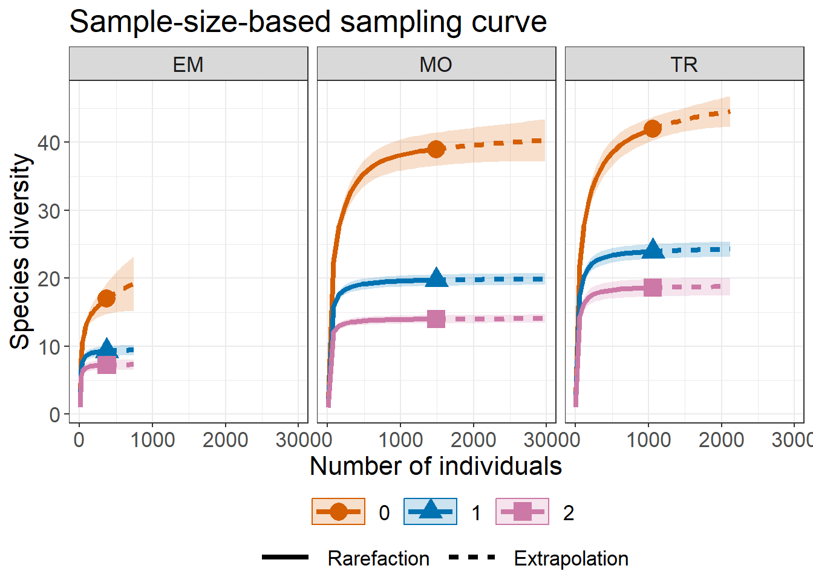

<!-- README.md is generated from README.Rmd. Please edit that file -->

# iNEXT.3D (R package)

<h5 align="right">
Latest version: 2023-04-10
</h5>
<font color="394CAE">
<h3 color="394CAE" style="font-weight: bold">
Introduction to `iNEXT.3D` (R package): Excerpt from iNEXT.3D User’s
Guide
</h3>
</font> <br>
<h5>
<b>Hsieh, Anne Chao, Kai-Hsiang Hu</b> <br><br> <i>Institute of
Statistics, National Tsing Hua University, Hsin-Chu, Taiwan 30043</i>
</h5>

<br> iNEXT.3D (INterpolation and EXTrapolation for three dimensions of
diversity) is an R package, available in
[Github](https://github.com/AnneChao), for rarefaction and extrapolation
of species diversity (Hill numbers) for three dimensions. Here we
provide a quick introduction demonstrating how to run iNEXT.3D, and
showing three types of sampling curves. See Chao et al. (2021) for
methodologies. An online version of iNEXT.3D Online is also available
for users without an R background. Detailed information about all
functions in iNEXT.3D is provided in the iNEXT.3D Manual in
[iNEXT.3D_vignettes](http://chao.stat.nthu.edu.tw/wordpress/wp-content/uploads/software/A%20Quick%20Introduction%20to%20iNEXT.3D%20via%20Examples.html),which
is available from [Anne Chao’s
website](http://chao.stat.nthu.edu.tw/wordpress/software_download/).

`iNEXT3D` focuses on three measures of Hill numbers of order q: species
richness (`q = 0`), Shannon diversity (`q = 1`, the exponential of
Shannon entropy) and Simpson diversity (`q = 2`, the inverse of Simpson
concentration) among three classes: taxonomic diversity (‘TD’),
phylogenetic diversity (‘PD’), functional diversity (‘FD’). For each
diversity measure, `iNEXT.3D` uses the observed sample of abundance or
incidence data (called the “reference sample”) to compute diversity
estimates and the associated confidence intervals for the following two
types of rarefaction and extrapolation (R/E):

1.  Sample‐size‐based R/E sampling curves:`iNEXT3D` computes diversity
    estimates for rarefied and extrapolated samples up to an appropriate
    size. This type of sampling curve plots the diversity estimates with
    respect to sample size.  
2.  Coverage‐based R/E sampling curves: `iNEXT3D` computes diversity
    estimates for rarefied and extrapolated samples with sample
    completeness (as measured by sample coverage) up to an appropriate
    coverage. This type of sampling curve plots the diversity estimates
    with respect to sample coverage.

`iNEXT3D` also plots the above two types of sampling curves and a sample
completeness curve. The sample completeness curve provides a bridge
between these two types of curves.

### SOFTWARE NEEDED TO RUN INEXT.3D IN R

-   Required: [R](http://cran.rstudio.com/)
-   Suggested: [RStudio IDE](http://www.rstudio.com/ide/download/)

### HOW TO RUN INEXT:

The iNEXT package is available on
[Github](https://github.com/AnneChao/iNEXT.3D) and can be downloaded
with a standard installation procedure using the commands shown
below.For a first-time installation, an additional visualization
extension package (ggplot2) must be installed and loaded.

``` r
## install the latest version from github
install.packages('devtools')
library(devtools)
# install_github('AnneChao/iNEXT.3D')
## import packages
library(iNEXT.3D)
library(ggplot2)
```

In this document, we provide a quick introduction demonstrating how to
run the package `iNEXT.3D`(iNterpolation and EXTrapolation in three
Dimensions). `iNEXT.3D` has several main function: `iNEXT3D`,
`ggiNEXT3D`, `AO3D`, `ggAO3D`, `estimate3D`, and `DataInfo3D.`

### MAIN FUNCTION: iNEXT3D()

The main function iNEXT3D() with default arguments is described below:
<br><br> iNEXT3D(data, diversity = ‘TD’, q = c(0,1,2), datatype =
“abundance”, size = NULL, endpoint = NULL, knots = 40, nboot = 50, conf
= 0.95, nT = NULL, PDtree = NULL, PDreftime = NULL, PDtype = ‘meanPD’,
FDdistM, FDtype = ‘AUC’, FDtau = NULL) <br><br> This main function
computes diversity estimates of order q, the sample coverage estimates
and related statistics for K (if knots=K) evenly-spaced knots (sample
sizes) between size 1 and the endpoint, where the endpoint is as
described below. Each knot represents a particular sample size for which
diversity estimates will be calculated. By default, endpoint is set to
be double the reference sample size.

This function returns an “iNEXT3D” object which can be further used to
make plots using the function ggiNEXT3D() to be described below.

<table class="gmisc_table" style="border-collapse: collapse; margin-top: 1em; margin-bottom: 1em;">
<thead>
<tr>
<th style="font-weight: 900; border-bottom: 1px solid grey; border-top: 2px solid grey; text-align: center;">
Argument
</th>
<th style="font-weight: 900; border-bottom: 1px solid grey; border-top: 2px solid grey; text-align: center;">
Description
</th>
</tr>
</thead>
<tbody>
<tr>
<td style="text-align: left;">
data
</td>
<td style="text-align: left;">
(a). For datatype = ‘abundance’, data can be input as a vector of
species abundances (for a single assemblage), matrix/data.frame (species
by assemblages), or a list of species abundance vectors. (b). For
datatype = ‘incidence_freq’, data can be input as a vector of incidence
frequencies (for a single assemblage), matrix/data.frame (species by
assemblages), or a list of incidence frequencies; the first entry in all
types of input must be the number of sampling units in each assemblage.
(c). For datatype = ‘incidence_raw’, data can be input as a list of
matrix/data.frame (species by sampling units); data can also be input as
a matrix/data.frame by merging all sampling units across assemblages
based on species identity; in this case, the number of sampling units
(nT, see below) must be input.
</td>
</tr>
<tr>
<td style="text-align: left;">
diversity
</td>
<td style="text-align: left;">
selection of diversity type: ‘TD’ = Taxonomic diversity, ‘PD’ =
Phylogenetic diversity, and ‘FD’ = Functional diversity.
</td>
</tr>
<tr>
<td style="text-align: left;">
q
</td>
<td style="text-align: left;">
a numerical vector specifying the diversity orders. Default is c(0, 1,
2).
</td>
</tr>
<tr>
<td style="text-align: left;">
datatype
</td>
<td style="text-align: left;">
data type of input data: individual-based abundance data (datatype =
‘abundance’), sampling-unit-based incidence frequencies data (datatype =
‘incidence_freq’), or species by sampling-units incidence matrix
(datatype = ‘incidence_raw’) with all entries being 0 (non-detection) or
1 (detection).
</td>
</tr>
<tr>
<td style="text-align: left;">
size
</td>
<td style="text-align: left;">
an integer vector of sample sizes for which diversity estimates will be
computed. If NULL, then diversity estimates will be calculated for those
sample sizes determined by the specified/default endpoint and knots;
</td>
</tr>
<tr>
<td style="text-align: left;">
endpoint
</td>
<td style="text-align: left;">
an integer specifying the sample size that is the endpoint for R/E
calculation; If NULL, then endpoint=double the reference sample size;
</td>
</tr>
<tr>
<td style="text-align: left;">
knots
</td>
<td style="text-align: left;">
an integer specifying the number of equally-spaced knots (say K, default
is 40) between size 1 and the endpoint;each knot represents a particular
sample size for which diversity estimate will be calculated. If the
endpoint is smaller than the reference sample size, then iNEXT3D()
computes only the rarefaction esimates for approximately K evenly spaced
knots. If the endpoint is larger than the reference sample size, then
iNEXT3D() computes rarefaction estimates for approximately K/2 evenly
spaced knots between sample size 1 and the reference sample size, and
computes extrapolation estimates for approximately K/2 evenly spaced
knots between the reference sample size and the endpoint.
</td>
</tr>
<tr>
<td style="text-align: left;">
nboot
</td>
<td style="text-align: left;">
a positive integer specifying the number of bootstrap replications when
assessing sampling uncertainty and constructing confidence intervals.
Enter 0 to skip the bootstrap procedures. Default is 50.
</td>
</tr>
<tr>
<td style="text-align: left;">
conf
</td>
<td style="text-align: left;">
a positive integer specifying the number of bootstrap replications when
assessing sampling uncertainty and constructing confidence intervals.
Enter 0 to skip the bootstrap procedures. Default is 50.
</td>
</tr>
<tr>
<td style="text-align: left;">
nT
</td>
<td style="text-align: left;">
(required only when datatype = ‘incidence_raw’ and input data is
matrix/data.frame) a vector of nonnegative integers specifying the
number of sampling units in each assemblage. If assemblage names are not
specified, then assemblages are automatically named as ‘assemblage1’,
‘assemblage2’,…, etc.
</td>
</tr>
<tr>
<td style="text-align: left;">
PDtree
</td>
<td style="text-align: left;">
(required only when diversity = ‘PD’), a phylogenetic tree in Newick
format for all observed species in the pooled assemblage.
</td>
</tr>
<tr>
<td style="text-align: left;">
PDreftime
</td>
<td style="text-align: left;">
(required only when diversity = ‘PD’), a vector of numerical values
specifying reference times for PD. Default is NULL (i.e., the age of the
root of PDtree).
</td>
</tr>
<tr>
<td style="text-align: left;">
PDtype
</td>
<td style="text-align: left;">
(required only when ), select PD type: PDtype = ‘PD’ (effective total
branch length) or PDtype = ‘meanPD’ (effective number of equally
divergent lineages). Default is ‘meanPD’, where meanPD = PD/tree depth.
</td>
</tr>
<tr>
<td style="text-align: left;">
FDdistM
</td>
<td style="text-align: left;">
(required only when diversity = ‘FD’), select FD type: FDtype =
‘tau_values’ for FD under specified threshold values, or FDtype = ‘AUC’
(area under the curve of tau-profile) for an overall FD which integrates
all threshold values between zero and one. Default is ‘AUC’.
</td>
</tr>
<tr>
<td style="text-align: left;">
FDtype
</td>
<td style="text-align: left;">
(required only when diversity = ‘FD’), select FD type: FDtype =
‘tau_values’ for FD under specified threshold values, or FDtype = ‘AUC’
(area under the curve of tau-profile) for an overall FD which integrates
all threshold values between zero and one. Default is ‘AUC’.
</td>
</tr>
<tr>
<td style="border-bottom: 2px solid grey; text-align: left;">
FDtau
</td>
<td style="border-bottom: 2px solid grey; text-align: left;">
(required only when diversity = ‘FD’ and FDtype = ‘tau_values’), a
numerical vector between 0 and 1 specifying tau values (threshold
levels). If NULL (default), then threshold is set to be the mean
distance between any two individuals randomly selected from the pooled
assemblage (i.e., quadratic entropy).
</td>
</tr>
</tbody>
</table>

This function returns an “iNEXT3D” object which can be further used to
make plots using the function ggiNEXT3D() to be described below.

### DATA FORMAT/INFORMATION

Three types of data are supported: (“abundance”, “incidence_raw”, or
“incidence_freq”):

1.  Individual‐based abundance data (datatype=“abundance”): Input data
    for each assemblage/site include samples species abundances in an
    empirical sample of n individuals (“reference sample”). When there
    are N assemblages, input data consist of an S by N abundance matrix,
    or N lists of species abundances.

2.  Sampling-unit-based incidence data: There are two kinds of input
    data.

(2a) Incidence‐raw data (datatype=“incidence_raw”): for each assemblage,
input data for a reference sample consist of a species‐by‐sampling‐unit
matrix; when there are N assemblages, input data consist of N lists of
matrices, and each matrix is a species‐by‐sampling‐unit matrix. If the
phylogenetic diversity required, the matrix of combined assemblage is
allowed, but nT must be specified (see above description).

(2b) Incidence‐frequency data (datatype=“incidence_freq”): input data
for each assemblage consist of species sample incidence frequencies (row
sums of each incidence matrix). When there are N assemblages, input data
consist of an S by N matrix, or N lists of species incidence
frequencies. The first entry of each list must be the total number of
sampling units, followed by the species incidence frequencies.

Two data sets (beetles for abundance data ) are included in iNEXT3D
package. The first list of beetles’ data consist of abundance data who
live on three treatments (“Control”, “Debarked” and “Scratched”) of
trees. The second list consist of the pylogenetic tree for every
beetles. And the third list consist of distance matrix for each pair of
beetles. For these data, the following commands display the sample
species abundances and run the iNEXT3D() function for three types of
diversty (“TD”, “PD”, “FD” with threshold dmean, “AUC” which integate FD
from threshold 0-1) in q = 0.

``` r
data("dunes")

out.TD <- iNEXT3D(data = dunes$data, diversity = "TD", 
               q = c(0, 1, 2), datatype = "abundance", 
               nboot = 10)
out.PD <- iNEXT3D(data = dunes$data, diversity = "PD", 
               q = c(0, 1, 2), datatype = "abundance", 
               PDtree = dunes$tree, 
               nboot = 10)
out.FD <- iNEXT3D(data = dunes$data, diversity = "FD", 
               q = c(0, 1, 2), datatype = "abundance", 
               FDdistM = dunes$dist,
               nboot = 5)

out.TD
Compare 3 assemblages with Hill number order q = 0, 1, 2.
$class: iNEXT3D

DataInfo: basic data information
  Assemblage    n S.obs     SC f1 f2 f3 f4 f5 f6 f7 f8 f9 f10
1         EM  373    17 0.9920  3  1  1  0  0  1  0  1  1   1
2         MO 1490    39 0.9987  2  1  1  4  2  2  3  1  1   1
3         TR 1059    42 0.9962  4  2  4  2  2  2  0  1  2   2

iNextEst: diversity estimates with rarefied and extrapolated samples.
$size_based (LCL and UCL are obtained for fixed size.)

# A tibble: 45 x 10
   Assemblage     m Method        Order.q    qD qD.LCL qD.UCL    SC SC.LCL SC.UCL
   <chr>      <dbl> <chr>           <dbl> <dbl>  <dbl>  <dbl> <dbl>  <dbl>  <dbl>
 1 EM             1 Rarefaction         0  1      1.00   1    0.136  0.122  0.150
 2 EM           196 Rarefaction         0 15.2   13.8   16.6  0.987  0.981  0.993
 3 EM           373 Observed            0 17     14.7   19.3  0.992  0.985  0.999
 4 EM           550 Extrapolation       0 18.2   15.0   21.4  0.994  0.989  1.00 
 5 EM           746 Extrapolation       0 19.2   15.2   23.2  0.996  0.991  1    
 6 EM             1 Rarefaction         1  1      1      1    0.136  0.122  0.150
 7 EM           196 Rarefaction         1  9.07   8.35   9.78 0.987  0.981  0.993
 8 EM           373 Observed            1  9.27   8.53  10.0  0.992  0.985  0.999
 9 EM           550 Extrapolation       1  9.37   8.61  10.1  0.994  0.989  1.00 
10 EM           746 Extrapolation       1  9.43   8.66  10.2  0.996  0.991  1    
# ... with 35 more rows
# i Use `print(n = ...)` to see more rows

NOTE: The above output only shows five estimates for each assemblage; call iNEXT.object$iNextEst$size_based to view complete output.

$coverage_based (LCL and UCL are obtained for fixed coverage; interval length is wider due to varying size in bootstraps.)

# A tibble: 45 x 8
   Assemblage    SC     m Method        Order.q    qD qD.LCL qD.UCL
   <chr>      <dbl> <dbl> <chr>           <dbl> <dbl>  <dbl>  <dbl>
 1 EM         0.136    1  Rarefaction         0  1     0.935   1.07
 2 EM         0.987  196. Rarefaction         0 15.2  13.0    17.5 
 3 EM         0.992  373  Observed            0 17    13.0    21.0 
 4 EM         0.994  550. Extrapolation       0 18.2  13.5    22.9 
 5 EM         0.996  746. Extrapolation       0 19.2  13.9    24.5 
 6 EM         0.136    1  Rarefaction         1  1     0.938   1.06
 7 EM         0.987  196. Rarefaction         1  9.07  8.28    9.85
 8 EM         0.992  373  Observed            1  9.27  8.46   10.1 
 9 EM         0.994  550. Extrapolation       1  9.37  8.56   10.2 
10 EM         0.996  746. Extrapolation       1  9.43  8.62   10.2 
# ... with 35 more rows
# i Use `print(n = ...)` to see more rows

NOTE: The above output only shows five estimates for each assemblage; call iNEXT.object$iNextEst$coverage_based to view complete output.

AsyEst: asymptotic diversity estimates along with related statistics.
  Assemblage         Diversity  Observed Estimator      s.e.       LCL       UCL
1         EM  Species richness 17.000000 21.487936 4.2141985 17.000000 29.747613
2         EM Shannon diversity  9.272102  9.541765 0.4226855  8.713317 10.370213
3         EM Simpson diversity  7.218106  7.340810 0.3548642  6.645289  8.036332
4         MO  Species richness 39.000000 40.998658 5.5655330 39.000000 51.906902
5         MO Shannon diversity 19.712107 19.987465 0.6638302 18.686382 21.288549
6         MO Simpson diversity 13.979950 14.102888 0.5221024 13.079587 15.126190
7         TR  Species richness 42.000000 45.996223 8.3988475 42.000000 62.457661
8         TR Shannon diversity 23.941938 24.481173 0.7021126 23.105058 25.857289
9         TR Simpson diversity 18.605455 18.920295 0.7092670 17.530157 20.310432
```

### BASIC GRAPHIC DISPLAYS: FUNCTION ggiNEXT3D()

The ggiNEXT3D() function, which extends ggplot2 to the “iNEXT3D” object,
is described as follows with default arguments: <br><br>
ggiNEXT3D(outcome, type = 1:3, se = TRUE, facet.var = “Assemblage”,
color.var = “Order.q”)  
<br><br> Here outcome is the object of iNEXT3D()’s output. Three types
of curves are allowed for different diversity classes:

1.  Sample-size-based R/E curve (type=1): see Figs. 1a and 2a in the
    main text. This curve plots diversity estimates with confidence
    intervals (if se=TRUE) as a function of sample size up to double the
    reference sample size, by default, or a user‐specified endpoint.

2.  Sample completeness curve (type=2) with confidence intervals (if
    se=TRUE): see Figs. 1b and 2b in the main text. This curve plots the
    sample coverage with respect to sample size for the same range
    described in (1).

3.  Coverage-based R/E curve (type=3): see Figs. 1c and 2c in the main
    text. This curve plots the diversity estimates with confidence
    intervals (if se=TRUE) as a function of sample coverage up to the
    maximum coverage obtained from the maximum size described in (1).

<br><br> The argument facet.var=(“Order.q”, “Assemblage”) is used to
create a separate plot for each value of the specified variable. For
example, the following code displays a separate plot (in Figs 1a and 1c)
for each value of the diversity order q. The ggiNEXT3D() function is a
wrapper around ggplot2 package to create a R/E curve using a single line
of code. The resulting object is of class “ggplot”, so can be
manipulated using the ggplot2 tools.

The argument facet.var=“Assemblage” in ggiNEXT3D function creates a
separate plot for each assembalge, therefore the different Order.q will
seperated by different colours as shown below:

### RAREFACTION/EXTRAPOLATION FOR ABUNDANCE DATA

``` r
# Sample‐size‐based R/E curves, separating by "assemblage""
ggiNEXT3D(out.TD, type = 1, facet.var = "Assemblage")
```



The argument facet.var=“Order.q” in ggiNEXT3D function creates a
separate plot for each order, therefore three assemblages will be
seperated by different colours as shown below:

``` r
# Sample-size-based R/E curves, separating plots by "Order.q"
ggiNEXT3D(out.TD, type = 1, facet.var = "Order.q")
```


The following commands return the sample completeness curve in which
different colors are used for the three assemblages. Since the sample
completeness curve are same for differnet class of diversity, ggiNEXT3D
returns only one plot:

``` r
ggiNEXT3D(out.TD, type = 2, facet.var = "Order.q", color.var="Assemblage")
```


The following commands return the coverage‐based R/E sampling curves in
which different colors are used for the three assemblages
(facet.var=“Assemblage”) and for three orders (facet.var=“Order.q”)

``` r
ggiNEXT3D(out.TD, type = 3, facet.var="Assemblage")
```


``` r
ggiNEXT3D(out.TD, type = 3, facet.var="Order.q")
```


### RAREFACTION/EXTRAPOLATION FOR RAW INCIDENCE DATA: (incidence_raw)

For illustration, we use the Hinkley’s fish data (in the dataset fish
included in the package) at three time periods (1981-1985, 1987-1991 and
2015-2019). Incidence raw data is allowed for all diversity class.This
data set (fish) included in the package is three list of matrices; each
matrix is a species by plots data.frame for a time period. We only use
Taxonomic diversity(TD) for demonstration below.

``` r
data("fish")
head(fish[[1]]$`1981-1985`,4)
                    1 2 3 4 5 6 7 8 9 10 11 12 13 14 15 17 18 19 20 21 22 23 24 25 26 27 28 29 30 31 32 33 34 35 36 37 38 39 40 41 42 43 44 45 46 47 48 49 50 51 52 53 54 55 56 57 58 59 60 61
Agonus_cataphractus 0 0 1 0 0 0 0 0 0  0  0  0  0  0  0  0  0  0  0  0  1  1  0  0  1  0  1  1  1  0  0  0  0  1  0  0  0  0  0  0  0  0  0  0  0  1  0  1  0  0  1  0  1  0  0  0  0  1  1  0
Alosa_fallax        0 0 0 0 0 0 0 0 1  0  0  0  1  0  0  0  0  0  1  1  0  1  0  1  1  0  1  0  0  1  1  1  1  1  1  0  1  0  0  1  1  1  0  1  1  1  1  1  0  0  1  1  1  1  1  0  0  0  0  1
Ammodytes_marinus   0 0 0 0 0 0 0 0 0  0  0  0  0  0  0  0  0  0  0  0  0  0  0  0  0  0  0  0  0  0  0  0  0  0  0  0  0  0  0  0  0  0  0  0  0  0  0  0  0  0  0  0  0  0  0  0  0  0  0  0
Ammodytes_tobianus  0 0 0 0 0 0 1 0 0  0  0  1  0  0  0  0  0  0  0  0  0  0  0  0  0  0  0  0  0  0  0  0  0  1  0  0  0  0  0  0  0  0  0  1  0  0  0  0  0  0  0  0  0  0  0  0  0  0  0  0
```

``` r
# fish.tree = fish$tree
# fish.dis = fish$dist

out.raw <- iNEXT3D(data = fish$data, 
                   diversity = "TD",
                   q = c(0, 1, 2), datatype = "incidence_raw",nboot = 10)
ggiNEXT3D(out.raw, type = 1)
```


``` r
ggiNEXT3D(out.raw, type = 2)
```


``` r
ggiNEXT3D(out.raw, type = 3)
```


### DATA INFORMATION FUNCTION: DataInfo3D()

We can supply the function <br><br> DataInfo3D(data, diversity = “TD”,
datatype = “abundance”, nT = NULL, PDtree, PDreftime = NULL, FDdistM,
FDtype = “AUC”, FDtau = NULL) <br><br> to compute three type
diversity(‘TD’,‘PD’,‘FD’) data information, which including sample size,
observed species richness, sample coverage estimate, and the first ten
abundance/incidence frequency counts, and so on.

``` r
DataInfo3D(dunes$data, diversity = 'TD', datatype = "abundance")
  Assemblage    n S.obs     SC f1 f2 f3 f4 f5 f6 f7 f8 f9 f10
1         EM  373    17 0.9920  3  1  1  0  0  1  0  1  1   1
2         MO 1490    39 0.9987  2  1  1  4  2  2  3  1  1   1
3         TR 1059    42 0.9962  4  2  4  2  2  2  0  1  2   2
```

### POINT ESTIMATION FUNCTION: estimate3D()

We also supply the function <br><br> estimate3D(data, diversity = “TD”,
q = c(0, 1, 2), datatype = “abundance”, base = “coverage”, level = NULL,
nboot = 50, conf = 0.95, nT = NULL, PDtree, PDreftime = NULL, PDtype =
“meanPD”, FDdistM, FDtype = “AUC”, FDtau = NULL) <br><br> to compute
three type diversity(‘TD’,‘PD’,‘FD’) estimates with q = 0, 1, 2 for any
particular level of sample size (base=“size”) or any specified level of
sample coverage (base=“coverage”) for either abundance data
(datatype=“abundance”) or incidence data (datatype=“incidence_freq” or
“incidence_raw”). If level=NULL, this function computes the diversity
estimates for the minimum sample size/coverage among all assemblages.

For example, the following command returns the taxonomic diversity
(‘TD’) with a specified level of sample coverage of 93% for the dunes
data. For some assemblages, this coverage value corresponds to the
rarefaction part whereas the others correspond to extrapolation, as
indicated in the method of the output.

``` r
estimate3D(dunes$data, diversity = 'TD', q = c(0,1,2), datatype = "abundance", base = "coverage",level = 0.93)
  Assemblage   SC         m      Method Order.q        qD      s.e.    qD.LCL    qD.UCL
1         EM 0.93  47.88966 Rarefaction       0 11.194508 0.5494942 10.117519 12.271496
2         EM 0.93  47.88966 Rarefaction       1  8.004329 0.3025071  7.411426  8.597232
3         EM 0.93  47.88966 Rarefaction       2  6.482469 0.2507604  5.990988  6.973950
4         MO 0.93 107.56810 Rarefaction       0 24.830302 0.7491849 23.361927 26.298678
5         MO 0.93 107.56810 Rarefaction       1 16.735683 0.4321771 15.888631 17.582734
6         MO 0.93 107.56810 Rarefaction       2 12.571520 0.3925961 11.802046 13.340995
7         TR 0.93 114.37603 Rarefaction       0 27.935556 0.9349285 26.103130 29.767982
8         TR 0.93 114.37603 Rarefaction       1 20.360646 0.5856914 19.212712 21.508580
9         TR 0.93 114.37603 Rarefaction       2 16.357398 0.5082425 15.361261 17.353535
```

### EMPIRICAL AND ASYMPTOTIC DIVERSITY FUNCTION: AO3D

<br><br> AO3D( data,diversity = “TD”,q = seq(0,2,0.2),datatype =
“abundance”, nboot = 50,conf = 0.95,nT = NULL,method = c(“Asymptotic”,
“Observed”), PDtree,PDreftime = NULL,PDtype = “meanPD”, FDdistM,FDtype =
“AUC”,FDtau = NULL ) <br><br>

The function AO3D() can compute three type
diversity(‘TD’,‘PD’,‘FD’),which including empirical diversity and
asymptotic diversity. For either abundance data (datatype=“abundance”)
or incidence data(datatype=“incidence_freq” or “incidence_raw”)with any
specified level of q can be compute.

For example, the following command returns an empirical taxonomic
diversity(‘TD’) and asymptotic taxonomic diversity(‘TD’) for dunes data,
along with its confidence interval, for a specified q level from 0 to 2.

``` r
out1 <- AO3D(dunes$data, diversity = 'TD', datatype = "abundance", method = c("Asymptotic", "Observed"),nboot = 5,conf = 0.95)

out1
   Order.q        qD      s.e.    qD.LCL    qD.UCL Assemblage     Method
1      0.0 21.487936 2.1586260 17.257106 25.718765         EM Asymptotic
2      0.2 16.936433 1.2222285 14.540909 19.331957         EM Asymptotic
3      0.4 13.885407 0.6812717 12.550139 15.220674         EM Asymptotic
4      0.6 11.862781 0.4314979 11.017061 12.708501         EM Asymptotic
5      0.8 10.496859 0.3533877  9.804232 11.189486         EM Asymptotic
6      1.0  9.541765 0.3379786  8.879339 10.204191         EM Asymptotic
7      1.2  8.847719 0.3355543  8.190044  9.505393         EM Asymptotic
8      1.4  8.325449 0.3353016  7.668270  8.982628         EM Asymptotic
9      1.6  7.920890 0.3368189  7.260737  8.581043         EM Asymptotic
10     1.8  7.600095 0.3407895  6.932159  8.268030         EM Asymptotic
11     2.0  7.340810 0.3473130  6.660090  8.021531         EM Asymptotic
12     0.0 40.998658 2.5480619 36.004548 45.992767         MO Asymptotic
13     0.2 34.209437 0.9570429 32.333667 36.085207         MO Asymptotic
14     0.4 29.060182 0.3352095 28.403183 29.717180         MO Asymptotic
15     0.6 25.175831 0.5231582 24.150460 26.201203         MO Asymptotic
16     0.8 22.235885 0.6947499 20.874200 23.597570         MO Asymptotic
17     1.0 19.987465 0.7754973 18.467519 21.507412         MO Asymptotic
18     1.2 18.241913 0.8057900 16.662594 19.821233         MO Asymptotic
19     1.4 16.863382 0.8111253 15.273605 18.453158         MO Asymptotic
20     1.6 15.755819 0.8048346 14.178372 17.333265         MO Asymptotic
21     1.8 14.851614 0.7935736 13.296239 16.406990         MO Asymptotic
22     2.0 14.102888 0.7805895 12.572961 15.632816         MO Asymptotic
23     0.0 45.996223 6.3382258 33.573529 58.418917         TR Asymptotic
24     0.2 38.731480 3.3524671 32.160765 45.302194         TR Asymptotic
25     0.4 33.399637 1.8328392 29.807339 36.991936         TR Asymptotic
26     0.6 29.505773 1.1550239 27.241968 31.769578         TR Asymptotic
27     0.8 26.635682 0.9031722 24.865497 28.405867         TR Asymptotic
28     1.0 24.481173 0.8240259 22.866112 26.096234         TR Asymptotic
29     1.2 22.827199 0.8025707 21.254189 24.400209         TR Asymptotic
30     1.4 21.527891 0.8008158 19.958321 23.097461         TR Asymptotic
31     1.6 20.484834 0.8073455 18.902466 22.067202         TR Asymptotic
32     1.8 19.631065 0.8179637 18.027885 21.234244         TR Asymptotic
33     2.0 18.920295 0.8304617 17.292620 20.547969         TR Asymptotic
34     0.0 17.000000 1.8708287 13.333243 20.666757         EM  Empirical
35     0.2 14.471457 1.1325167 12.251765 16.691149         EM  Empirical
36     0.4 12.567736 0.6662856 11.261840 13.873632         EM  Empirical
37     0.6 11.145510 0.4468355 10.269728 12.021291         EM  Empirical
38     0.8 10.079552 0.4065980  9.282635 10.876470         EM  Empirical
39     1.0  9.272102 0.4338156  8.421839 10.122365         EM  Empirical
40     1.2  8.651511 0.4663010  7.737577  9.565444         EM  Empirical
41     1.4  8.166818 0.4895748  7.207269  9.126367         EM  Empirical
42     1.6  7.782094 0.5035548  6.795145  8.769043         EM  Empirical
43     1.8  7.471913 0.5107119  6.470937  8.472890         EM  Empirical
44     2.0  7.218106 0.5133376  6.211983  8.224229         EM  Empirical
45     0.0 39.000000 0.5477226 37.926484 40.073516         MO  Empirical
46     0.2 32.970780 0.5710005 31.851639 34.089920         MO  Empirical
47     0.4 28.269000 0.5092416 27.270904 29.267095         MO  Empirical
48     0.6 24.647500 0.4061480 23.851464 25.443535         MO  Empirical
49     0.8 21.864493 0.3035494 21.269547 22.459439         MO  Empirical
50     1.0 19.712107 0.2275442 19.266129 20.158085         MO  Empirical
51     1.2 18.026804 0.1904618 17.653506 18.400102         MO  Empirical
52     1.4 16.686924 0.1879207 16.318607 17.055242         MO  Empirical
53     1.6 15.604656 0.2032899 15.206215 16.003097         MO  Empirical
54     1.8 14.717297 0.2233200 14.279598 15.154997         MO  Empirical
55     2.0 13.979950 0.2421836 13.505279 14.454621         MO  Empirical
56     0.0 42.000000 1.5811388 38.901025 45.098975         TR  Empirical
57     0.2 36.253363 1.1038084 34.089938 38.416788         TR  Empirical
58     0.4 31.844736 0.8558004 30.167398 33.522074         TR  Empirical
59     0.6 28.487492 0.7596194 26.998665 29.976318         TR  Empirical
60     0.8 25.922807 0.7342453 24.483713 27.361902         TR  Empirical
61     1.0 23.941938 0.7348519 22.501655 25.382221         TR  Empirical
62     1.2 22.387845 0.7456059 20.926484 23.849205         TR  Empirical
63     1.4 21.146894 0.7620431 19.653317 22.640471         TR  Empirical
64     1.6 20.138290 0.7825158 18.604587 21.671993         TR  Empirical
65     1.8 19.304760 0.8057609 17.725498 20.884022         TR  Empirical
66     2.0 18.605455 0.8305754 16.977557 20.233353         TR  Empirical
```

### GRAPHIC DISPLAYS FUNCTION: ggAO3D()

Plots q-profile, time-profile, and tau-profile based on the outcome of
AO3D using the ggplot2 package.

The function ggAO3D(), which extends ggplot2 with default arguments, is
described as follows: <br><br> ggAO3D(outcome, profile = “q”) <br><br>
Here outcome is the object of AO3D’s output and profile is an object
versus to diversity.Default is profile = “q”.Note that profile = “time”
is allowed for only when diversity = “PD” and profile = “tau” profile is
allowed for only when diversity = “FD” and FDtype = “tau_values”.

``` r
# q profile curve""
ggAO3D(out1,profile = "q")
```


The argument profile = “time” in ggAO3D function creates a separate plot
for each order.q. Therefore the different assemblages will seperated by
different colours as shown below:

``` r
# time curves, separating by "Order.q"
data(data.inc)
data <- data.inc$data
tree <- data.inc$tree
nT <- data.inc$nT
out2 <- AO3D(data, diversity = 'PD', q = c(0, 1, 2), datatype = "incidence_raw", nT = nT, nboot = 5, method = c("Asymptotic", "Observed"), PDtree = tree, PDreftime = seq(0.1, 82.8575, length.out = 40))
ggAO3D(out2, profile = "time")
```


The argument profile = “tau” in ggAO3D function creates a separate plot
for each order.q. Therefore the different assemblages will seperated by
different colours as shown below:

``` r
# tau curves, separating by "Order.q"
data <- dunes$data
distM <-  dunes$dist
out3 <- AO3D(data, diversity = 'FD', q = c(0, 1, 2), datatype = "abundance", nboot = 5, method = c("Asymptotic", "Observed"), FDtau = seq(0, 1, 0.1), FDdistM = distM, FDtype = 'tau_values')
ggAO3D(out3, profile = "tau")
```


## \#\#\# How to cite

### Referance

Chao, A., Henderson, P. A., Chiu, C.-H., Moyes, F., Hu, K.-H., Dornelas,
M and Magurran, A. E. (2021). Measuring temporal change in alpha
diversity: a framework integrating taxonomic, phylogenetic and
functional diversity and the iNEXT.3D standardization. Methods in
Ecology and Evolution, 12, 1926-1940.
