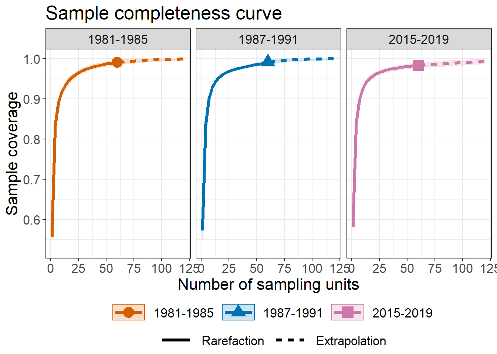
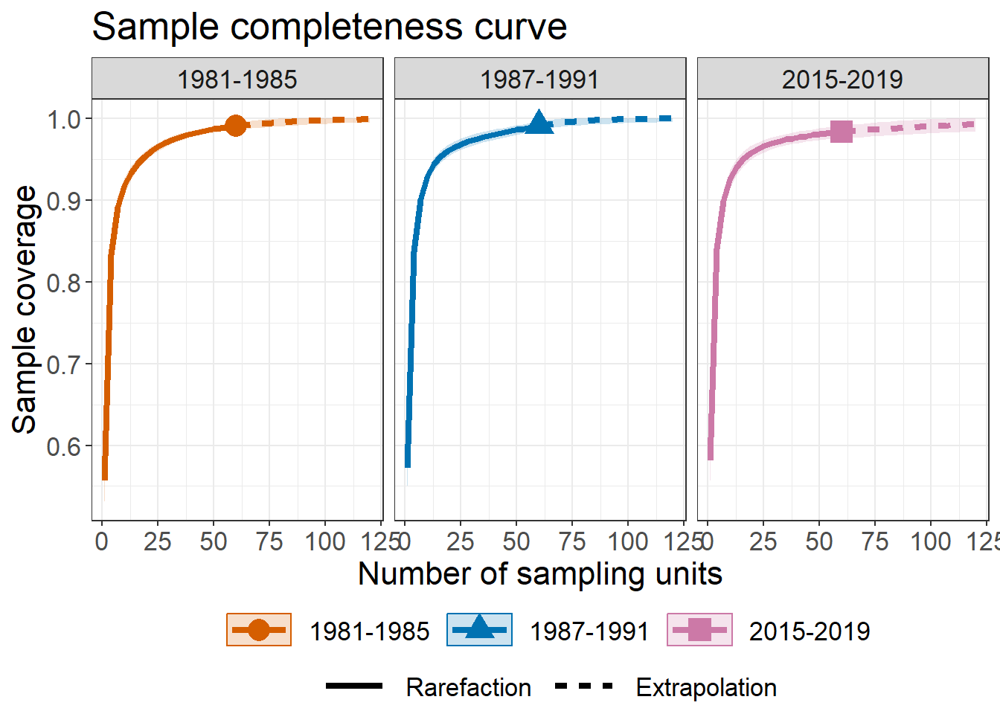
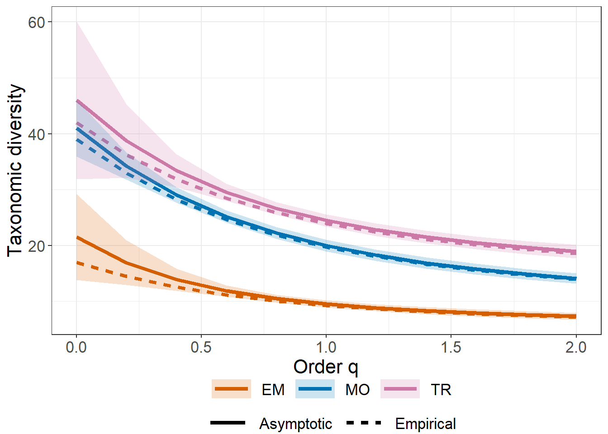
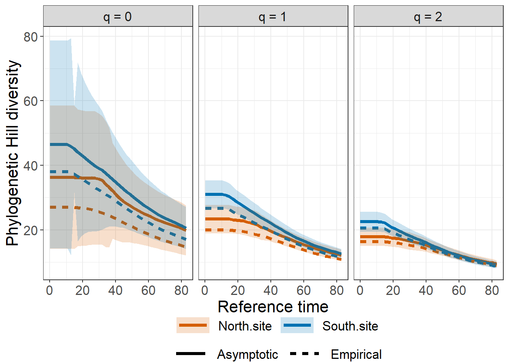
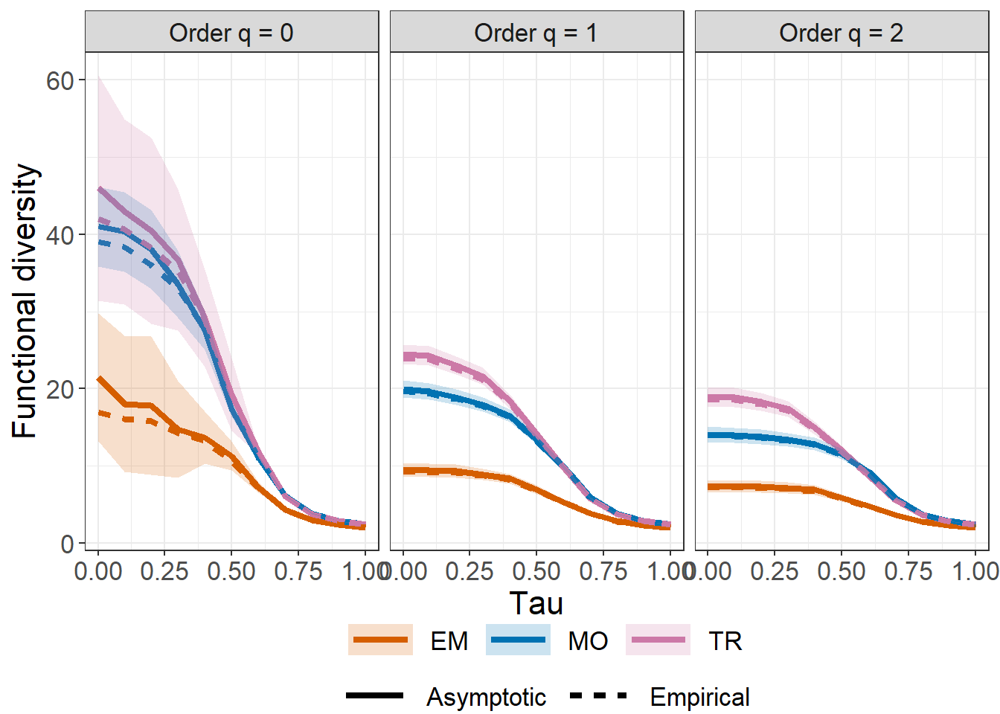

<!-- README.md is generated from README.Rmd. Please edit that file -->

# iNEXT.3D (R package)

<h5 align="right">
Latest version: 2023-08-05
</h5>
<font color="394CAE">
<h3 color="394CAE" style="font-weight: bold">
Introduction to iNEXT.3D (R package): Excerpt from iNEXT.3D User’s Guide
</h3>
</font> <br>
<h5>
<b>Anne Chao, Kai-Hsiang Hu</b> <br><br> <i>Institute of Statistics,
National Tsing Hua University, Hsin-Chu, Taiwan 30043</i>
</h5>

<br> iNEXT.3D (INterpolation and EXTrapolation for three dimensions of
diversity) is an R package, available in
[Github](https://github.com/AnneChao), for rarefaction and extrapolation
of species diversity (Hill numbers) for three dimensions. Here we
provide a quick introduction demonstrating how to run iNEXT.3D, and
showing three types of rarefaction/extrapolation sampling curves. See
Chao et al. (2021) for methodologies. An online version of [iNEXT.3D
Online](https://chao.shinyapps.io/iNEXT_3D/) is also available for users
without an R background. Detailed information about all functions in
iNEXT.3D is provided in the iNEXT.3D Manual in
[iNEXT.3D_vignettes](http://chao.stat.nthu.edu.tw/wordpress/wp-content/uploads/software/A%20Quick%20Introduction%20to%20iNEXT.3D%20via%20Examples.html),
which is also available from [Anne Chao’s
website](http://chao.stat.nthu.edu.tw/wordpress/software_download/).

`iNEXT.3D` is the extension of R package
[iNEXT](https://cran.r-project.org/web/packages/iNEXT/index.html) (Hsieh
et al., 2016). `iNEXT.3D` focuses on three measures of Hill numbers of
order q: species richness (`q = 0`), Shannon diversity (`q = 1`, the
exponential of Shannon entropy) and Simpson diversity (`q = 2`, the
inverse of Simpson concentration) and extend Hill number to three
dimensions: taxonomic diversity (TD), phylogenetic diversity (PD), and
functional diversity (FD) under Hill-Chao family frame work (Chao et
al., 2019). Besides, `iNEXT.3D` also provide statistic estimation for
three dimensions biodiversity (Chao et al., 2021). For each diversity
measure, `iNEXT.3D` uses the observed sample of abundance or incidence
data (called the “reference sample”) to compute diversity estimates and
the associated confidence intervals for the following two types of
rarefaction and extrapolation (R/E):

1.  Sample-size-based R/E sampling curves:`iNEXT3D` computes diversity
    estimates for rarefied and extrapolated samples up to an appropriate
    size. This type of sampling curve plots the diversity estimates with
    respect to sample size.  
2.  Coverage-based R/E sampling curves: `iNEXT3D` computes diversity
    estimates for rarefied and extrapolated samples with sample
    completeness (as measured by sample coverage) up to an appropriate
    coverage. This type of sampling curve plots the diversity estimates
    with respect to sample coverage.

`iNEXT.3D` also plots the above two types of sampling curves and a
sample completeness curve by `ggiNEXT3D`. The sample completeness curve
provides a bridge between these two types of curves.

### SOFTWARE NEEDED TO RUN INEXT.3D IN R

-   Required: [R](http://cran.rstudio.com/)
-   Suggested: [RStudio IDE](http://www.rstudio.com/ide/download/)

### HOW TO RUN INEXT.3D:

The iNEXT.3D package is available on
[Github](https://github.com/AnneChao/iNEXT.3D) and can be downloaded
with a standard installation procedure using the commands shown below.
For a first-time installation, an additional visualization extension
package (ggplot2) must be installed and loaded.

``` r
## install iNEXT.3D package from CRAN
# install.packages("iNEXT.3D")  # coming soon

## install the latest version from github
install.packages('devtools')
library(devtools)
install_github('AnneChao/iNEXT.3D')

## import packages
library(iNEXT.3D)
library(ggplot2)
```

In this document, here provide a quick introduction demonstrating how to
run the package `iNEXT.3D` (iNterpolation and EXTrapolation in three
Dimensions). `iNEXT.3D` has several main functions: `iNEXT3D`,
`ggiNEXT3D`, `AO3D`, `ggAO3D`, `estimate3D`, and `DataInfo3D.`

### MAIN FUNCTION: iNEXT3D()

The main function iNEXT3D() with default arguments is described below:
<br><br> iNEXT3D(data, diversity = ‘TD’, q = c(0,1,2), datatype =
“abundance”, size = NULL, endpoint = NULL, knots = 40, nboot = 50, conf
= 0.95, nT = NULL, PDtree = NULL, PDreftime = NULL, PDtype = ‘meanPD’,
FDdistM, FDtype = ‘AUC’, FDtau = NULL) <br><br> This main function
computes diversity estimates of order q, the sample coverage estimates
and related statistics for K (if `knots = K`) evenly-spaced knots
(sample sizes) between size 1 and the `endpoint`, where the endpoint is
described below. Each knot represents a particular sample size for which
diversity estimates will be calculated. By default, `endpoint` = double
the reference sample size for abundance data or double the total
sampling units for incidence data. For example, if `endpoint = 10`,
`knot = 4`, diversity estimates will be computed for a sequence of
samples with sizes (1, 4, 7, 10).

<table class="gmisc_table" style="border-collapse: collapse; margin-top: 1em; margin-bottom: 1em;">
<thead>
<tr>
<th style="font-weight: 900; border-bottom: 1px solid grey; border-top: 2px solid grey; text-align: center;">
Argument
</th>
<th style="font-weight: 900; border-bottom: 1px solid grey; border-top: 2px solid grey; text-align: center;">
Description
</th>
</tr>
</thead>
<tbody>
<tr>
<td style="text-align: left;">
data
</td>
<td style="text-align: left;">
(a). For datatype = ‘abundance’, data can be input as a vector of
species abundances (for a single assemblage), matrix/data.frame (species
by assemblages), or a list of species abundance vectors. (b). For
datatype = ‘incidence_freq’, data can be input as a vector of incidence
frequencies (for a single assemblage), matrix/data.frame (species by
assemblages), or a list of incidence frequencies; the first entry in all
types of input must be the number of sampling units in each assemblage.
(c). For datatype = ‘incidence_raw’, data can be input as a list of
matrix/data.frame (species by sampling units); data can also be input as
a matrix/data.frame by merging all sampling units across assemblages
based on species identity; in this case, the number of sampling units
(nT, see below) must be input.
</td>
</tr>
<tr>
<td style="text-align: left;">
diversity
</td>
<td style="text-align: left;">
selection of diversity type: ‘TD’ = Taxonomic diversity, ‘PD’ =
Phylogenetic diversity, and ‘FD’ = Functional diversity.
</td>
</tr>
<tr>
<td style="text-align: left;">
q
</td>
<td style="text-align: left;">
a numerical vector specifying the diversity orders. Default is c(0, 1,
2).
</td>
</tr>
<tr>
<td style="text-align: left;">
datatype
</td>
<td style="text-align: left;">
data type of input data: individual-based abundance data (datatype =
‘abundance’), sampling-unit-based incidence frequencies data (datatype =
‘incidence_freq’), or species by sampling-units incidence matrix
(datatype = ‘incidence_raw’) with all entries being 0 (non-detection) or
1 (detection).
</td>
</tr>
<tr>
<td style="text-align: left;">
size
</td>
<td style="text-align: left;">
an integer vector of sample sizes for which diversity estimates will be
computed. If NULL, then diversity estimates will be calculated for those
sample sizes determined by the specified/default endpoint and knots;
</td>
</tr>
<tr>
<td style="text-align: left;">
endpoint
</td>
<td style="text-align: left;">
an integer specifying the sample size that is the endpoint for R/E
calculation; If NULL, then endpoint=double the reference sample size;
</td>
</tr>
<tr>
<td style="text-align: left;">
knots
</td>
<td style="text-align: left;">
an integer specifying the number of equally-spaced knots (say K, default
is 40) between size 1 and the endpoint;each knot represents a particular
sample size for which diversity estimate will be calculated. If the
endpoint is smaller than the reference sample size, then iNEXT3D()
computes only the rarefaction esimates for approximately K evenly spaced
knots. If the endpoint is larger than the reference sample size, then
iNEXT3D() computes rarefaction estimates for approximately K/2 evenly
spaced knots between sample size 1 and the reference sample size, and
computes extrapolation estimates for approximately K/2 evenly spaced
knots between the reference sample size and the endpoint.
</td>
</tr>
<tr>
<td style="text-align: left;">
nboot
</td>
<td style="text-align: left;">
a positive integer specifying the number of bootstrap replications when
assessing sampling uncertainty and constructing confidence intervals.
Enter 0 to skip the bootstrap procedures. Default is 50.
</td>
</tr>
<tr>
<td style="text-align: left;">
conf
</td>
<td style="text-align: left;">
a positive number \< 1 specifying the level of confidence interval.
Default is 0.95.
</td>
</tr>
<tr>
<td style="text-align: left;">
nT
</td>
<td style="text-align: left;">
(required only when datatype = ‘incidence_raw’ and input data is
matrix/data.frame) a vector of nonnegative integers specifying the
number of sampling units in each assemblage. If assemblage names are not
specified, then assemblages are automatically named as ‘assemblage1’,
‘assemblage2’,…, etc.
</td>
</tr>
<tr>
<td style="text-align: left;">
PDtree
</td>
<td style="text-align: left;">
(required only when diversity = ‘PD’), a phylogenetic tree in Newick
format for all observed species in the pooled assemblage.
</td>
</tr>
<tr>
<td style="text-align: left;">
PDreftime
</td>
<td style="text-align: left;">
(required only when diversity = ‘PD’), a vector of numerical values
specifying reference times for PD. Default is NULL (i.e., the age of the
root of PDtree).
</td>
</tr>
<tr>
<td style="text-align: left;">
PDtype
</td>
<td style="text-align: left;">
(required only when diversity = ‘PD’), select PD type: PDtype = ‘PD’
(effective total branch length) or PDtype = ‘meanPD’ (effective number
of equally divergent lineages). Default is ‘meanPD’, where meanPD =
PD/tree depth.
</td>
</tr>
<tr>
<td style="text-align: left;">
FDdistM
</td>
<td style="text-align: left;">
(required only when diversity = ‘FD’), select FD type: FDtype =
‘tau_values’ for FD under specified threshold values, or FDtype = ‘AUC’
(area under the curve of tau-profile) for an overall FD which integrates
all threshold values between zero and one. Default is ‘AUC’.
</td>
</tr>
<tr>
<td style="text-align: left;">
FDtype
</td>
<td style="text-align: left;">
(required only when diversity = ‘FD’), select FD type: FDtype =
‘tau_values’ for FD under specified threshold values, or FDtype = ‘AUC’
(area under the curve of tau-profile) for an overall FD which integrates
all threshold values between zero and one. Default is ‘AUC’.
</td>
</tr>
<tr>
<td style="border-bottom: 2px solid grey; text-align: left;">
FDtau
</td>
<td style="border-bottom: 2px solid grey; text-align: left;">
(required only when diversity = ‘FD’ and FDtype = ‘tau_values’), a
numerical vector between 0 and 1 specifying tau values (threshold
levels). If NULL (default), then threshold is set to be the mean
distance between any two individuals randomly selected from the pooled
assemblage (i.e., quadratic entropy).
</td>
</tr>
</tbody>
</table>

This function returns an “iNEXT3D” object which can be further used to
make plots by the function `ggiNEXT3D()` to described later.

### DATA FORMAT/INFORMATION

Three types of data are supported:

1.  Individual-based abundance data (`datatype = "abundance"`): Input
    data for each assemblage/site include samples species abundances in
    an empirical sample of n individuals (“reference sample”). When
    there are N assemblages, input data consist of an S by N abundance
    matrix, or N lists of species abundances.

2.  Sampling-unit-based incidence data: There are two kinds of input
    data.  

<!-- -->

1.  Incidence-raw data (`datatype = "incidence_raw"`): for each
    assemblage, input data for a reference sample consist of a
    species-by-sampling-unit matrix; when there are N assemblages, input
    data consist of N lists of matrices, and each matrix is a
    species-by-sampling-unit matrix. The matrix of combined assemblage
    is allowed, but nT must be specified (see above description).

2.  Incidence-frequency data (`datatype = "incidence_freq"`): input data
    for each assemblage consist of species sample incidence frequencies
    (row sums of each incidence matrix). When there are N assemblages,
    input data consist of an (S + 1) by N matrix, or N lists of species
    incidence frequencies. The first entry of each list must be the
    total number of sampling units, followed by the species incidence
    frequencies.

``` r
data("dunes")

out.TD <- iNEXT3D(data = dunes$data, diversity = "TD", 
               q = c(0, 1, 2), datatype = "abundance", 
               nboot = 10)
out.PD <- iNEXT3D(data = dunes$data, diversity = "PD", 
               q = c(0, 1, 2), datatype = "abundance", 
               PDtree = dunes$tree, 
               nboot = 10)
out.FD <- iNEXT3D(data = dunes$data, diversity = "FD", 
               q = c(0, 1, 2), datatype = "abundance", 
               FDdistM = dunes$dist,
               nboot = 5)
```

``` r
out.TD$DataInfo
  Assemblage    n S.obs     SC f1 f2 f3 f4 f5 f6 f7 f8 f9 f10
1         EM  373    17 0.9920  3  1  1  0  0  1  0  1  1   1
2         MO 1490    39 0.9987  2  1  1  4  2  2  3  1  1   1
3         TR 1059    42 0.9962  4  2  4  2  2  2  0  1  2   2
```

Second part of output from function `iNEXT3D` is diversity estimates and
related statistics computed for these 40 knots by default (for example
in “EM” assemblage, corresponding to sample sizes m = 1, 20, 40, …, 372,
373, 374, …, 746), which locates the reference sample size at the
mid-point of the selected knots. The diversity can be based on
sample-size-based and sample coverage-based. The first data frame of
list `$iNextEst` (as shown below for ‘size_based’) includes the sample
size (`m`), the `Method` (`Rarefaction`, `Observed`, or `Extrapolation`,
depending on whether the size `m` is less than, equal to, or greater
than the reference sample size), the diversity order (`Order.q`), the
diversity estimate of order q, the lower and upper confidence limits of
diversity conditioning on sample size, and the sample coverage estimate
(`SC`) along with the lower and upper confidence limits of sample
coverage (`SC.LCL`, `SC.UCL`). These sample coverage estimates with
confidence intervals are used for plotting the sample completeness
curve. It is time consuming for `diversity = FD` and `FDtype = "AUC"`.
If the argument `nboot` is greater than zero, then the bootstrap method
is applied to obtain the confidence intervals for each diversity and
sample coverage estimates.

Here only show first six rows for taxonomic diversity:

``` r
head(out.TD$iNextEst$size_based)
# A tibble: 6 x 10
  Assemblage     m Method      Order.q    qD qD.LCL qD.UCL    SC SC.LCL SC.UCL
  <chr>      <dbl> <chr>         <dbl> <dbl>  <dbl>  <dbl> <dbl>  <dbl>  <dbl>
1 EM             1 Rarefaction       0  1      1      1    0.136  0.123  0.150
2 EM            20 Rarefaction       0  8.22   7.83   8.62 0.837  0.822  0.852
3 EM            40 Rarefaction       0 10.6    9.98  11.2  0.915  0.902  0.929
4 EM            59 Rarefaction       0 11.9   11.1   12.7  0.945  0.932  0.958
5 EM            79 Rarefaction       0 12.8   11.9   13.8  0.962  0.951  0.973
6 EM            98 Rarefaction       0 13.4   12.4   14.5  0.972  0.962  0.982
```

The second data frame of list `$iNextEst` (as shown below for
‘coverage_based’) includes the sample coverage estimate (‘SC’), the
sample size (`m`), the `Method` (`Rarefaction`, `Observed`, or
`Extrapolation`, depending on whether the size `m` is less than, equal
to, or greater than the reference sample size), the diversity order
(`Order.q`), the diversity estimate of order q, the lower and upper
confidence limits of diversity conditioning on sample coverage estimate.

Here only show first six rows for taxonomic diversity:

``` r
head(out.TD$iNextEst$coverage_based)
# A tibble: 6 x 8
  Assemblage    SC     m Method      Order.q    qD qD.LCL qD.UCL
  <chr>      <dbl> <dbl> <chr>         <dbl> <dbl>  <dbl>  <dbl>
1 EM         0.136   1   Rarefaction       0  1     0.970   1.03
2 EM         0.837  20.0 Rarefaction       0  8.22  7.53    8.92
3 EM         0.915  40.0 Rarefaction       0 10.6   9.62   11.5 
4 EM         0.945  59.0 Rarefaction       0 11.9  10.7    13.1 
5 EM         0.962  79.0 Rarefaction       0 12.8  11.3    14.3 
6 EM         0.972  98.0 Rarefaction       0 13.4  11.7    15.2 
```

The output `$AsyEst` lists the diversity labels, the observed diversity,
asymptotic diversity estimates, estimated bootstrap standard error
(`s.e.`) and confidence intervals for diversity with q = 0, 1, and 2
(`LCL`, `UCL`). The estimated asymptotic and observed diversity can also
be computed via the function `AO3D()`. The output are shown below:

``` r
out.TD$AsyEst
  Assemblage         Diversity  Observed Estimator      s.e.       LCL       UCL
1         EM  Species richness 17.000000 21.487936 3.3026767 17.000000 27.961063
2         EM Shannon diversity  9.272102  9.541765 0.3072638  8.939539 10.143991
3         EM Simpson diversity  7.218106  7.340810 0.2150888  6.919244  7.762377
4         MO  Species richness 39.000000 40.998658 5.0222279 39.000000 50.842044
5         MO Shannon diversity 19.712107 19.987465 0.4893122 19.028431 20.946500
6         MO Simpson diversity 13.979950 14.102888 0.6085372 12.910177 15.295599
7         TR  Species richness 42.000000 45.996223 3.9664256 42.000000 53.770274
8         TR Shannon diversity 23.941938 24.481173 0.8177399 22.878433 26.083914
9         TR Simpson diversity 18.605455 18.920295 0.5968307 17.750528 20.090061
```

### BASIC GRAPHIC DISPLAYS: FUNCTION ggiNEXT3D()

The function `ggiNEXT3D()`, which extends `ggplot2` with default
arguments, is described as follows:

<br><br> ggiNEXT3D(outcome, type = 1:3, se = TRUE, facet.var =
“Assemblage”, color.var = “Order.q”)  
<br><br> Here `outcome` is the object of `iNEXT3D()`’s output. Three
types of curves are allowed for different diversity dimensions:

1.  Sample-size-based R/E curve (`type = 1`): This curve plots diversity
    estimates with confidence intervals as a function of sample size.

2.  Sample completeness curve (`type = 2`): This curve plots the sample
    coverage with respect to sample size.

3.  Coverage-based R/E curve (`type = 3`): This curve plots the
    diversity estimates with confidence intervals as a function of
    sample coverage.

<br><br> The argument `facet.var = "Order.q"` or
`facet.var = "Assemblage"` is used to create a separate plot for each
value of the specified variable. For example, the following code
displays a separate plot of the diversity order q. The `ggiNEXT3D()`
function is a wrapper with package `ggplot2` to create a R/E curve in a
single line of code. The figure object is of class `"ggplot"`, so can be
manipulated by using the `ggplot2` tools.

When `facet.var = "Assemblage"` in `ggiNEXT3D` function, it creates a
separate plot for each assemblage and the different color lines
represent each diversity order. Sample-size-based R/E curve (`type = 1`)
as below:

``` r
# Sample-size-based R/E curves, separating by "assemblage""
ggiNEXT3D(out.TD, type = 1, facet.var = "Assemblage")
```


When `facet.var = "Order.q"` in `ggiNEXT3D` function, it creates a
separate plot for each diversity order and the different color lines
represent each assemblage. Sample-size-based R/E curve (`type = 1`) as
below:

``` r
# Sample-size-based R/E curves, separating by "Order.q"
ggiNEXT3D(out.TD, type = 1, facet.var = "Order.q")
```


The following command return the sample completeness (sample coverage)
curve (`type = 2`) in which different colors are used for the three
assemblages.

``` r
ggiNEXT3D(out.TD, type = 2, facet.var = "Order.q", color.var = "Assemblage")
```


The following commands return the coverage-based R/E sampling curves in
which different colors are used for the three assemblages
(`facet.var = "Assemblage"`) and for three diversity orders
(`facet.var = "Order.q"`).

``` r
ggiNEXT3D(out.TD, type = 3, facet.var = "Assemblage")
```


``` r
ggiNEXT3D(out.TD, type = 3, facet.var = "Order.q")
```


### EXAMPLE for INCIDENCE-RAW DATA

Incidence raw data is allowed for three diversity dimensions. For
illustration, use the Hinkley’s fish data (the dataset is included in
the package) at three time periods (1981-1985, 1987-1991 and 2015-2019).
This data set (`fish`) includes a list with three matrices; each matrix
is a species-by-sampling-unit data. Here only use taxonomic diversity
(TD) as demonstration below.

``` r
data("fish")
head(fish$data$`1981-1985`)
                    1 2 3 4 5 6 7 8 9 10 11 12 13 14 15 17 18 19 20 21 22 23 24 25 26 27 28 29 30 31 32 33 34 35 36 37 38 39 40 41 42 43 44 45 46 47 48 49 50 51 52 53 54 55 56 57 58 59 60 61
Agonus_cataphractus 0 0 1 0 0 0 0 0 0  0  0  0  0  0  0  0  0  0  0  0  1  1  0  0  1  0  1  1  1  0  0  0  0  1  0  0  0  0  0  0  0  0  0  0  0  1  0  1  0  0  1  0  1  0  0  0  0  1  1  0
Alosa_fallax        0 0 0 0 0 0 0 0 1  0  0  0  1  0  0  0  0  0  1  1  0  1  0  1  1  0  1  0  0  1  1  1  1  1  1  0  1  0  0  1  1  1  0  1  1  1  1  1  0  0  1  1  1  1  1  0  0  0  0  1
Ammodytes_marinus   0 0 0 0 0 0 0 0 0  0  0  0  0  0  0  0  0  0  0  0  0  0  0  0  0  0  0  0  0  0  0  0  0  0  0  0  0  0  0  0  0  0  0  0  0  0  0  0  0  0  0  0  0  0  0  0  0  0  0  0
Ammodytes_tobianus  0 0 0 0 0 0 1 0 0  0  0  1  0  0  0  0  0  0  0  0  0  0  0  0  0  0  0  0  0  0  0  0  0  1  0  0  0  0  0  0  0  0  0  1  0  0  0  0  0  0  0  0  0  0  0  0  0  0  0  0
Anguilla_anguilla   1 1 1 1 0 0 0 1 0  1  0  1  0  1  1  0  0  0  1  0  0  1  0  1  1  1  1  0  0  0  1  0  1  1  0  0  1  1  0  1  0  0  0  0  1  1  1  0  1  1  1  1  1  1  0  0  0  0  0  0
Aphia_minuta        0 0 0 0 1 1 0 0 0  0  0  0  0  0  1  1  1  1  1  0  0  0  0  0  0  0  1  1  1  1  1  0  1  0  0  0  0  0  0  0  1  1  1  0  0  0  0  0  0  0  1  1  1  1  1  1  0  0  0  0
```

``` r
# fish.tree = fish$tree  ## for PD
# fish.dis = fish$dist   ## for FD

out.raw <- iNEXT3D(data = fish$data, diversity = "TD",
                   q = c(0, 1, 2), datatype = "incidence_raw", nboot = 30)
ggiNEXT3D(out.raw, type = 1)
```


``` r
ggiNEXT3D(out.raw, type = 2)
```



``` r
ggiNEXT3D(out.raw, type = 3)
```


### EXAMPLE for INCIDENCE-FREQUENCY DATA

We transform Hinkley’s fish data (incidence-raw data) to
incidence-frequency data (`incidence_freq`). The first row must be the
total number of sampling units, followed by the species incidence
frequencies in each assemblage. Here only use taxonomic diversity (TD)
for demonstration below.

``` r
fish.freq = cbind(c( ncol(fish$data$`1981-1985`), rowSums(fish$data$`1981-1985`) ),
                  c( ncol(fish$data$`1987-1991`), rowSums(fish$data$`1987-1991`) ),
                  c( ncol(fish$data$`2015-2019`), rowSums(fish$data$`2015-2019`) ))
rownames(fish.freq)[1] = "sample units"
colnames(fish.freq) = names(fish$data)
```

``` r
head(fish.freq)
                    1981-1985 1987-1991 2015-2019
sample units               60        60        60
Agonus_cataphractus        14        19        21
Alosa_fallax               29        22        18
Ammodytes_marinus           0         0         0
Ammodytes_tobianus          4         2         8
Anguilla_anguilla          30        29         8
```

Note that incidence-frequency data (`datatype = "incidence_freq`) is
allowed only for diversity class: `"TD"`, `"FD"`. If `"PD"` required,
use incidence-raw data instead. The following commands return three R/E
sampling curves for fish data. The argument `color.var =  "Order.q"` is
used to display curves in different colors for diversity order.

``` r
out.incfreq <- iNEXT3D(data = fish.freq, diversity = "TD",
                       q = c(0, 1, 2), datatype = "incidence_freq",nboot = 30)


# Sample-size-based R/E curves
ggiNEXT3D(out.incfreq, type = 1, color.var = "Order.q")
```


``` r
# Sample completeness curves
ggiNEXT3D(out.incfreq, type = 2)
```



``` r
# Coverage-based R/E curves
ggiNEXT3D(out.incfreq, type = 3, color.var = "Order.q")     
```


### DATA INFORMATION FUNCTION: DataInfo3D()

<br><br> DataInfo3D(data, diversity = “TD”, datatype = “abundance”, nT =
NULL, PDtree, PDreftime = NULL, FDdistM, FDtype = “AUC”, FDtau = NULL)
<br><br> Here provide the function `DataInfo3D` to compute three
diversity dimensions (‘TD’, ‘PD’, ‘FD’) data information, which
including sample size, observed species richness, sample coverage
estimate, and the first ten abundance/incidence frequency counts when
`diversity = TD`. And so on for PD, FD.

``` r
DataInfo3D(dunes$data, diversity = 'TD', datatype = "abundance")
  Assemblage    n S.obs     SC f1 f2 f3 f4 f5 f6 f7 f8 f9 f10
1         EM  373    17 0.9920  3  1  1  0  0  1  0  1  1   1
2         MO 1490    39 0.9987  2  1  1  4  2  2  3  1  1   1
3         TR 1059    42 0.9962  4  2  4  2  2  2  0  1  2   2
```

### POINT ESTIMATION FUNCTION: estimate3D()

<br><br> estimate3D(data, diversity = “TD”, q = c(0, 1, 2), datatype =
“abundance”, base = “coverage”, level = NULL, nboot = 50, conf = 0.95,
nT = NULL, PDtree, PDreftime = NULL, PDtype = “meanPD”, FDdistM, FDtype
= “AUC”, FDtau = NULL) <br><br> `estimate3D` is used to compute three
diversity dimensions (TD, PD, FD) estimates with q = 0, 1, 2 under any
specified level of sample size (when `base = "size"`) or sample coverage
(when `base = "coverage"`) for either abundance data
(`datatype = "abundance"`) or incidence data
(`datatype = "incidence_freq"` or `"incidence_raw"`). If `level = NULL`,
this function computes the diversity estimates for the minimum sample
size among all samples extrapolated to double reference sizes (when
`base = "size"`) or the minimum sample coverage among all samples
extrapolated to double reference sizes (when `base = "coverage"`).

For example, the following command returns the taxonomic diversity
(‘TD’) with a specified level of sample coverage = 99.5% for the dunes
data. For some assemblages, this coverage value corresponds to the
rarefaction part whereas the others correspond to extrapolation.

``` r
estimate3D(dunes$data, diversity = 'TD', q = c(0,1,2), datatype = "abundance", 
           base = "coverage", level = 0.995)
  Assemblage    SC        m        Method Order.q        qD      s.e.    qD.LCL   qD.UCL
1         EM 0.995 637.4836 Extrapolation       0 18.692936 4.8488409  9.189382 28.19649
2         EM 0.995 637.4836 Extrapolation       1  9.400018 0.4376309  8.542277 10.25776
3         EM 0.995 637.4836 Extrapolation       2  7.268513 0.3598977  6.563127  7.97390
4         MO 0.995 732.4154   Rarefaction       0 37.191467 1.0499609 35.133582 39.24935
5         MO 0.995 732.4154   Rarefaction       1 19.428728 0.4277988 18.590257 20.26720
6         MO 0.995 732.4154   Rarefaction       2 13.855022 0.4283415 13.015488 14.69456
7         TR 0.995 853.3564   Rarefaction       0 41.115774 3.7841373 33.699001 48.53255
8         TR 0.995 853.3564   Rarefaction       1 23.815218 0.7010055 22.441272 25.18916
9         TR 0.995 853.3564   Rarefaction       2 18.531144 0.6785671 17.201177 19.86111
```

### EMPIRICAL AND ASYMPTOTIC DIVERSITY FUNCTION: AO3D

<br><br> AO3D( data,diversity = “TD”,q = seq(0,2,0.2),datatype =
“abundance”, nboot = 50,conf = 0.95,nT = NULL,method = c(“Asymptotic”,
“Observed”), PDtree,PDreftime = NULL,PDtype = “meanPD”, FDdistM,FDtype =
“AUC”,FDtau = NULL ) <br><br>

The function `AO3D()` compute three diversity dimensions (TD, PD, FD)
for empirical (observed) diversity and estimated asymptotic diversity
with any diversity order. For example, the following commands returns
empirical and asymptotic taxonomic diversity (‘TD’) for dunes data,
along with its confidence interval at diversity order q from 0 to 2.
Here only show the first ten rows.

``` r
out1 <- AO3D(dunes$data, diversity = 'TD', datatype = "abundance", 
             method = c("Asymptotic", "Observed"), nboot = 30, conf = 0.95)

head(out1, 10)
   Order.q        qD      s.e.    qD.LCL    qD.UCL Assemblage     Method
1      0.0 21.487936 3.9187781 13.807272 29.168600         EM Asymptotic
2      0.2 16.936433 2.0579518 12.902922 20.969944         EM Asymptotic
3      0.4 13.885407 1.0179171 11.890326 15.880487         EM Asymptotic
4      0.6 11.862781 0.5277510 10.828408 12.897154         EM Asymptotic
5      0.8 10.496859 0.3565462  9.798042 11.195677         EM Asymptotic
6      1.0  9.541765 0.3205752  8.913449 10.170081         EM Asymptotic
7      1.2  8.847719 0.3164388  8.227510  9.467928         EM Asymptotic
8      1.4  8.325449 0.3154286  7.707220  8.943677         EM Asymptotic
9      1.6  7.920890 0.3135268  7.306389  8.535391         EM Asymptotic
10     1.8  7.600095 0.3111726  6.990208  8.209982         EM Asymptotic
```

### GRAPHIC DISPLAYS FUNCTION: ggAO3D()

Plots q-profile, time-profile, and tau-profile based on the outcome of
AO3D using the ggplot2 package.

The function ggAO3D(), which extends ggplot2 with default arguments, is
described as follows: <br><br> ggAO3D(outcome, profile = “q”) <br><br>
`ggAO3D` plots q-profile, time-profile, and tau-profile based on
`ggplot2`. Here `outcome` is the object from the function `AO3D`, and
`profile` is a profile selection versus to diversity. Default is
`profile = "q"`. Note that `profile = "time"` is allowed for only when
diversity = “PD” and `profile = "tau"` profile is allowed for only when
`diversity = "FD"` and `FDtype = "tau_values"`.

``` r
# q-profile curves
ggAO3D(out1,profile = "q")
```



The argument `profile = "time"` in `ggAO3D` function creates a separate
plot for each diversity order q. Therefore the different assemblages
will be represented by different color lines.

``` r
# time-profile curves, separating by "Order.q"
data(data.inc)
data <- data.inc$data
tree <- data.inc$tree
nT <- data.inc$nT

out2 <- AO3D(data, diversity = 'PD', q = c(0, 1, 2), datatype = "incidence_raw", 
             nT = nT, nboot = 30, method = c("Asymptotic", "Observed"), 
             PDtree = tree, PDreftime = seq(0.1, 82.8575, length.out = 40))
ggAO3D(out2, profile = "time")
```



The argument `profile = "tau"` in `ggAO3D` function creates a separate
plot for each diversity order q. Therefore the different assemblages
will be represented by different color lines.

``` r
# tau-profile curves, separating by "Order.q"
data <- dunes$data
distM <- dunes$dist

out3 <- AO3D(data, diversity = 'FD', q = c(0, 1, 2), datatype = "abundance", nboot = 30, method = c("Asymptotic", "Observed"), 
             FDtau = seq(0, 1, 0.1), FDdistM = distM, FDtype = 'tau_values')
ggAO3D(out3, profile = "tau")
```



### How to cite

If you publish your work based on results from iNEXT.3D package, you
should make references to the following Online reference:

-   Chao, A., Henderson, P. A., Chiu, C.-H., Moyes, F., Hu, K.-H.,
    Dornelas, M and. Magurran, A. E. (2021). Measuring temporal change
    in alpha diversity: a framework integrating taxonomic, phylogenetic
    and functional diversity and the iNEXT.3D standardization. Methods
    in Ecology and Evolution, 12, 1926-1940.

### License

The iNEXT.3D package is licensed under the GPLv3. To help refine
`iNEXT.3D`, your comments or feedback would be welcome (please send them
to Anne Chao or report an issue on the iNEXT.3D github
[iNEXT.3D_github](https://github.com/AnneChao/iNEXT.3D).

### References

-   Chao, A., Chiu, C.-H., Villéger, S., Sun, I.-F., Thorn, S., Lin,
    Y.-C., Chiang, J. M. and Sherwin, W. B. (2019). An
    attribute-diversity approach to functional diversity, functional
    beta diversity, and related (dis)similarity measures. Ecological
    Monographs, 89, e01343. 10.1002/ecm.1343.

-   Chao, A., Henderson, P. A., Chiu, C.-H., Moyes, F., Hu, K.-H.,
    Dornelas, M and Magurran, A. E. (2021). Measuring temporal change in
    alpha diversity: a framework integrating taxonomic, phylogenetic and
    functional diversity and the iNEXT.3D standardization. Methods in
    Ecology and Evolution, 12, 1926-1940.

-   T.C. Hsieh, K. H. Ma, and Chao, A. (2016). iNEXT: An R package for
    rarefaction and extrapolation of species diversity (Hill numbers).
    Methods in Ecology and Evolution, 7, 1451-1456.
