<!-- README.md is generated from README.Rmd. Please edit that file -->

# iNEXT.3D (R package)

<h5 align="right">
Latest version: 2024-02-03
</h5>
<font color="394CAE">
<h3 color="394CAE" style="font-weight: bold">
Introduction to iNEXT.3D (R package): Excerpt from iNEXT.3D User’s Guide
</h3>
</font> <br>
<h5>
<b>Anne Chao, Kai-Hsiang Hu</b> <br><br> <i>Institute of Statistics,
National Tsing Hua University, Hsin-Chu, Taiwan 30043</i>
</h5>

<br> `iNEXT.3D` (INterpolation and EXTrapolation for three dimensions of
biodiversity) is a sequel to
[iNEXT](https://cran.r-project.org/web/packages/iNEXT/index.html) (Hsieh
et al., 2016). Here the three dimensions (3D) of diversity include
taxonomic diversity (TD), phylogenetic diversity (PD) and functional
diversity (FD). An online version “iNEXT.3D Online”
(<https://chao.shinyapps.io/iNEXT_3D/>) is also available for users
without an R background.

A unified framework based on Hill numbers (for TD) and their
generalizations (Hill-Chao numbers, for PD and FD) is adopted to
quantify 3D. In this framework, TD quantifies the effective number of
species, PD quantifies the effective total branch length, mean-PD (PD
divided by tree depth) quantifies the effective number of lineages, and
FD quantifies the effective number of virtual functional groups (or
functional “species”). Thus, TD, mean-PD, and FD are all in the same
units of species/lineage equivalents and can be meaningfully compared;
see Chao et al. (2014) for the basic standardization theory for TD, and
Chao et al. (2021) for a review of the unified theory for 3D.

For each of the three dimensions of biodiversity, `iNEXT.3D` features
two statistical analyses (non-asymptotic and asymptotic):

1.  A non-asymptotic approach based on interpolation and extrapolation
    for 3D diversity (i.e., Hill-Chao numbers)

`iNEXT.3D` computes the estimated 3D diversity for standardized samples
with a common sample size or sample completeness. This approach aims to
compare diversity estimates for equally-large (with a common sample
size) or equally-complete (with a common sample coverage) samples; it is
based on the seamless rarefaction and extrapolation (R/E) sampling
curves of Hill-Chao numbers for q = 0, 1 and 2. For each dimension of
biodiversity, `iNEXT.3D` offers three types of R/E sampling curves:

-   Sample-size-based (or size-based) R/E sampling curves: This type of
    sampling curve plots the diversity estimates with respect to sample
    size.

-   Coverage-based R/E sampling curves: This type of sampling curve
    plots the diversity estimates with respect to sample coverage.

-   Sample completeness curve: This curve depicts how sample coverage
    varies with sample size. The sample completeness curve provides a
    bridge between the size- and coverage-based R/E sampling curves.

1.  An asymptotic approach to infer asymptotic 3D diversity (i.e.,
    Hill-Chao numbers)

`iNEXT.3D` computes the estimated asymptotic 3D diversity and also plots
3D diversity profiles (q-profiles) for q between 0 and 2, in comparison
with the observed diversity. Typically, the asymptotic estimates for q ≥
1 are reliable, but for q \< 1 (especially for q = 0, species richness),
the asymptotic estimates represent only lower bounds. `iNEXT.3D` also
features a time-profile (which depicts the observed and asymptotic
estimate of PD or mean PD with respect to reference times), and a
tau-profile (which depicts the observed and asymptotic estimate of FD
with respect to threshold level tau).

## How to cite

If you publish your work based on results from `iNEXT.3D` package, you
should make references to the following methodology paper and the
package:

-   Chao, A., Henderson, P. A., Chiu, C.-H., Moyes, F., Hu, K-H.,
    Dornelas, M and. Magurran, A. E. (2021). Measuring temporal change
    in alpha diversity: a framework integrating taxonomic, phylogenetic
    and functional diversity and the iNEXT.3D standardization. Methods
    in Ecology and Evolution, 12, 1926-1940.

-   Chao, A. and Hu, K.-H. (2023). The iNEXT.3D package: interpolation
    and extrapolation for three dimensions of biodiversity. R package
    available from CRAN.

## SOFTWARE NEEDED TO RUN iNEXT.3D IN R

-   Required: [R](https://cran.r-project.org/)
-   Suggested: [RStudio
    IDE](https://www.rstudio.com/products/RStudio/#Desktop)

## HOW TO RUN iNEXT.3D:

The `iNEXT.3D` package can be downloaded from CRAN or Anne Chao’s
[iNEXT.3D_github](https://github.com/AnneChao/iNEXT.3D) using the
commands below. For a first-time installation, some additional packages
must be installed and loaded; see package manual.

``` r
## install iNEXT.3D package from CRAN
install.packages("iNEXT.3D")  

## or install the latest version from github
install.packages('devtools')
library(devtools)
install_github('AnneChao/iNEXT.3D')

## import packages
library(iNEXT.3D)
```

There are six main functions in this package:

Two functions for non-asymptotic analysis with graphical displays:

-   **iNEXT3D** computes standardized 3D diversity estimates of order q
    = 0, 1 and 2 for rarefied and extrapolated samples at specified
    sample coverage values and sample sizes.

-   **ggiNEXT3D** visualizes the output from the function `iNEXT3D`.

Two functions for point estimation and basic data information

-   **estimate3D** computes 3D diversity of order q = 0, 1 and 2 with a
    particular set of user-specified level of sample sizes or sample
    coverage values.

-   **DataInfo3D** provides basic data information based on the observed
    data.

Two functions for asymptotic analysis with graphical displays:

-   **ObsAsy3D** computes observed and asymptotic diversity of order q
    between 0 and 2 (in increments of 0.2) for 3D diversity; it also
    computes observed and asymptotic PD for specified reference times,
    and observed and asymptotic FD for specified threshold levels.

-   **ggObsAsy3D** visualizes the output from the function `ObsAsy3D`.

## <span style="color:red;">DATA INPUT FORMAT</span>

### Species abundance/incidence data format

Although species identities/names are not required to assess TD or
compare TD across individual assemblages (as in the `iNEXT` package),
they are required for PD and FD. Thus, for `iNEXT.3D` package,
information on species identity (or any unique identification code) and
assemblage affiliation is required. Two types of species
abundance/incidence data are supported:

1.  Individual-based abundance data (`datatype = "abundance"`): When
    there are multiple assemblages, in addition to the assemblage/site
    names (as column names) and the species names (as row names),
    species abundance data (reference sample) can be input as a species
    (in rows) by assemblage (in columns) matrix/data.frame or a list of
    species abundance vectors. In the special case that there is only
    one assemblage, all data should be read in one column.

2.  Sampling-unit-based incidence data: Incidence-raw data
    (`datatype = "incidence_raw"`): for each assemblage, input data for
    a reference sample consist of a species-by-sampling-unit matrix, in
    addition to the sampling-unit names (as column names) and the
    species names (as row names). When there are N assemblages, input
    data consist of N lists of matrices, and each matrix is a
    species-by-sampling-unit matrix. Each element in the incidence raw
    matrix is 1 for a detection, and 0 for a non-detection. Input a
    matrix which combines data for all assemblages is allowed, but the
    argument `nT` in the function `iNEXT3D` must be specified so that
    the number of sampling units in each assemblage is specified.

For example, the dataset `Brazil_rainforest_abun_data` included in the
`iNEXT.3D` package consists of species sample abundances of two
assemblages/habitats: “Edge” and “Interior”. Run the following code to
view the first 15 rows of the abundance data.

``` r
data("Brazil_rainforest_abun_data")
Brazil_rainforest_abun_data
```

                             Edge Interior
    Carpotroche_brasiliensis   11       21
    Astronium_concinnum       110       11
    Astronium_graveolens       36        7
    Spondias_macrocarpa        12        1
    Spondias_venulosa           2        0
    Tapirira_guianensis         7        1
    Thyrsodium_spruceanum      11       11
    Anaxagorea_silvatica        1       13
    Annona_acutiflora           1        1
    Annona_cacans               0        2
    Annona_dolabripetala        3        3
    Annona_sp                   0        1
    Duguetia_chrysocarpa        1        1
    Ephedranthus_sp1            1        0
    Ephedranthus_sp2            0        1

We use data (`Fish_incidence_data`) collected from two time periods,
namely `"2013-2015"` and `"2016-2018"`, as an example. Each time period
is designated as an assemblage. The purpose was to compare 3D diversity
of the two time periods. In each time period, species
incidence/occurrence was recorded in 36 sampling units in each
assemblage; each sampling unit represents a sampling date. Thus, there
are 36 columns in each time period. Run the following code to view the
first 7 rows and 7 columns for each matrix.

``` r
data("Fish_incidence_data")
Fish_incidence_data
```

    $`2013-2015`
                        17/01/2013 18/02/2013 19/03/2013 17/04/2013 16/05/2013 14/06/2013 15/07/2013
    Agonus_cataphractus          0          1          1          1          0          0          0
    Alosa_fallax                 0          0          0          0          0          0          0
    Ammodytes_tobianus           0          0          0          0          0          0          0
    Anguilla_anguilla            0          1          1          0          0          0          0
    Aphia_minuta                 0          0          0          0          1          1          0
    Arnoglossus_laterna          0          0          0          0          0          0          0
    Atherina_boyeri              0          0          0          0          0          0          0

    $`2016-2018`
                        18/01/2016 15/02/2016 16/03/2016 14/04/2016 12/05/2016 10/06/2016 11/07/2016
    Agonus_cataphractus          1          1          1          1          1          0          0
    Alosa_fallax                 0          0          0          0          0          0          0
    Ammodytes_tobianus           0          0          0          0          0          0          0
    Anguilla_anguilla            0          0          0          0          0          0          1
    Aphia_minuta                 0          0          0          0          1          0          0
    Arnoglossus_laterna          0          0          0          0          0          0          0
    Atherina_boyeri              0          1          0          0          1          1          0

### Phylogenetic tree format for PD

To perform PD analysis, the phylogenetic tree (in Newick format) spanned
by species observed in the pooled data is required. For the dataset
`Fish_incidence_data`, the phylogenetic tree for all observed species
(including species in both time periods) is stored in the file
`fish_phylo_tree`; for the dataset `Brazil_rainforest_abun_data`, the
phylogenetic tree for all observed species (including species in both
Edge and Interior habitats) is stored in the file
`Brazil_rainforest_phylo_tree`. A partial list of the tip labels and
node labels are shown below.

``` r
data("Brazil_rainforest_phylo_tree")
Brazil_rainforest_phylo_tree

Phylogenetic tree with 425 tips and 205 internal nodes.

Tip labels:
  Carpotroche_brasiliensis, Casearia_ulmifolia, Casearia_sp4, Casearia_sylvestris, Casearia_sp2, Casearia_sp3, ...
Node labels:
  magnoliales_to_asterales, poales_to_asterales, , , , celastrales_to_malpighiales, ...

Rooted; includes branch lengths.
```

### Species pairwise distance matrix format for FD

To perform FD analysis, the species-pairwise distance matrix (Gower
distance computed from species traits) for species observed in the
pooled data is required in a matrix/data.frame format. For the dataset
`Fish_incidence_data`, the distance matrix for all observed species
(including species in both time periods) is stored in the file
`fish_dist_matrix`; for the dataset `Brazil_rainforest_abun_data`, the
distance matrix for all species (including species in both Edge and
Interior habitats) is stored in the file
`Brazil_rainforest_dist_matrix`. The distance matrix for the first 3
Brazil rainforest tree species is shown below.

``` r
data("Brazil_rainforest_distance_matrix")
Brazil_rainforest_distance_matrix
```

                             Carpotroche_brasiliensis Astronium_concinnum Astronium_graveolens
    Carpotroche_brasiliensis                    0.000               0.522                0.522
    Astronium_concinnum                         0.522               0.000                0.000
    Astronium_graveolens                        0.522               0.000                0.000

## <span style="color:red;">MAIN FUNCTION iNEXT3D(): RAREFACTION/EXTRAPOLATION</span>

We first describe the main function `iNEXT3D()` with default arguments:

``` r
iNEXT3D(data, diversity = 'TD', q = c(0,1,2), datatype = "abundance", 
        size = NULL, endpoint = NULL, knots = 40, nboot = 50, conf = 0.95, nT = NULL, 
        PDtree = NULL, PDreftime = NULL, PDtype = 'meanPD', 
        FDdistM, FDtype = 'AUC', FDtau = NULL, FDcut_number = 50)
```

The arguments of this function are briefly described below, and will be
explained in more details by illustrative examples in later text. This
main function computes standardized 3D diversity estimates of order q =
0, 1 and 2, the sample coverage estimates, and related statistics for K
(if `knots = K` in the specified argument) evenly-spaced knots (sample
sizes) between size 1 and the `endpoint`, where the endpoint is
described below. Each knot represents a particular sample size for which
3D diversity estimates will be calculated. By default, `endpoint` =
double the reference sample size for abundance data or double the total
sampling units for incidence data. For example, if `endpoint = 10`,
`knot = 4` is specified, diversity estimates will be computed for a
sequence of samples with sizes (1, 4, 7, 10).

<table class='gmisc_table' style='border-collapse: collapse; margin-top: 1em; margin-bottom: 1em;' >
<thead>
<tr>
<th style="font-weight: 900; border-bottom: 1px solid grey; border-top: 2px solid grey; text-align: center;">
Argument
</th>
<th style="font-weight: 900; border-bottom: 1px solid grey; border-top: 2px solid grey; text-align: center;">
Description
</th>
</tr>
</thead>
<tbody>
<tr>
<td style="text-align: left;">
data
</td>
<td style='text-align: left;'>

1.  For <code>datatype = ‘abundance’</code>, data can be input as a
    vector of species abundances (for a single assemblage),
    matrix/data.frame (species by assemblages), or a list of species
    abundance vectors.
2.  For <code>datatype = ‘incidence_raw’</code>, data can be input as a
    list of matrices/data.frames (species by sampling units); data can
    also be input as a single matrix/data.frame by merging all sampling
    units across assemblages based on species identity; in this case,
    the number of sampling units (nT, see below) must be specified.
    </td>
    </tr>
    <tr>
    <td style="text-align: left;">
    diversity
    </td>
    <td style="text-align: left;">
    selection of diversity type: <code>‘TD’</code> = Taxonomic
    diversity, <code>‘PD’</code> = Phylogenetic diversity, and
    <code>‘FD’</code> = Functional diversity.
    </td>
    </tr>
    <tr>
    <td style="text-align: left;">
    q
    </td>
    <td style="text-align: left;">
    a numerical vector specifying the diversity orders. Default is
    <code>c(0, 1, 2)</code>.
    </td>
    </tr>
    <tr>
    <td style="text-align: left;">
    datatype
    </td>
    <td style="text-align: left;">
    data type of input data: individual-based abundance data
    (<code>datatype = ‘abundance’</code>), or species by sampling-units
    incidence/occurrence matrix (<code>datatype =
    ‘incidence_raw’</code>) with all entries being 0 (non-detection) or
    1 (detection).
    </td>
    </tr>
    <tr>
    <td style="text-align: left;">
    size
    </td>
    <td style="text-align: left;">
    an integer vector of sample sizes (number of individuals or sampling
    units) for which diversity estimates will be computed. If
    <code>NULL</code>, then diversity estimates will be computed for
    those sample sizes determined by the specified/default
    <code>endpoint</code> and <code>knots</code>.
    </td>
    </tr>
    <tr>
    <td style="text-align: left;">
    endpoint
    </td>
    <td style="text-align: left;">
    an integer specifying the sample size that is the
    <code>endpoint</code> for rarefaction/extrapolation. If NULL, then
    <code>endpoint</code> <code>=</code> double the reference sample
    size.
    </td>
    </tr>
    <tr>
    <td style="text-align: left;">
    knots
    </td>
    <td style="text-align: left;">
    an integer specifying the number of equally-spaced
    <code>knots</code> (say K, default is 40) between size 1 and the
    <code>endpoint</code>; each knot represents a particular sample size
    for which diversity estimate will be calculated. If the
    <code>endpoint</code> is smaller than the reference sample size,
    then <code>iNEXT3D()</code> computes only the rarefaction estimates
    for approximately K evenly spaced <code>knots</code>. If the
    <code>endpoint</code> is larger than the reference sample size, then
    <code>iNEXT3D()</code> computes rarefaction estimates for
    approximately K/2 evenly spaced <code>knots</code> between sample
    size 1 and the reference sample size, and computes extrapolation
    estimates for approximately K/2 evenly spaced <code>knots</code>
    between the reference sample size and the <code>endpoint</code>.
    </td>
    </tr>
    <tr>
    <td style="text-align: left;">
    nboot
    </td>
    <td style="text-align: left;">
    a positive integer specifying the number of bootstrap replications
    when assessing sampling uncertainty and constructing confidence
    intervals. Enter 0 to skip the bootstrap procedures. Default is 50.
    </td>
    </tr>
    <tr>
    <td style="text-align: left;">
    conf
    </td>
    <td style="text-align: left;">
    a positive number \< 1 specifying the level of confidence interval.
    Default is 0.95.
    </td>
    </tr>
    <tr>
    <td style="text-align: left;">
    nT
    </td>
    <td style="text-align: left;">
    (required only when <code>datatype = ‘incidence_raw’</code> and
    input data in a single matrix/data.frame) a vector of nonnegative
    integers specifying the number of sampling units in each assemblage.
    If assemblage names are not specified(i.e., <code>names(nT) =
    NULL</code>), then assemblages are automatically named as
    ‘assemblage1’, ‘assemblage2’,…, etc.
    </td>
    </tr>
    <tr>
    <td style="text-align: left;">
    PDtree
    </td>
    <td style="text-align: left;">
    (required argument for <code>diversity = ‘PD’</code>), a
    phylogenetic tree in Newick format for all observed species in the
    pooled assemblage.
    </td>
    </tr>
    <tr>
    <td style="text-align: left;">
    PDreftime
    </td>
    <td style="text-align: left;">
    (argument only for <code>diversity = ‘PD’</code>), a vector of
    numerical values specifying reference times for PD. Default is
    <code>NULL</code> (i.e., the age of the root of PDtree).
    </td>
    </tr>
    <tr>
    <td style="text-align: left;">
    PDtype
    </td>
    <td style="text-align: left;">
    (argument only for <code>diversity = ‘PD’</code>), select PD type:
    <code>PDtype = ‘PD’</code> (effective total branch length) or
    <code>PDtype = ‘meanPD’</code> (effective number of equally
    divergent lineages). Default is <code>‘meanPD’</code>, where
    <code>meanPD = PD/tree depth</code>.
    </td>
    </tr>
    <tr>
    <td style="text-align: left;">
    FDdistM
    </td>
    <td style="text-align: left;">
    (required argument for <code>diversity = ‘FD’</code>), a species
    pairwise distance matrix for all species in the pooled assemblage.
    </td>
    </tr>
    <tr>
    <td style="text-align: left;">
    FDtype
    </td>
    <td style="text-align: left;">
    (argument only for <code>diversity = ‘FD’</code>), select FD type:
    <code>FDtype = ‘tau_values’</code> for FD under specified threshold
    values, or <code>FDtype = ‘AUC’</code> (area under the curve of
    tau-profile) for an overall FD which integrates all threshold values
    between zero and one. Default is <code>‘AUC’</code>.
    </td>
    </tr>
    <tr>
    <td style="text-align: left;">
    FDtau
    </td>
    <td style="text-align: left;">
    (argument only for <code>diversity = ‘FD’</code> and <code>FDtype =
    ‘tau_values’</code>), a numerical vector between 0 and 1 specifying
    tau values (threshold levels). If <code>NULL</code> (default), then
    threshold is set to be the mean distance between any two individuals
    randomly selected from the pooled assemblage (i.e., quadratic
    entropy).
    </td>
    </tr>
    <tr>
    <td style="border-bottom: 2px solid grey; text-align: left;">
    FDcut_number
    </td>
    <td style="border-bottom: 2px solid grey; text-align: left;">
    (argument only for <code>diversity = ‘FD’</code> and <code>FDtype =
    ‘AUC’</code>), a numeric number to cut \[0, 1\] interval into
    equal-spaced sub-intervals to obtain the AUC value by integrating
    the tau-profile. Equivalently, the number of tau values that will be
    considered to compute the integrated AUC value. Default is
    <code>FDcut_number = 50</code>. A larger value can be set to obtain
    more accurate AUC value.
    </td>
    </tr>
    </tbody>
    </table>

For each dimension of diversity (`TD`, `PD`, `FD`), the main function
`iNEXT3D()` returns the `iNEXT3D` object, which can be further used to
make plots using the function `ggiNEXT3D()` to be described below. The
`"iNEXT3D"` object includes three lists:

1.  `$TDInfo` (`$PDInfo`,or `$FDInfo`) for summarizing data information.

2.  `$TDiNextEst` (`$PDiNextEst`, or `$FDiNextEst`) for showing
    diversity estimates along with related statistics for a series of
    rarefied and extrapolated samples; there are two data frames
    (`$size_based` and `$coverage_based`) conditioning on standardized
    sample size or sample coverage, respectively.

3.  `$TDAsyEst` (`$PDAsyEst`, or `$FDAsyEst`) for showing asymptotic
    diversity estimates along with related statistics.

## <span style="color:red;">FUNCTION ggiNEXT3D(): GRAPHIC DISPLAYS</span>

The function `ggiNEXT3D()`, which extends `ggplot2` with default
arguments, is described as follows:

``` r
ggiNEXT3D(output, type = 1:3, facet.var = "Assemblage", color.var = "Order.q")  
```

Here `output` is the `iNEXT3D()` object. Three types of curves are
allowed for 3D diversity:

1.  Sample-size-based R/E curve (`type = 1`): This curve plots diversity
    estimates with confidence intervals as a function of sample size.

2.  Sample completeness curve (`type = 2`): This curve plots the sample
    coverage with respect to sample size.

3.  Coverage-based R/E curve (`type = 3`): This curve plots the
    diversity estimates with confidence intervals as a function of
    sample coverage.

The argument `facet.var = "Order.q"`, `facet.var = "Assemblage"`,
`facet.var = "Both"`, or `facet.var = "None"` is used to create a
separate plot for each value of the specified variable.

The `ggiNEXT3D()` function is a wrapper with the package `ggplot2` to
create a rarefaction/extrapolation sampling curve in a single line of
code. The figure object is of class `"ggplot"`, so it can be manipulated
by using the `ggplot2` tools.

## <span style="color:blue;">TAXONOMIC DIVERSITY (TD): RAREFACTION/EXTRAPOLATION VIA EXAMPLES</span>

### EXAMPLE 1: TD rarefaction/extrapolation for abundance data

Based on the dataset (`Brazil_rainforest_abun_data`) included in the
package, the following commands return all numerical results for `TD`.
The first list of the output (`$TDInfo`) returns basic data information
including the name of the Assemblage, sample size (`n`), observed
species richness (`S.obs`), sample coverage estimate of the reference
sample with size n (`SC(n)`), sample coverage estimate of the
extrapolated sample with size 2n (`SC(2n)`) as well as the first five
species abundance frequency counts in the reference sample (`f1-f5`).
The output is identical to that based on the function `DataInfo3D()` by
specifying `diversity = 'TD'` and `datatype = "abundance"`; see later
text). Thus, if only data information is required, the simpler function
`DataInfo3D()` (see later text) can be used to obtain the same output.
More information about the observed diversity (for any order q between 0
and 2) can be obtained by function `ObsAsy3D()`, which will be
introduced later.

``` r
data(Brazil_rainforest_abun_data)
output_TD_abun <- iNEXT3D(Brazil_rainforest_abun_data, diversity = 'TD', q = c(0,1,2), 
                          datatype = "abundance")
output_TD_abun$TDInfo
```

    $TDInfo
      Assemblage    n S.obs SC(n) SC(2n)  f1 f2 f3 f4 f5
    1       Edge 1794   319 0.939  0.974 110 48 38 28 13
    2   Interior 2074   356 0.941  0.973 123 48 41 32 19

The second list of the output (`$TDiNextEst`) includes size- and
coverage-based standardized diversity estimates and related statistics
computed for 40 knots by default (for example in the “Edge” assemblage,
corresponding to the target sample size `m` = 1, 95, 189, …, 1699, 1794,
1795, 1899, …, 3588), which locates the reference sample size at the
mid-point of the selected knots. There are two data frames
(`$size_based` and `$coverage_based`).

The first data frame (`$size_based`) includes the name of the
Assemblage, diversity order (`Order.q`), the target sample size (`m`),
the `Method` (`Rarefaction`, `Observed`, or `Extrapolation`, depending
on whether the size `m` is less than, equal to, or greater than the
reference sample size), the diversity estimate of order q (`qTD`), the
lower and upper confidence limits of diversity (`qTD.LCL` and `qTD.UCL`)
conditioning on the sample size, and the corresponding sample coverage
estimate (`SC`) along with the lower and upper confidence limits of
sample coverage (`SC.LCL` and `SC.UCL`). These sample coverage estimates
with confidence intervals are used for plotting the sample completeness
curve. If the argument `nboot` is greater than zero, then a bootstrap
method is applied to obtain the confidence intervals for the diversity
and sample coverage estimates. Otherwise, all confidence intervals will
not be computed. Here only the first six rows of the `$size_based`
output are displayed:

``` r
output_TD_abun$TDiNextEst$size_based
```

      Assemblage Order.q   m      Method     qTD qTD.LCL qTD.UCL    SC SC.LCL SC.UCL
    1       Edge       0   1 Rarefaction   1.000   1.000   1.000 0.012  0.010  0.013
    2       Edge       0  95 Rarefaction  66.306  64.878  67.734 0.484  0.467  0.501
    3       Edge       0 189 Rarefaction 106.743 103.952 109.535 0.638  0.622  0.653
    4       Edge       0 284 Rarefaction 137.029 133.062 140.996 0.718  0.705  0.732
    5       Edge       0 378 Rarefaction 161.010 156.022 165.998 0.768  0.756  0.781
    6       Edge       0 472 Rarefaction 181.073 175.177 186.970 0.803  0.792  0.814

The second data frame (`$coverage_based`) includes the name of
assemblage, the diversity order (`Order.q`), the target sample coverage
value (`SC`), the corresponding sample size (`m`), the `Method`
(`Rarefaction`, `Observed`, or `Extrapolation`, depending on whether the
coverage `SC` is less than, equal to, or greater than the reference
sample coverage), the diversity estimate of order q (`qTD`), the lower
and upper confidence limits of diversity (`qTD.LCL` and `qTD.UCL`)
conditioning on the target sample coverage value. Here only the first
six rows of the `$coverage_based` output are displayed below: (Note for
a fixed coverage value, the confidence interval in the `$coverage_based`
table is wider than the corresponding interval in the `$size_based`
table. This is because, for a given coverage value, the sample size
needed to attain a fixed coverage value varies with bootstrap
replication, leading to higher uncertainty on the resulting diversity
estimate.)

``` r
output_TD_abun$TDiNextEst$coverage_based
```

      Assemblage Order.q    SC   m      Method     qTD qTD.LCL qTD.UCL
    1       Edge       0 0.012   1 Rarefaction   1.000   0.958   1.042
    2       Edge       0 0.484  95 Rarefaction  66.306  61.580  71.032
    3       Edge       0 0.638 189 Rarefaction 106.743  99.839 113.647
    4       Edge       0 0.718 284 Rarefaction 137.029 128.379 145.680
    5       Edge       0 0.768 378 Rarefaction 161.010 150.914 171.107
    6       Edge       0 0.803 472 Rarefaction 181.073 169.728 192.419

The third list of the output (`$TDAsyEst`) includes the name of the
Assemblage, diversity label (`qTD`, species richness for q = 0, Shannon
diversity for q = 1, and Simpson diversity for q = 2), the observed
diversity (`TD_obs`), asymptotic diversity estimate (`TD_asy`) and its
estimated bootstrap standard error (`s.e.`) as well as the confidence
intervals for asymptotic diversity (`qTD.LCL` and `qTD.UCL`). These
statistics are computed only for q = 0, 1 and 2. More detailed
information about asymptotic and observed diversity estimates for any
order q between 0 and 2 can be obtained from function `ObsAsy3D()`. The
output for `$TDAsyEst` is shown below:

``` r
output_TD_abun$TDAsyEst
```

      Assemblage               qTD  TD_obs  TD_asy   s.e. qTD.LCL qTD.UCL
    1       Edge  Species richness 319.000 444.971 24.053 397.828 492.115
    2       Edge Shannon diversity 155.386 178.000  4.865 168.464 187.535
    3       Edge Simpson diversity  82.023  85.905  4.205  77.664  94.147
    4   Interior  Species richness 356.000 513.518 26.493 461.593 565.442
    5   Interior Shannon diversity 163.514 186.983  5.925 175.371 198.595
    6   Interior Simpson diversity  72.153  74.718  4.790  65.330  84.105

The `ggiNEXT3D` function can be used to make graphical displays for
rarefaction and extrapolation sampling curves. When
`facet.var = "Assemblage"` is specified in the `ggiNEXT3D` function, it
creates a separate plot for each assemblage; within each assemblage,
different color curves represent diversity of different orders. An
example for showing sample-size-based rarefaction/extrapolation curves
(`type = 1`) is given below:

``` r
# TD sample-size-based R/E curves, separating by "Assemblage"
ggiNEXT3D(output_TD_abun, type = 1, facet.var = "Assemblage")
```


When `facet.var = "Order.q"` is specified in the `ggiNEXT3D` function,
it creates a separate plot for each diversity order; within each plot,
different color curves represent different assemblages. An example is
shown below:

``` r
# TD sample-size-based R/E curves, separating by "Order.q"
ggiNEXT3D(output_TD_abun, type = 1, facet.var = "Order.q")
```

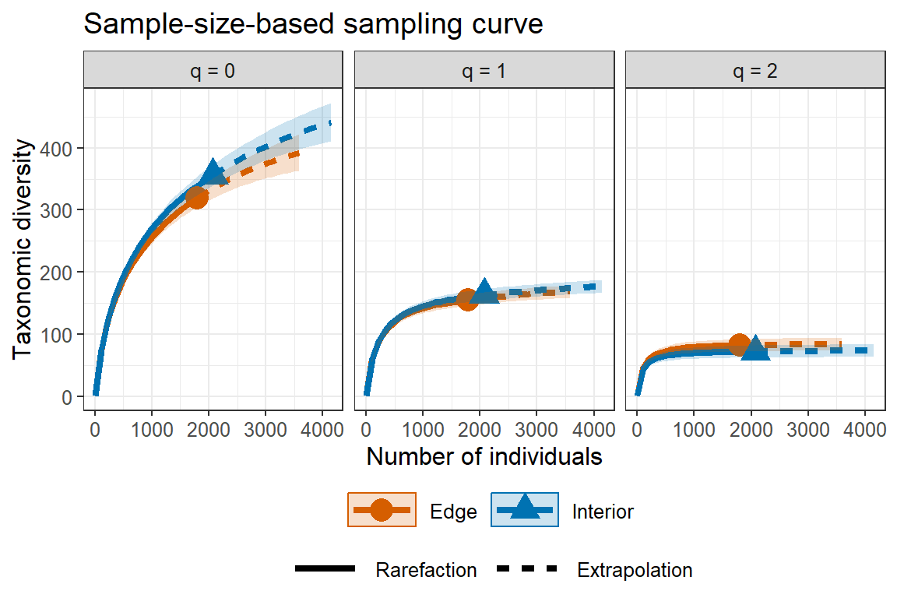

The following commands return the sample completeness (sample coverage)
curve (`type = 2`) in which different colors represent different
assemblages.

``` r
# Sample completeness curves for abundance data, separating by "Assemblage"
ggiNEXT3D(output_TD_abun, type = 2, color.var = "Assemblage")
```


The following commands return the coverage-based
rarefaction/extrapolation sampling curves in which different color
curves represent three diversity orders within each assemblage
(`facet.var = "Assemblage"`), or represent two assemblages within each
diversity order (`facet.var = "Order.q"`), respectively.

``` r
# TD coverage-based R/E curves, separating by "Assemblage"
ggiNEXT3D(output_TD_abun, type = 3, facet.var = "Assemblage")
```

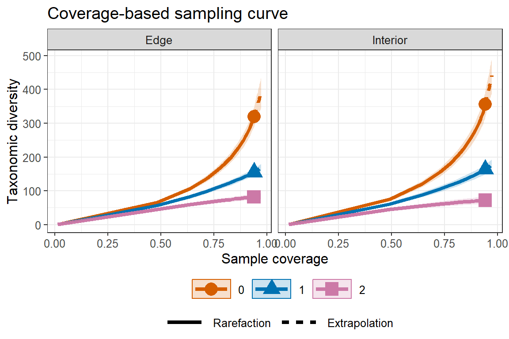

``` r
# TD coverage-based R/E curves, separating by "Order.q"
ggiNEXT3D(output_TD_abun, type = 3, facet.var = "Order.q")
```

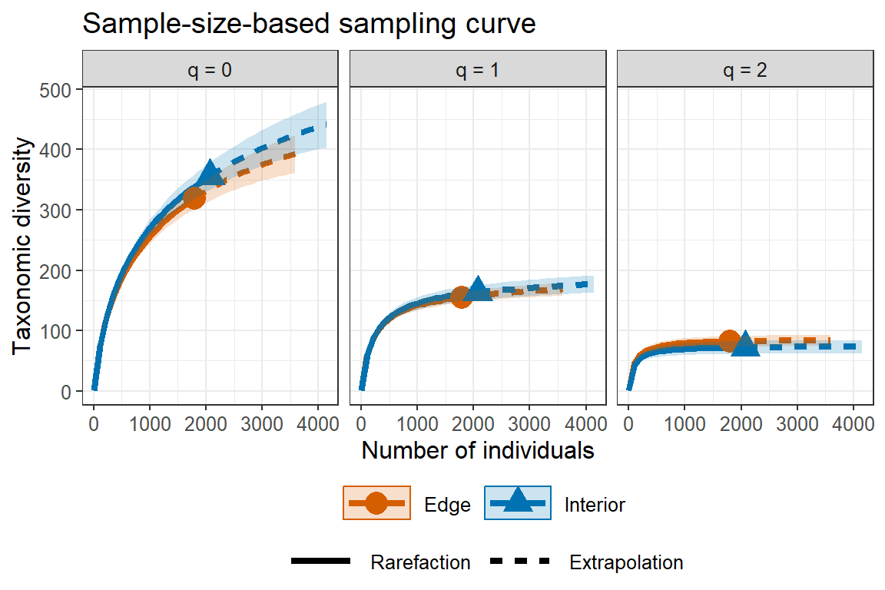

### EXAMPLE 2: TD rarefaction/extrapolation for incidence data

Based on the dataset (`Fish_incidence_data`) included in the package,
the following commands return all numerical results for `TD`. The first
list of the output (`$TDInfo`) returns basic data information including
the name of the Assemblage, number of sampling units (`T`), total number
of incidences (`U`), observed species richness (`S.obs`), sample
coverage estimate of the reference sample with size T (`SC(T)`), sample
coverage estimate of the extrapolated sample with size 2T (`SC(2T)`) as
well as the first five species incidence frequency counts in the
reference sample (`Q1-Q5`). The output is identical to that based on the
function `DataInfo3D()` by specifying `diversity = 'TD'` and
`datatype = "incidence_raw"`; see later text). Thus, if only data
information is required, the simpler function `DataInfo3D()` (see later
text) can be used to obtain the same output. More information about the
observed diversity (for any order q between 0 and 2) can be obtained by
function `ObsAsy3D()`, which will be introduced later.

``` r
data(Fish_incidence_data)
output_TD_inci <- iNEXT3D(Fish_incidence_data, diversity = 'TD', q = c(0, 1, 2), 
                          datatype = "incidence_raw")
output_TD_inci$TDInfo
```

    $TDInfo
      Assemblage  T   U S.obs SC(T) SC(2T) Q1 Q2 Q3 Q4 Q5
    1  2013-2015 36 532    50 0.980  0.993 11  6  4  1  3
    2  2016-2018 36 522    53 0.976  0.989 13  5  5  2  3

The second list of the output (`$TDiNextEst`) includes size- and
coverage-based standardized diversity estimates and related statistics
computed for 40 knots by default (for example in the `"2013-2015"` time
period, corresponding to the target number of sample units `mT` = 1, 2,
4, …, 34, 36, 37, 38, …, 72), which locates the reference sampling units
at the mid-point of the selected knots. There are two data frames
(`$size_based` and `$coverage_based`).

The first data frame (`$size_based`) includes the name of the
Assemblage, diversity order (`Order.q`), the target number of sampling
units (`mT`), the `Method` (`Rarefaction`, `Observed`, or
`Extrapolation`, depending on whether the target number of sample units
`mT` is less than, equal to, or greater than the number of sampling
units in the reference sample), the diversity estimate of order q
(`qTD`), the lower and upper confidence limits of diversity (`qTD.LCL`
and `qTD.UCL`) conditioning on the sample size, and the corresponding
sample coverage estimate (`SC`) along with the lower and upper
confidence limits of sample coverage (`SC.LCL` and `SC.UCL`). These
sample coverage estimates with confidence intervals are used for
plotting the sample completeness curve. If the argument `nboot` is
greater than zero, then a bootstrap method is applied to obtain the
confidence intervals for the diversity and sample coverage estimates.
Otherwise, all confidence intervals will not be computed. Here only the
first six rows of the `$size_based` output are displayed:

``` r
output_TD_inci$TDiNextEst$size_based
```

      Assemblage Order.q mT      Method    qTD qTD.LCL qTD.UCL    SC SC.LCL SC.UCL
    1  2013-2015       0  1 Rarefaction 14.778  14.035  15.521 0.606  0.574  0.637
    2  2013-2015       0  2 Rarefaction 20.603  19.639  21.567 0.749  0.726  0.772
    3  2013-2015       0  4 Rarefaction 27.079  25.703  28.455 0.851  0.834  0.867
    4  2013-2015       0  6 Rarefaction 31.121  29.430  32.813 0.894  0.880  0.908
    5  2013-2015       0  8 Rarefaction 34.042  32.095  35.989 0.919  0.907  0.931
    6  2013-2015       0 10 Rarefaction 36.319  34.149  38.488 0.934  0.923  0.945

The second data frame (`$coverage_based`) includes the name of
assemblage, the diversity order (`Order.q`), the target sample coverage
value (`SC`), the corresponding number of sampling units (`mT`), the
`Method` (`Rarefaction`, `Observed`, or `Extrapolation`, depending on
whether the coverage `SC` is less than, equal to, or greater than the
reference sample coverage), the diversity estimate of order q (`qTD`),
the lower and upper confidence limits of diversity (`qTD.LCL` and
`qTD.UCL`) conditioning on the target sample coverage value. Here only
the first six rows of the `$coverage_based` output are displayed below:
(Note for a fixed coverage value, the confidence interval in the
`$coverage_based` table is wider than the corresponding interval in the
`$size_based` table. This is because, for a given coverage value, the
sample size needed to attain a fixed coverage value varies with
bootstrap replication, leading to higher uncertainty on the resulting
diversity estimate.)

``` r
output_TD_inci$TDiNextEst$coverage_based
```

      Assemblage Order.q    SC mT      Method    qTD qTD.LCL qTD.UCL
    1  2013-2015       0 0.606  1 Rarefaction 14.778  13.999  15.556
    2  2013-2015       0 0.749  2 Rarefaction 20.603  19.158  22.049
    3  2013-2015       0 0.851  4 Rarefaction 27.079  24.966  29.193
    4  2013-2015       0 0.894  6 Rarefaction 31.121  28.553  33.690
    5  2013-2015       0 0.919  8 Rarefaction 34.042  31.102  36.982
    6  2013-2015       0 0.934 10 Rarefaction 36.319  33.010  39.628

The third list of the output (`$TDAsyEst`) includes the name of the
Assemblage, diversity label (`qTD`, species richness for q = 0, Shannon
diversity for q = 1, and Simpson diversity for q = 2), the observed
diversity (`TD_obs`), asymptotic diversity estimate (`TD_asy`) and its
estimated bootstrap standard error (`s.e.`) as well as the confidence
intervals for asymptotic diversity (`qTD.LCL` and `qTD.UCL`). These
statistics are computed only for q = 0, 1 and 2. More detailed
information about asymptotic and observed diversity estimates for any
order q between 0 and 2 can be obtained from function `ObsAsy3D()`. The
output is shown below:

``` r
output_TD_inci$TDAsyEst
```

      Assemblage               qTD TD_obs TD_asy   s.e. qTD.LCL qTD.UCL
    1  2013-2015  Species richness 50.000 59.803  8.208  43.716  75.890
    2  2013-2015 Shannon diversity 30.089 31.542  1.185  29.219  33.864
    3  2013-2015 Simpson diversity 23.961 24.394  0.754  22.915  25.873
    4  2016-2018  Species richness 53.000 69.431 10.444  48.961  89.900
    5  2016-2018 Shannon diversity 31.534 33.393  1.252  30.940  35.847
    6  2016-2018 Simpson diversity 24.889 25.409  0.738  23.963  26.855

The `ggiNEXT3D` function can be used to make graphical displays for
rarefaction and extrapolation sampling curves. When
`facet.var = "Assemblage"` is specified in the `ggiNEXT3D` function, it
creates a separate plot for each assemblage; within each assemblage,
different color curves represent diversity of different orders. An
example for showing sample-size-based rarefaction/extrapolation curves
(`type = 1`) for incidence data is given below:

``` r
# TD sample-size-based R/E curves for incidence data, separating by "Assemblage"
ggiNEXT3D(output_TD_inci, type = 1, facet.var = "Assemblage")
```

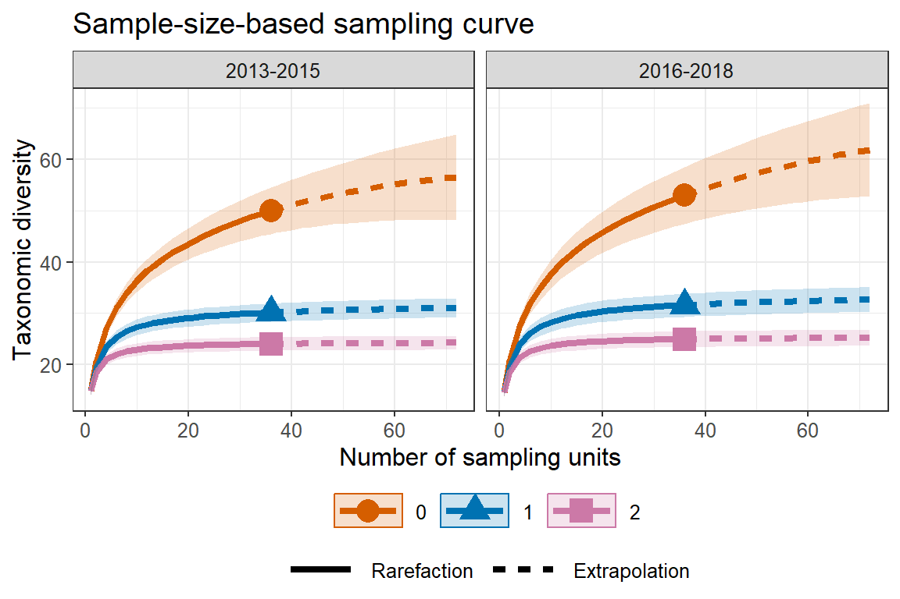

When `facet.var = "Order.q"` is specified in the `ggiNEXT3D` function,
it creates a separate plot for each diversity order; within each plot,
different color curves represent different assemblages. An example is
shown below:

``` r
# TD sample-size-based R/E curves for incidence data, separating by "Order.q"
ggiNEXT3D(output_TD_inci, type = 1, facet.var = "Order.q")
```

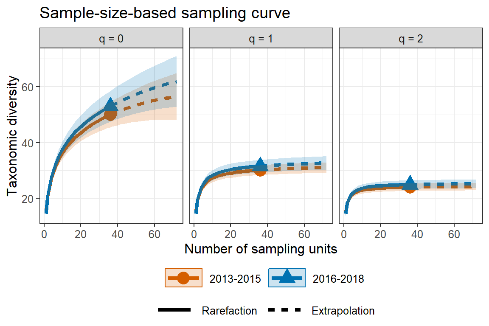

The following commands return the sample completeness (sample coverage)
curve (`type = 2`) in which different colors are used for different
assemblages.

``` r
# Sample completeness curves for incidence data, separating by "Assemblage"
ggiNEXT3D(output_TD_inci, type = 2, color.var = "Assemblage")
```

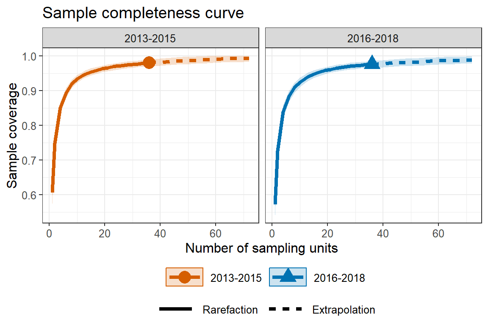

The following commands return the coverage-based
rarefaction/extrapolation sampling curves in which different color
curves represent three diversity orders within each assemblage
(`facet.var = "Assemblage"`), or represent two assemblages within each
diversity order (`facet.var = "Order.q"`), respectively.

``` r
# TD coverage-based R/E curves for incidence data, separating by "Assemblage"
ggiNEXT3D(output_TD_inci, type = 3, facet.var = "Assemblage")
```

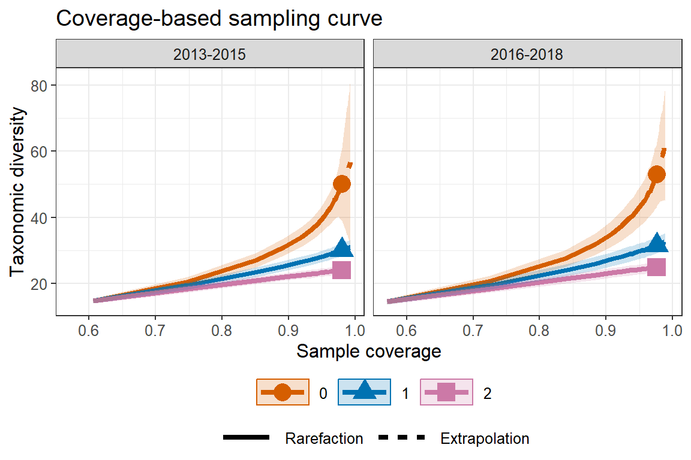

``` r
# TD coverage-based R/E curves for incidence data, separating by "Order.q"
ggiNEXT3D(output_TD_inci, type = 3, facet.var = "Order.q")
```

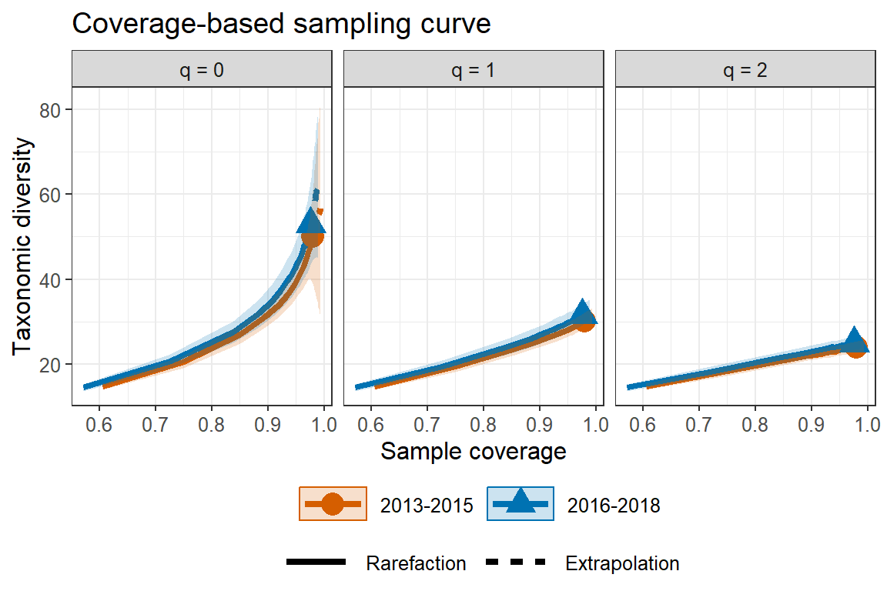

## <span style="color:blue;">PHYLOGENETIC DIVERSITY (PD): RAREFACTION/EXTRAPOLATION VIA EXAMPLES</span>

### EXAMPLE 3: PD rarefaction/extrapolation for abundance data

Based on the dataset (`Brazil_rainforest_abun_data`) and the phylogentic
tree (`Brazil_rainforest_phylo_tree`) included in the package, the
following commands return all numerical results for `PD`. The first list
of the output (`$PDInfo`) returns basic data information including the
name of the Assemblage, sample size (`n`), observed species richness
(`S.obs`), sample coverage estimate of the reference sample with size n
(`SC(n)`), sample coverage estimate of the extrapolated sample with size
2n (`SC(2n)`), the observed total branch length in the phylogenetic tree
spanned by all observed specise (`PD.obs`), the number of singletons and
doubletons in the node/branch abundance set (`f1*,f2*`), the total
branch length of those singletons and doubletons in the node/branch
abundance set (`g1,g2`), and the reference time (`Reftime`). The output
is identical to that based on the function `DataInfo3D()` by specifying
`diversity = 'PD'` and `datatype = "abundance"`; see later text). Thus,
if only data information is required, the simpler function
`DataInfo3D()` (see later text) can be used to obtain the same output.
More information about the observed diversity (for any order q between 0
and 2) can be obtained by function `ObsAsy3D()`, which will be
introduced later.

The required argument for performing PD analysis is `PDtree`. For
example, the phylogenetic tree for all observed species (including
species in both Edge and Interior habitats) is stored in
`Brazil_rainforest_phylo_tree`. Then we enter the argument
`PDtree = Brazil_rainforest_phylo_tree`. Two optional arguments are:
`PDtype` and `PDreftime`. There are two options for `PDtype`: `"PD"`
(effective total branch length) or `"meanPD"` (effective number of
equally divergent lineages, `meanPD` = PD/tree depth). Default is
`PDtype = "meanPD"`. `PDreftime` is a numerical value specifying a
reference time for computing phylogenetic diversity. By default
(`PDreftime = NULL`), the reference time is set to the tree depth, i.e.,
age of the root of the phylogenetic tree. Run the following code to
perform PD analysis.

``` r
data(Brazil_rainforest_abun_data)
data(Brazil_rainforest_phylo_tree)
data <- Brazil_rainforest_abun_data
tree <- Brazil_rainforest_phylo_tree
output_PD_abun <- iNEXT3D(data, diversity = 'PD', q = c(0, 1, 2), datatype = "abundance", 
                          nboot = 20, PDtree = tree)
output_PD_abun$PDInfo
```

    $PDInfo
    # A tibble: 2 x 11
      Assemblage     n S.obs `SC(n)` `SC(2n)` PD.obs `f1*` `f2*`    g1    g2 Reftime
      <chr>      <int> <int>   <dbl>    <dbl>  <dbl> <dbl> <dbl> <dbl> <dbl>   <dbl>
    1 Edge        1794   319   0.939    0.974  24516   110    52  6578  2885     400
    2 Interior    2074   356   0.941    0.973  27727   123    56  7065  3656     400

The second list of the output (`$PDiNextEst`) includes size- and
coverage-based standardized diversity estimates and related statistics
computed for 40 knots by default (for example in the “Edge” assemblage,
corresponding to the target sample size `m` = 1, 95, 189, …, 1699, 1794,
1795, 1899, …, 3588), which locates the reference sample size at the
mid-point of the selected knots. There are two data frames
(`$size_based` and `$coverage_based`).

The first data frame (`$size_based`) includes the name of the
Assemblage, diversity order (`Order.q`), the target sample size (`m`),
the `Method` (`Rarefaction`, `Observed`, or `Extrapolation`, depending
on whether the size `m` is less than, equal to, or greater than the
reference sample size), the diversity estimate of order q (`qPD`), the
lower and upper confidence limits of diversity (`qPD.LCL` and `qPD.UCL`)
conditioning on the sample size, the corresponding sample coverage
estimate (`SC`) along with the lower and upper confidence limits of
sample coverage (`SC.LCL` and `SC.UCL`), the reference time (`Reftime`)
and the type of PD (`Type`). These sample coverage estimates with
confidence intervals are used for plotting the sample completeness
curve. If the argument `nboot` is greater than zero, then a bootstrap
method is applied to obtain the confidence intervals for the diversity
and sample coverage estimates. Otherwise, all confidence intervals will
not be computed. Here only the first six rows of the `$size_based`
output are displayed:

``` r
output_PD_abun$PDiNextEst$size_based
```

      Assemblage Order.q   m      Method    qPD qPD.LCL qPD.UCL    SC SC.LCL SC.UCL Reftime   Type
    1       Edge       0   1 Rarefaction  1.000   0.989   1.011 0.012  0.011  0.013     400 meanPD
    2       Edge       0  95 Rarefaction 18.547  18.090  19.004 0.484  0.470  0.498     400 meanPD
    3       Edge       0 189 Rarefaction 26.723  26.039  27.407 0.638  0.625  0.650     400 meanPD
    4       Edge       0 284 Rarefaction 32.305  31.458  33.153 0.718  0.707  0.730     400 meanPD
    5       Edge       0 378 Rarefaction 36.498  35.522  37.475 0.768  0.758  0.779     400 meanPD
    6       Edge       0 472 Rarefaction 39.882  38.791  40.972 0.803  0.792  0.814     400 meanPD

The second data frame (`$coverage_based`) includes the name of
assemblage, the diversity order (`Order.q`), the target sample coverage
value (`SC`), the corresponding sample size (`m`), the `Method`
(`Rarefaction`, `Observed`, or `Extrapolation`, depending on whether the
coverage `SC` is less than, equal to, or greater than the reference
sample coverage), the diversity estimate of order q (`qPD`), the lower
and upper confidence limits of diversity (`qPD.LCL` and `qPD.UCL`)
conditioning on the target sample coverage value, the reference times
(`Reftime`) and the type of PD (`Type`). Here only the first six rows of
the `$coverage_based` output are displayed below: (Note for a fixed
coverage value, the confidence interval in the `$coverage_based` table
is wider than the corresponding interval in the `$size_based` table.
This is because, for a given coverage value, the sample size needed to
attain a fixed coverage value varies with bootstrap replication, leading
to higher uncertainty on the resulting diversity estimate.)

``` r
output_PD_abun$PDiNextEst$coverage_based
```

      Assemblage Order.q    SC   m      Method    qPD qPD.LCL qPD.UCL Reftime   Type
    1       Edge       0 0.012   1 Rarefaction  1.000   0.977   1.023     400 meanPD
    2       Edge       0 0.484  95 Rarefaction 18.547  17.705  19.388     400 meanPD
    3       Edge       0 0.638 189 Rarefaction 26.723  25.592  27.854     400 meanPD
    4       Edge       0 0.718 284 Rarefaction 32.305  30.931  33.679     400 meanPD
    5       Edge       0 0.768 378 Rarefaction 36.498  34.900  38.097     400 meanPD
    6       Edge       0 0.803 472 Rarefaction 39.882  38.070  41.693     400 meanPD

The third list of the output (`$PDAsyEst`) includes the name of the
Assemblage, PD (or meanPD) for q = 0, 1, and 2 (`qPD`), the observed
diversity (`PD_obs`), asymptotic diversity estimates (`PD_asy`),
estimated asymptotic bootstrap standard error (`s.e.`) as well as the
confidence intervals for asymptotic diversity with q = 0, 1, and 2
(`qPD.LCL` and `qPD.UCL`), the reference times (`Reftime`) and the type
of PD (`Type`). These statistics are computed only for q = 0, 1 and 2.
More detailed information about asymptotic and observed diversity
estimates for any order q between 0 and 2 can be obtained from function
`ObsAsy3D()`. The output is shown below:

``` r
output_PD_abun$PDAsyEst
```

      Assemblage      qPD PD_obs PD_asy  s.e. qPD.LCL qPD.UCL Reftime   Type
    1       Edge q = 0 PD 61.290 80.027 4.638  70.936  89.118     400 meanPD
    2       Edge q = 1 PD  5.246  5.372 0.147   5.084   5.660     400 meanPD
    3       Edge q = 2 PD  1.797  1.798 0.032   1.735   1.860     400 meanPD
    4   Interior q = 0 PD 69.318 86.375 4.199  78.145  94.605     400 meanPD
    5   Interior q = 1 PD  5.721  5.854 0.121   5.616   6.092     400 meanPD
    6   Interior q = 2 PD  1.914  1.915 0.031   1.854   1.975     400 meanPD

The `ggiNEXT3D` function can be used to make graphical displays for
rarefaction and extrapolation sampling curves. When
`facet.var = "Assemblage"` is specified in the `ggiNEXT3D` function, it
creates a separate plot for each assemblage; within each assemblage,
different color curves represent diversity of different orders. An
example for showing sample-size-based rarefaction/extrapolation curves
(`type = 1`) is given below:

``` r
# PD sample-size-based R/E curves, separating by "Assemblage"
ggiNEXT3D(output_PD_abun, type = 1, facet.var = "Assemblage")
```

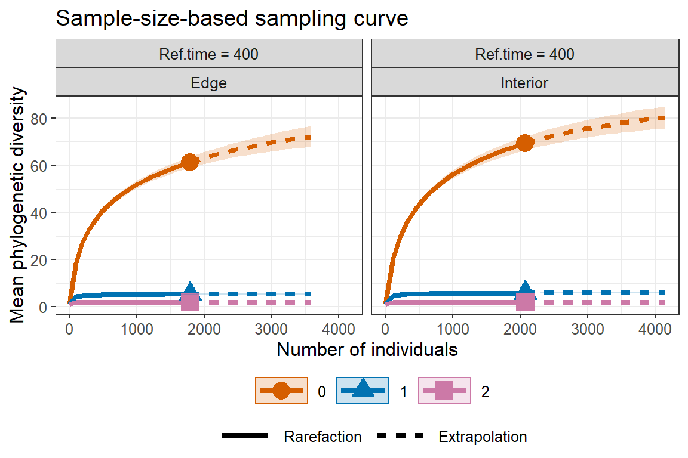

When `facet.var = "Order.q"` is specified in the `ggiNEXT3D` function,
it creates a separate plot for each diversity order; within each plot,
different color curves represent different assemblages. An example is
shown below:

``` r
# PD sample-size-based R/E curves, separating by "Order.q"
ggiNEXT3D(output_PD_abun, type = 1, facet.var = "Order.q")
```

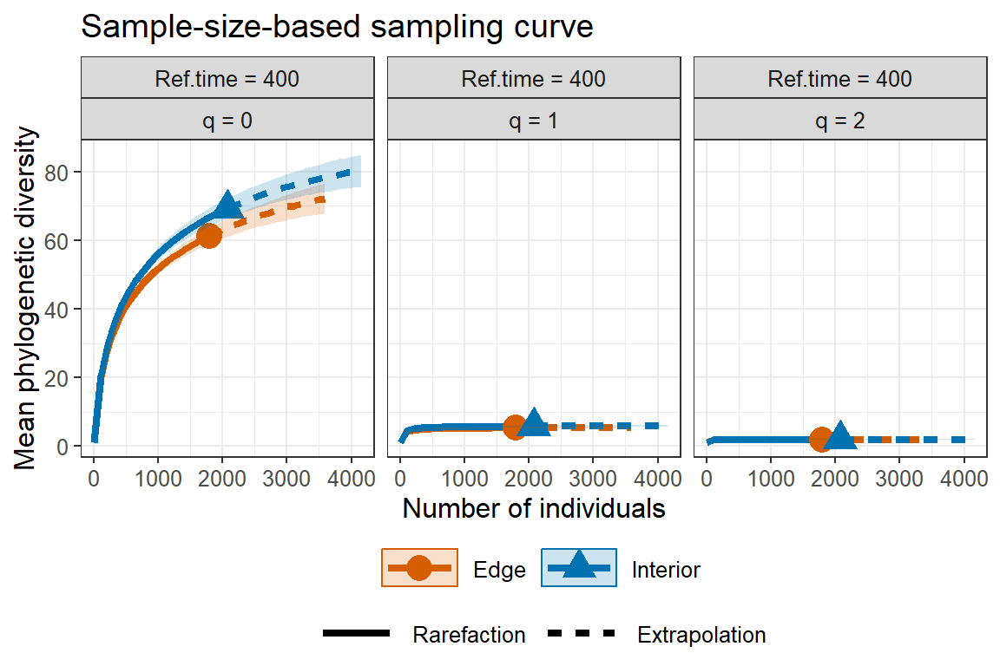

The following commands return the sample completeness (sample coverage)
curve (`type = 2`) in which different colors are used for different
assemblages.

``` r
# Sample completeness curves for abundance data, separating by "Assemblage"
ggiNEXT3D(output_PD_abun, type = 2, color.var = "Assemblage")
```


The following commands return the coverage-based
rarefaction/extrapolation sampling curves in which different color
curves represent three diversity orders within each assemblage
(`facet.var = "Assemblage"`), or represent two assemblages within each
diversity order (`facet.var = "Order.q"`), respectively.

``` r
# PD coverage-based R/E curves, separating by "Assemblage"
ggiNEXT3D(output_PD_abun, type = 3, facet.var = "Assemblage")
```

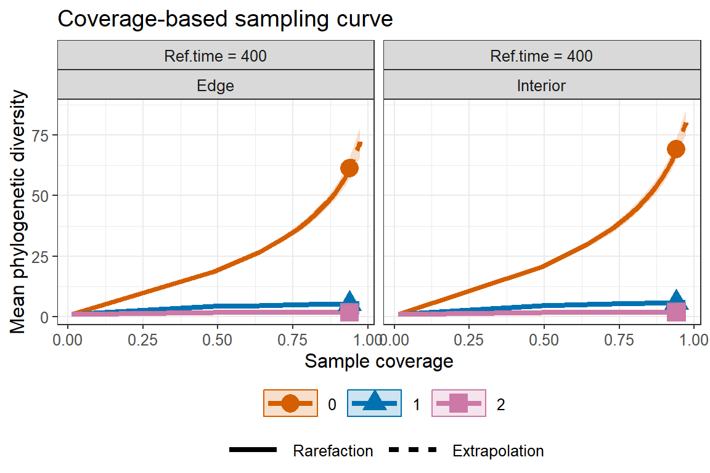

``` r
# PD coverage-based R/E curves, separating by "Order.q"
ggiNEXT3D(output_PD_abun, type = 3, facet.var = "Order.q")
```

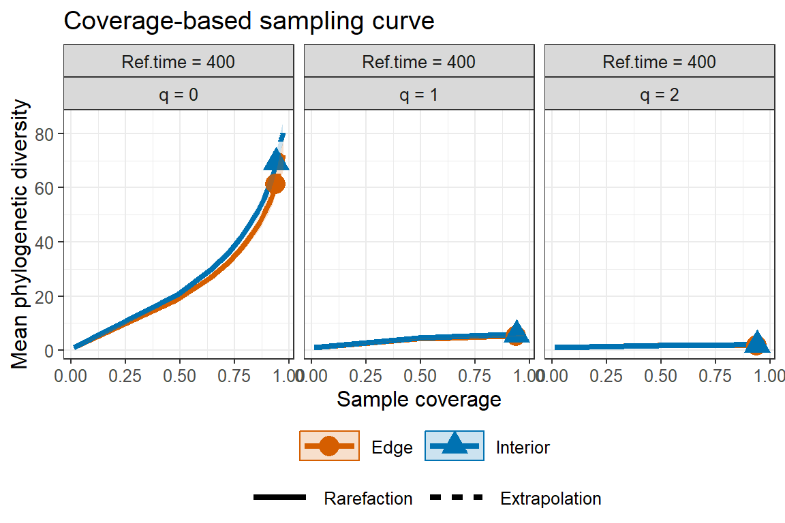

### EXAMPLE 4: PD rarefaction/extrapolation for incidence data

Based on the dataset (`Fish_incidence_data`) included in the package and
the phylogentic tree (`Fish_phylo_tree`), the following commands return
all numerical results for `PD`. The first list of the output (`$PDInfo`)
returns basic data information including the name of the Assemblage,
number of sampling units (`T`), total number of incidences (`U`),
observed species richness (`S.obs`), sample coverage estimate of the
reference sample with size T (`SC(T)`), sample coverage estimate of the
extrapolated sample with size 2T (`SC(2T)`), the observed total branch
length in the phylogenetic tree spanned by all observed species
(`PD.obs`), the singletons/doubletons in the sample branch incidence
(`Q1*,Q2*`), the total branch length of those singletons/doubletons in
the sample branch incidence (`R1,R2`), and the reference time
(`Reftime`). The output is identical to that based on the function
`DataInfo3D()` by specifying `diversity = 'PD'` and
`datatype = "incidence_raw"`; see later text). Thus, if only data
information is required, the simpler function `DataInfo3D()` (see later
text) can be used to obtain the same output. More information about the
observed diversity (for any order q between 0 and 2) can be obtained by
function `ObsAsy3D()`, which will be introduced later.

The required argument for performing PD analysis is `PDtree`. For
example, the phylogenetic tree for all observed species (including
species in both `"2013-2015"` and `"2016-2018"` time periods) is stored
in `Fish_phylo_tree`. Then we enter the argument
`PDtree = Fish_phylo_tree`. Two optional arguments are: `PDtype` and
`PDreftime`. There are two options for `PDtype`: `"PD"` (effective total
branch length) or `"meanPD"` (effective number of equally divergent
lineages, `meanPD` = PD/tree depth). Default is `PDtype = "meanPD"`.
`PDreftime` is a numerical value specifying a reference time for
computing phylogenetic diversity. By default (`PDreftime = NULL`), the
reference time is set to the tree depth, i.e., age of the root of the
phylogenetic tree. Run the following code to perform PD analysis.

``` r
data(Fish_incidence_data)
data(Fish_phylo_tree)
data <- Fish_incidence_data
tree <- Fish_phylo_tree
output_PD_inci <- iNEXT3D(data, diversity = 'PD', q = c(0, 1, 2), 
                          datatype = "incidence_raw", nboot = 20, PDtree = tree)
output_PD_inci$PDInfo
```

    $PDInfo
    # A tibble: 2 x 12
      Assemblage     T     U S.obs `SC(T)` `SC(2T)` PD.obs `Q1*` `Q2*`    R1    R2 Reftime
      <chr>      <int> <int> <int>   <dbl>    <dbl>  <dbl> <dbl> <dbl> <dbl> <dbl>   <dbl>
    1 2013-2015     36   532    50   0.98     0.993   9.62    11     7 0.69  1.23    0.977
    2 2016-2018     36   522    53   0.976    0.989   9.44    13     6 0.368 0.345   0.977

The second list of the output (`$PDiNextEst`) includes size- and
coverage-based standardized diversity estimates and related statistics
computed for 40 knots by default (for example in the `"2013-2015"` time
period, corresponding to the target number of sample units `mT` = 1, 2,
4, …, 34, 36, 37, 38, …, 72), which locates the reference sampling units
at the mid-point of the selected knots. There are two data frames
(`$size_based` and `$coverage_based`).

The first data frame (`$size_based`) includes the name of the
Assemblage, diversity order (`Order.q`), the target number of sample
units (`mT`), the `Method` (`Rarefaction`, `Observed`, or
`Extrapolation`, depending on whether the target number of sample units
`mT` is less than, equal to, or greater than the number of sampling
units in the reference sample), the diversity estimate of order q
(`qPD`), the lower and upper confidence limits of diversity (`qPD.LCL`
and `qPD.UCL`) conditioning on the sample size, the corresponding sample
coverage estimate (`SC`) along with the lower and upper confidence
limits of sample coverage (`SC.LCL` and `SC.UCL`), the reference time
(`Reftime`) and the type of PD (`Type`). These sample coverage estimates
with confidence intervals are used for plotting the sample completeness
curve. If the argument `nboot` is greater than zero, then a bootstrap
method is applied to obtain the confidence intervals for the diversity
and sample coverage estimates. Otherwise, all confidence intervals will
not be computed. Here only the first six rows of the `$size_based`
output are displayed:

``` r
output_PD_inci$PDiNextEst$size_based
```

      Assemblage Order.q mT      Method   qPD qPD.LCL qPD.UCL    SC SC.LCL SC.UCL Reftime   Type
    1  2013-2015       0  1 Rarefaction 5.744   5.518   5.969 0.606  0.576  0.635   0.977 meanPD
    2  2013-2015       0  2 Rarefaction 6.813   6.551   7.075 0.749  0.731  0.767   0.977 meanPD
    3  2013-2015       0  4 Rarefaction 7.716   7.447   7.986 0.851  0.840  0.861   0.977 meanPD
    4  2013-2015       0  6 Rarefaction 8.130   7.813   8.446 0.894  0.886  0.903   0.977 meanPD
    5  2013-2015       0  8 Rarefaction 8.389   8.012   8.767 0.919  0.911  0.927   0.977 meanPD
    6  2013-2015       0 10 Rarefaction 8.589   8.151   9.027 0.934  0.926  0.941   0.977 meanPD

The second data frame (`$coverage_based`) includes the name of
assemblage, the diversity order (`Order.q`), the target sample coverage
value (`SC`), the corresponding number of sample units (`mT`), the
`Method` (`Rarefaction`, `Observed`, or `Extrapolation`, depending on
whether the coverage `SC` is less than, equal to, or greater than the
reference sample coverage), the diversity estimate of order q (`qPD`),
the lower and upper confidence limits of diversity (`qPD.LCL` and
`qPD.UCL`) conditioning on the target sample coverage value, the
reference time (`Reftime`) and the type of PD (`Type`). Here only the
first six rows of the `$coverage_based` output are displayed below:
(Note for a fixed coverage value, the confidence interval in the
`$coverage_based` table is wider than the corresponding interval in the
`$size_based` table. This is because, for a given coverage value, the
sample size needed to attain a fixed coverage value varies with
bootstrap replication, leading to higher uncertainty on the resulting
diversity estimate.)

``` r
output_PD_inci$PDiNextEst$coverage_based
```

      Assemblage Order.q    SC mT      Method   qPD qPD.LCL qPD.UCL Reftime   Type
    1  2013-2015       0 0.606  1 Rarefaction 5.744   5.504   5.983   0.977 meanPD
    2  2013-2015       0 0.749  2 Rarefaction 6.813   6.557   7.069   0.977 meanPD
    3  2013-2015       0 0.851  4 Rarefaction 7.716   7.455   7.978   0.977 meanPD
    4  2013-2015       0 0.894  6 Rarefaction 8.130   7.811   8.448   0.977 meanPD
    5  2013-2015       0 0.919  8 Rarefaction 8.389   8.003   8.776   0.977 meanPD
    6  2013-2015       0 0.934 10 Rarefaction 8.589   8.138   9.041   0.977 meanPD

The third list of the output (`$PDAsyEst`) includes the name of the
Assemblage, PD (or meanPD) for q = 0, 1, and 2 (`qPD`), the observed
diversity (`PD_obs`), asymptotic diversity estimate (`PD_asy`) and its
estimated bootstrap standard error (`s.e.`), the confidence intervals
for asymptotic diversity (`qPD.LCL` and `qPD.UCL`), the reference time
(`Reftime`) and the type of PD (`Type`) . These statistics are computed
only for q = 0, 1 and 2. More detailed information about asymptotic and
observed diversity estimates for any order q between 0 and 2 can be
obtained from function `ObsAsy3D()`. The output is shown below:

``` r
output_PD_inci$PDAsyEst
```

      Assemblage      qPD PD_obs PD_asy  s.e. qPD.LCL qPD.UCL Reftime   Type
    1  2013-2015 q = 0 PD  9.847 10.039 0.651   8.764  11.315   0.977 meanPD
    2  2013-2015 q = 1 PD  7.635  7.729 0.169   7.397   8.061   0.977 meanPD
    3  2013-2015 q = 2 PD  7.013  7.057 0.160   6.744   7.371   0.977 meanPD
    4  2016-2018 q = 0 PD  9.659  9.854 1.309   7.288  12.420   0.977 meanPD
    5  2016-2018 q = 1 PD  7.781  7.859 0.194   7.478   8.240   0.977 meanPD
    6  2016-2018 q = 2 PD  7.202  7.244 0.185   6.882   7.606   0.977 meanPD

The `ggiNEXT3D` function can be used to make graphical displays for
rarefaction and extrapolation sampling curves. When
`facet.var = "Assemblage"` is specified in the `ggiNEXT3D` function, it
creates a separate plot for each assemblage; within each assemblage,
different color curves represent diversity of different orders. An
example for showing sample-size-based rarefaction/extrapolation curves
(`type = 1`) is given below:

``` r
# PD sample-size-based R/E curves for incidence data, separating by "Assemblage"
ggiNEXT3D(output_PD_inci, type = 1, facet.var = "Assemblage")
```

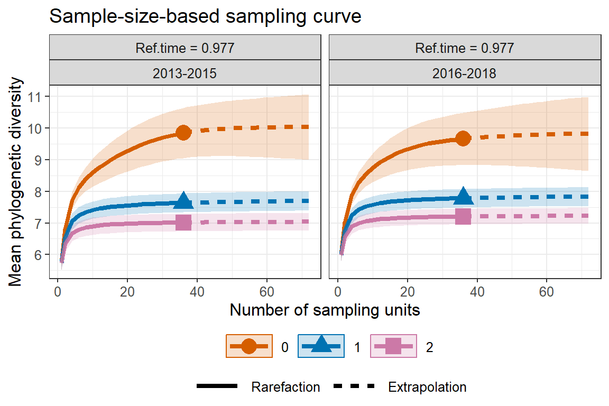

When `facet.var = "Order.q"` is specified in the `ggiNEXT3D` function,
it creates a separate plot for each diversity order; within each plot,
different color curves represent different assemblages. An example is
shown below:

``` r
# PD sample-size-based R/E curves for incidence data, separating by "Order.q"
ggiNEXT3D(output_PD_inci, type = 1, facet.var = "Order.q")
```

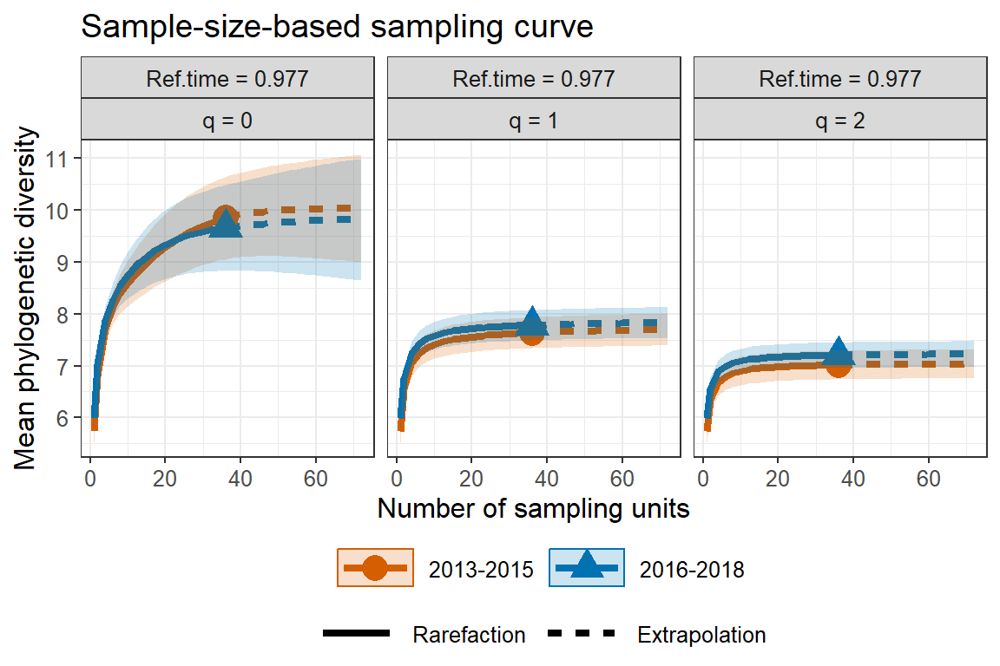

The following commands return the sample completeness (sample coverage)
curve (`type = 2`) in which different colors are used for different
assemblages.

``` r
# Sample completeness curves for incidence data, separating by "Assemblage"
ggiNEXT3D(output_PD_inci, type = 2, color.var = "Assemblage")
```

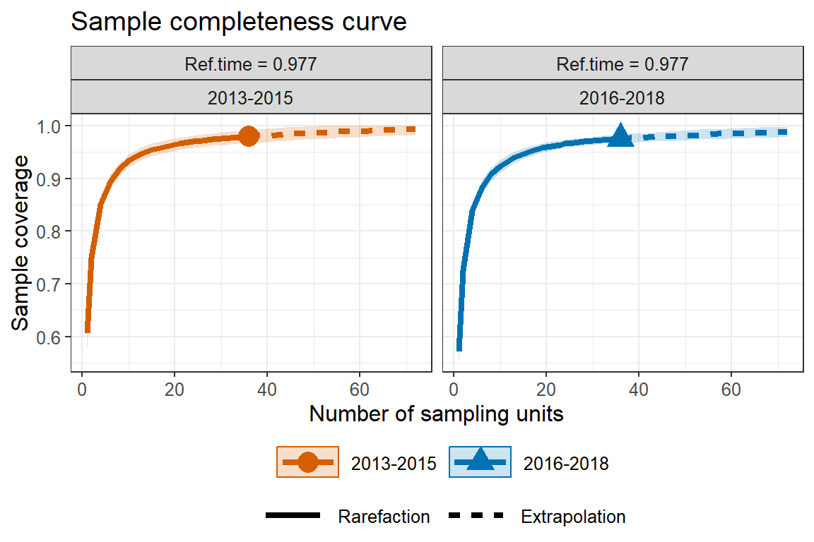

The following commands return the coverage-based
rarefaction/extrapolation sampling curves in which different color
curves represent three diversity orders within each assemblage
(`facet.var = "Assemblage"`), or represent two assemblages within each
diversity order (`facet.var = "Order.q"`), respectively.

``` r
# PD coverage-based R/E curves for incidence data, separating by "Assemblage"
ggiNEXT3D(output_PD_inci, type = 3, facet.var = "Assemblage")
```


``` r
# PD coverage-based R/E curves for incidence data, separating by "Order.q"
ggiNEXT3D(output_PD_inci, type = 3, facet.var = "Order.q")
```

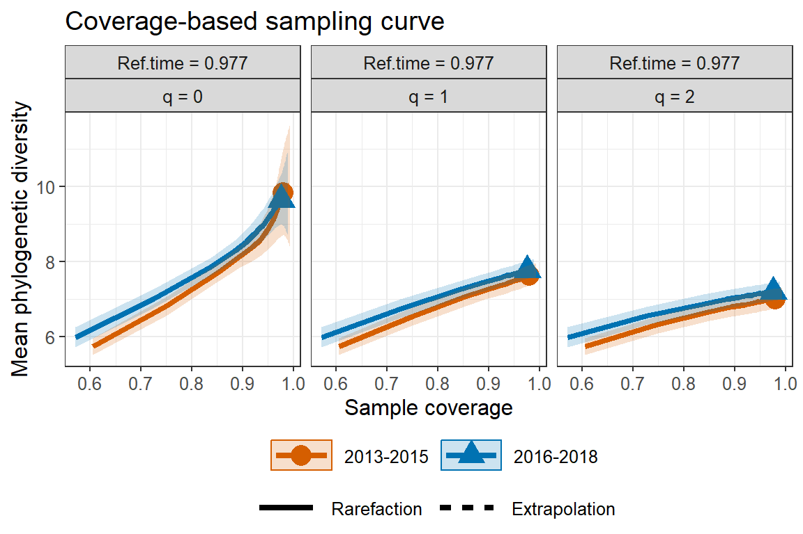

## <span style="color:blue;">FUNCTIONAL DIVERSITY (FD): RAREFACTION/EXTRAPOLATION VIA EXAMPLES</span>

### EXAMPLE 5: FD rarefaction/extrapolation for abundance data

Based on the dataset (`Brazil_rainforest_abun_data`) and the the
distance matrix (`Brazil_rainforest_distance_matrix`) included in the
package, the following commands return all numerical results for `FD`.
The first list of the output (`$FDInfo`) returns basic data information
including the name of the Assemblage, sample size (`n`), observed
species richness (`S.obs`), sample coverage estimate of the reference
sample with size n (`SC(n)`), sample coverage estimate of the
extrapolated sample with size 2n (`SC(2n)`), and the minimum, mean, and
maximum distance among all non-diagonal elements in the distance
matrix(`dmin, dmean, dmax`). The output is identical to that based on
the function `DataInfo3D()` by specifying `diversity = 'FD'` and
`datatype = "abundance"`; see later text). Thus, if only data
information is required, the simpler function `DataInfo3D()` (see later
text) can be used to obtain the same output. More information about the
observed diversity (for any order q between 0 and 2) can be obtained by
function `ObsAsy3D()`, which will be introduced later.

The required argument for performing FD analysis is `FDdistM`. For
example, the distance matrix for all species (including species in both
Edge and Interior habitats) is stored in
`Brazil_rainforest_distance_matrix`. Then we enter the argument
`FDdistM = Brazil_rainforest_distance_matrix` Three optional arguments
are (1) `FDtype`: `FDtype = "AUC"` means FD is computed from the area
under the curve of a tau-profile by integrating all plausible threshold
values between zero and one; `FDtype = "tau_values"` means FD is
computed under specific threshold values to be specified in the argument
`FD_tau`. (2) `FD_tau`: a numerical value specifying the tau value
(threshold level) that will be used to compute FD. If
`FDtype = "tau_values"` and `FD_tau = NULL`, then the threshold level is
set to be the mean distance between any two individuals randomly
selected from the pooled data over all data (i.e., quadratic entropy).

``` r
data(Brazil_rainforest_abun_data)
data(Brazil_rainforest_distance_matrix)
data <- Brazil_rainforest_abun_data
distM <- Brazil_rainforest_distance_matrix
output_FD_abun <- iNEXT3D(data, diversity = 'FD', datatype = "abundance", nboot = 10, 
                          FDdistM = distM, FDtype = 'AUC')
output_FD_abun$FDInfo
```

    $FDInfo
      Assemblage    n S.obs SC(n) SC(2n) dmin dmean  dmax
    1       Edge 1794   319 0.939  0.974    0 0.372 0.776
    2   Interior 2074   356 0.941  0.973    0 0.329 0.776

The second list of the output (`$FDiNextEst`) includes size- and
coverage-based standardized diversity estimates and related statistics
computed for 40 knots by default (for example in the “Edge” assemblage,
corresponding to the target sample size `m` = 1, 95, 189, …, 1699, 1794,
1795, 1899, …, 3588), which locates the reference sample size at the
mid-point of the selected knots. There are two data frames
(`$size_based` and `$coverage_based`).

The first data frame (`$size_based`) includes the name of the
Assemblage, diversity order (`Order.q`), the target sample size (`m`),
the `Method` (`Rarefaction`, `Observed`, or `Extrapolation`, depending
on whether the size `m` is less than, equal to, or greater than the
reference sample size), the diversity estimate of order q (`qFD`), the
lower and upper confidence limits of diversity (`qFD.LCL` and `qFD.UCL`)
conditioning on the sample size, and the corresponding sample coverage
estimate (`SC`) along with the lower and upper confidence limits of
sample coverage (`SC.LCL` and `SC.UCL`). These sample coverage estimates
with confidence intervals are used for plotting the sample completeness
curve. If the argument `nboot` is greater than zero, then a bootstrap
method is applied to obtain the confidence intervals for the diversity
and sample coverage estimates. Otherwise, all confidence intervals will
not be computed. Here only the first six rows of the `$size_based`
output are displayed:

``` r
output_FD_abun$FDiNextEst$size_based
```

      Assemblage Order.q   m      Method    qFD qFD.LCL qFD.UCL    SC SC.LCL SC.UCL
    1       Edge       0   1 Rarefaction  1.000   1.000   1.000 0.012  0.010  0.013
    2       Edge       0  95 Rarefaction 10.900  10.585  11.215 0.484  0.466  0.502
    3       Edge       0 189 Rarefaction 12.993  12.453  13.532 0.638  0.625  0.650
    4       Edge       0 284 Rarefaction 14.129  13.405  14.853 0.718  0.710  0.727
    5       Edge       0 378 Rarefaction 14.860  13.982  15.738 0.768  0.762  0.775
    6       Edge       0 472 Rarefaction 15.383  14.369  16.397 0.803  0.797  0.809

The second data frame (`$coverage_based`) includes the name of
assemblage, the diversity order (`Order.q`), the target sample coverage
value (`SC`), the corresponding sample size (`m`), the `Method`
(`Rarefaction`, `Observed`, or `Extrapolation`, depending on whether the
coverage `SC` is less than, equal to, or greater than the reference
sample coverage), the diversity estimate of order q (`qFD`), and the
lower and upper confidence limits of diversity (`qFD.LCL` and `qFD.UCL`)
conditioning on the target sample coverage value. Here only the first
six rows of the `$coverage_based` output are displayed below: (Note for
a fixed coverage value, the confidence interval in the `$coverage_based`
table is wider than the corresponding interval in the `$size_based`
table. This is because, for a given coverage value, the sample size
needed to attain a fixed coverage value varies with bootstrap
replication, leading to higher uncertainty on the resulting diversity
estimate.)

``` r
output_FD_abun$FDiNextEst$coverage_based
```

      Assemblage Order.q    SC   m      Method    qFD qFD.LCL qFD.UCL
    1       Edge       0 0.012   1 Rarefaction  1.000   0.993   1.007
    2       Edge       0 0.484  95 Rarefaction 10.900  10.497  11.303
    3       Edge       0 0.638 189 Rarefaction 12.993  12.439  13.546
    4       Edge       0 0.718 284 Rarefaction 14.129  13.431  14.827
    5       Edge       0 0.768 378 Rarefaction 14.860  14.021  15.700
    6       Edge       0 0.803 472 Rarefaction 15.383  14.398  16.368

The third list of the output (`$FDAsyEst`) includes the name of the
Assemblage, FD for q = 0, 1, and 2 (`qFD`), the observed diversity
(`FD_obs`), asymptotic diversity estimate (`FD_asy`) and its estimated
bootstrap standard error (`s.e.`) as well as the confidence intervals
for asymptotic diversity (`qFD.LCL` and `qFD.UCL`). These statistics are
computed only for q = 0, 1 and 2. More detailed information about
asymptotic and observed diversity estimates for any order q between 0
and 2 can be obtained from function `ObsAsy3D()`. The output is shown
below:

``` r
output_FD_abun$FDAsyEst
```

      Assemblage           qFD FD_obs FD_asy   s.e. qFD.LCL qFD.UCL
    1       Edge q = 0 FD(AUC) 17.851 19.008  6.753   5.771  32.244
    2       Edge q = 1 FD(AUC) 11.781 12.037  0.420  11.214  12.860
    3       Edge q = 2 FD(AUC)  9.139  9.228  0.292   8.657   9.800
    4   Interior q = 0 FD(AUC) 17.168 18.208 10.050   0.000  37.907
    5   Interior q = 1 FD(AUC)  9.716  9.922  0.429   9.081  10.763
    6   Interior q = 2 FD(AUC)  7.007  7.055  0.184   6.694   7.416

The `ggiNEXT3D` function can be used to make graphical displays for
rarefaction and extrapolation sampling curves. When
`facet.var = "Assemblage"` is specified in the `ggiNEXT3D` function, it
creates a separate plot for each assemblage; within each assemblage,
different color curves represent diversity of different orders. An
example for showing sample-size-based rarefaction/extrapolation curves
(`type = 1`) is given below:

``` r
# FD sample-size-based R/E curves, separating by "Assemblage"
ggiNEXT3D(output_FD_abun, type = 1, facet.var = "Assemblage")
```

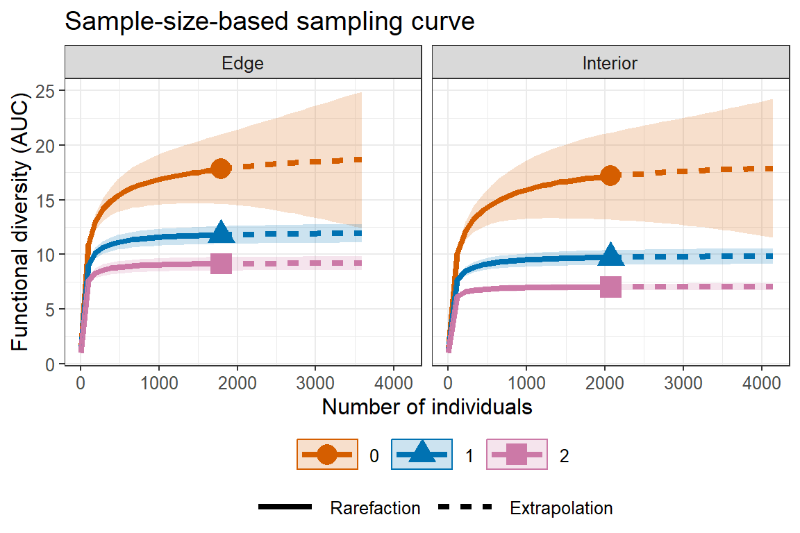

When `facet.var = "Order.q"` is specified in the `ggiNEXT3D` function,
it creates a separate plot for each diversity order; within each plot,
different color curves represent different assemblages. An example is
shown below:

``` r
# FD sample-size-based R/E curves, separating by "Order.q"
ggiNEXT3D(output_FD_abun, type = 1, facet.var = "Order.q")
```

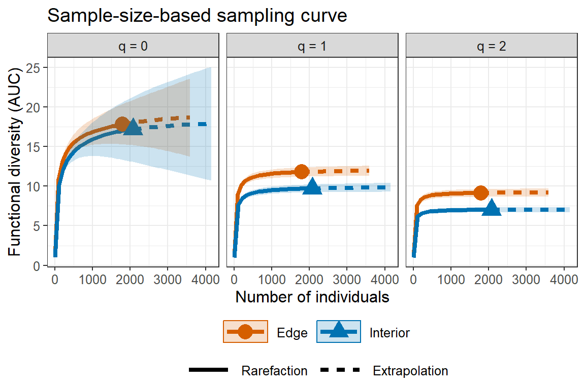

The following commands return the sample completeness (sample coverage)
curve (`type = 2`) in which different colors are used for different
assemblages.

``` r
# Sample completeness curves for abundance data, separating by "Assemblage"
ggiNEXT3D(output_FD_abun, type = 2, color.var = "Assemblage")
```

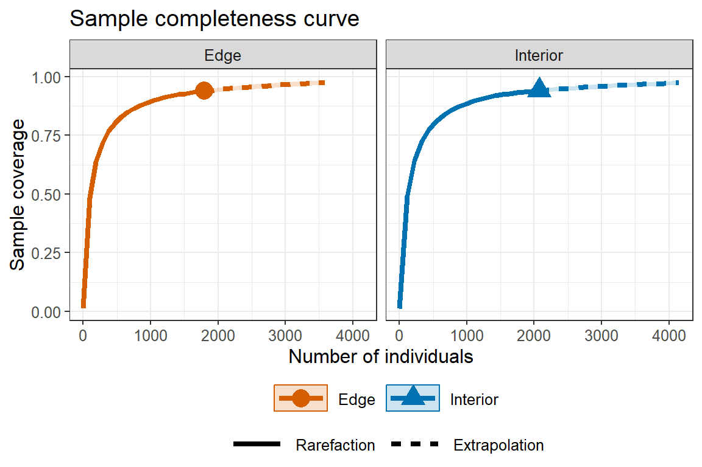

The following commands return the coverage-based
rarefaction/extrapolation sampling curves in which different color
curves represent three diversity orders within each assemblage
(`facet.var = "Assemblage"`), or represent two assemblages within each
diversity order (`facet.var = "Order.q"`), respectively.

``` r
# FD coverage-based R/E curves, separating by "Assemblage"
ggiNEXT3D(output_FD_abun, type = 3, facet.var = "Assemblage")
```

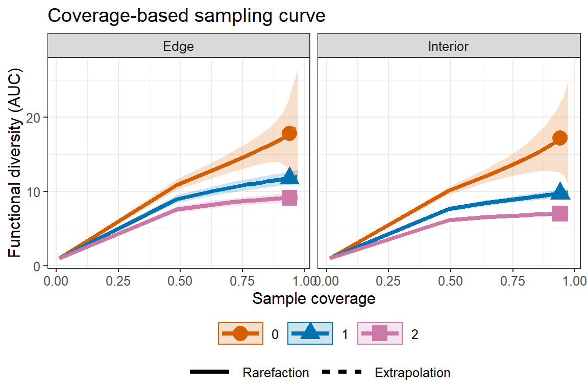

``` r
# FD coverage-based R/E curves, separating by "Order.q"
ggiNEXT3D(output_FD_abun, type = 3, facet.var = "Order.q")
```

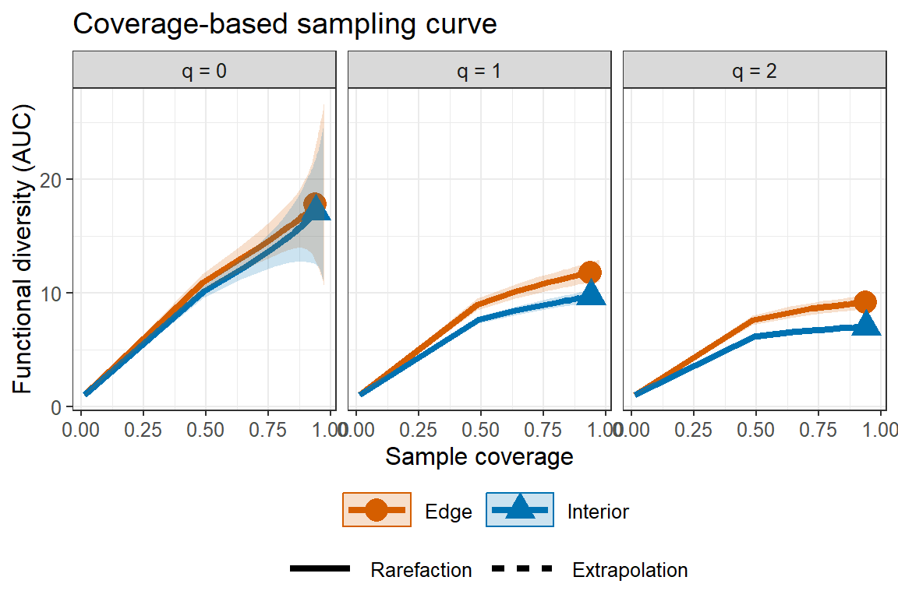

### EXAMPLE 6: FD rarefaction/extrapolation for incidence data

Based on the dataset (`Fish_incidence_data`) and the the distance matrix
(`Fish_distance_matrix`) included in the package, the following commands
return all numerical results for `FD`. The first list of the output
(`$FDInfo`) returns basic data information including the name of the
Assemblage, number of sampling units (`T`), total number of incidences
(`U`), observed species richness (`S.obs`), sample coverage estimate of
the reference sample with size T (`SC(T)`), sample coverage estimate of
the reference sample with size 2T (`SC(2T)`), and the minimum, mean, and
maximum distance among all non-diagonal elements in the distance
matrix(`dmin, dmean, dmax`). The output is identical to that based on
the function `DataInfo3D()` by specifying `diversity = 'FD'` and
`datatype = "incidence_raw"`; see later text). Thus, if only data
information is required, the simpler function `DataInfo3D()` (see later
text) can be used to obtain the same output. More information about the
observed diversity (for any order q between 0 and 2) can be obtained by
function `ObsAsy3D()`, which will be introduced later.

The required argument for performing FD analysis is `FDdistM`. For
example, the distance matrix for all species (including species in both
`"2013-2015"` and `"2016-2018"` time periods) is stored in
`Fish_distance_matrix`. Then we enter the argument
`FDdistM = Fish_distance_matrix` Three optional arguments are (1)
`FDtype`: `FDtype = "AUC"` means FD is computed from the area under the
curve of a tau-profile by integrating all plausible threshold values
between zero and one; `FDtype = "tau_values"` means FD is computed under
specific threshold values to be specified in the argument FD_tau. (2)
`FD_tau`: a numerical value specifying the tau value (threshold level)
that will be used to compute FD. If `FDtype = "tau_values"` and
`FD_tau = NULL`, then the threshold level is set to be the mean distance
between any two individuals randomly selected from the pooled data over
all data (i.e., quadratic entropy).

``` r
data(Fish_incidence_data)
data(Fish_distance_matrix)
data <- Fish_incidence_data
distM <- Fish_distance_matrix
output_FD_inci <- iNEXT3D(data, diversity = 'FD', datatype = "incidence_raw", nboot = 20, 
                          FDdistM = distM, FDtype = 'AUC')
output_FD_inci$FDInfo
```

    $FDInfo
      Assemblage  T   U S.obs SC(T) SC(2T)  dmin dmean  dmax
    1  2013-2015 36 532    50 0.980  0.993 0.006 0.240 0.733
    2  2016-2018 36 522    53 0.976  0.989 0.006 0.237 0.733

The second list of the output (`$FDiNextEst`) includes size- and
coverage-based standardized diversity estimates and related statistics
computed for 40 knots by default (for example in the `"2013-2015"` time
period, corresponding to the target number of sample units `mT` = 1, 2,
4, …, 34, 36, 37, 38, …, 72), which locates the reference sampling units
at the mid-point of the selected knots. There are two data frames
(`$size_based` and `$coverage_based`).

The first data frame (`$size_based`) includes the name of the
Assemblage, diversity order (`Order.q`), the target number of sample
units (`mT`), the `Method` (`Rarefaction`, `Observed`, or
`Extrapolation`, depending on whether the target number of sample units
`mT` is less than, equal to, or greater than the number of sampling
units in the reference sample), the diversity estimate of order q
(`qFD`), the lower and upper confidence limits of diversity (`qFD.LCL`
and `qFD.UCL`) conditioning on the sample size, and the corresponding
sample coverage estimate (`SC`) along with the lower and upper
confidence limits of sample coverage (`SC.LCL` and `SC.UCL`). These
sample coverage estimates with confidence intervals are used for
plotting the sample completeness curve. If the argument `nboot` is
greater than zero, then a bootstrap method is applied to obtain the
confidence intervals for the diversity and sample coverage estimates.
Otherwise, all confidence intervals will not be computed. Here only the
first six rows of the `$size_based` output are displayed:

``` r
output_FD_inci$FDiNextEst$size_based
```

      Assemblage Order.q mT      Method    qFD qFD.LCL qFD.UCL    SC SC.LCL SC.UCL
    1  2013-2015       0  1 Rarefaction 14.778  13.788  15.768 0.606  0.573  0.638
    2  2013-2015       0  2 Rarefaction 15.318  14.309  16.328 0.749  0.720  0.778
    3  2013-2015       0  4 Rarefaction 15.888  14.855  16.920 0.851  0.829  0.873
    4  2013-2015       0  6 Rarefaction 16.224  15.171  17.276 0.894  0.876  0.912
    5  2013-2015       0  8 Rarefaction 16.463  15.386  17.539 0.919  0.903  0.934
    6  2013-2015       0 10 Rarefaction 16.652  15.549  17.755 0.934  0.920  0.947

The second data frame (`$coverage_based`) includes the name of
assemblage, the diversity order (`Order.q`), the target sample coverage
value (`SC`), the corresponding number of sample units (`mT`), the
`Method` (`Rarefaction`, `Observed`, or `Extrapolation`, depending on
whether the coverage `SC` is less than, equal to, or greater than the
reference sample coverage), the diversity estimate of order q (`qFD`),
and the lower and upper confidence limits of diversity (`qFD.LCL` and
`qFD.UCL`) conditioning on the target sample coverage value. Here only
the first six rows of the `$coverage_based` output are displayed below:
(Note for a fixed coverage value, the confidence interval in the
`$coverage_based` table is wider than the corresponding interval in the
`$size_based` table. This is because, for a given coverage value, the
sample size needed to attain a fixed coverage value varies with
bootstrap replication, leading to higher uncertainty on the resulting
diversity estimate.)

``` r
output_FD_inci$FDiNextEst$coverage_based
```

      Assemblage Order.q    SC mT      Method    qFD qFD.LCL qFD.UCL
    1  2013-2015       0 0.606  1 Rarefaction 14.778  13.904  15.652
    2  2013-2015       0 0.749  2 Rarefaction 15.318  14.455  16.182
    3  2013-2015       0 0.851  4 Rarefaction 15.888  14.999  16.776
    4  2013-2015       0 0.894  6 Rarefaction 16.224  15.299  17.148
    5  2013-2015       0 0.919  8 Rarefaction 16.463  15.491  17.434
    6  2013-2015       0 0.934 10 Rarefaction 16.652  15.629  17.675

The third list of the output (`$FDAsyEst`) includes the name of the
Assemblage, FD for q = 0, 1, and 2 (`qFD`), the observed diversity
(`FD_obs`), asymptotic diversity estimate (`FD_asy`) and its estimated
bootstrap standard error (`s.e.`), and the confidence intervals for
asymptotic diversity (`qFD.LCL` and `qFD.UCL`). These statistics are
computed only for q = 0, 1 and 2. More detailed information about
asymptotic and observed diversity estimates for any order q between 0
and 2 can be obtained from function `ObsAsy3D()`. The output is shown
below:

``` r
output_FD_inci$FDAsyEst
```

      Assemblage           qFD FD_obs FD_asy  s.e. qFD.LCL qFD.UCL
    1  2013-2015 q = 0 FD(AUC) 17.904 18.906 2.659  13.693  24.118
    2  2013-2015 q = 1 FD(AUC) 15.944 16.043 0.454  15.154  16.932
    3  2013-2015 q = 2 FD(AUC) 15.463 15.490 0.441  14.625  16.355
    4  2016-2018 q = 0 FD(AUC) 17.739 19.770 3.201  13.495  26.045
    5  2016-2018 q = 1 FD(AUC) 15.749 15.867 0.473  14.940  16.795
    6  2016-2018 q = 2 FD(AUC) 15.275 15.305 0.443  14.436  16.174

The `ggiNEXT3D` function can be used to make graphical displays for
rarefaction and extrapolation sampling curves. When
`facet.var = "Assemblage"` is specified in the `ggiNEXT3D` function, it
creates a separate plot for each assemblage; within each assemblage,
different color curves represent diversity of different orders. An
example for showing sample-size-based rarefaction/extrapolation curves
(`type = 1`) is given below:

``` r
# FD sample-size-based R/E curves for incidence data, separating by "Assemblage"
ggiNEXT3D(output_FD_inci, type = 1, facet.var = "Assemblage")
```

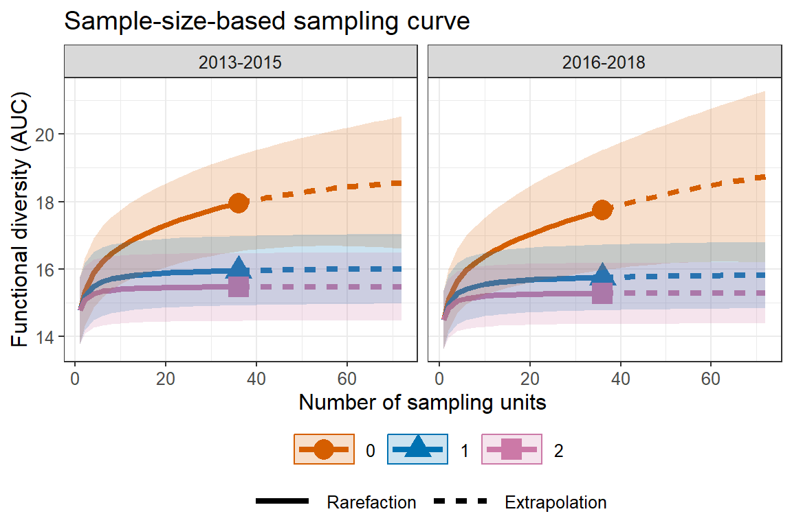

When `facet.var = "Order.q"` is specified in the `ggiNEXT3D` function,
it creates a separate plot for each diversity order; within each plot,
different color curves represent different assemblages. An example is
shown below:

``` r
# FD sample-size-based R/E curves for incidence data, separating by "Order.q"
ggiNEXT3D(output_FD_inci, type = 1, facet.var = "Order.q")
```

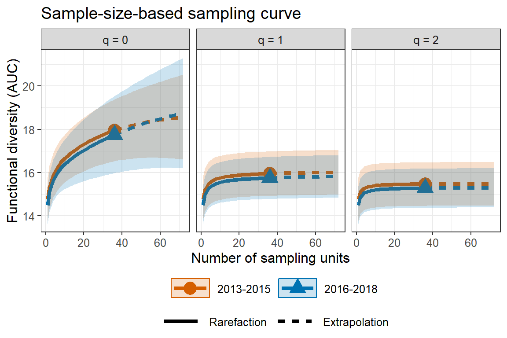

The following commands return the sample completeness (sample coverage)
curve (`type = 2`) in which different colors are used for different
assemblages.

``` r
# Sample completeness curves for incidence data, separating by "Assemblage"
ggiNEXT3D(output_FD_inci, type = 2, color.var = "Assemblage")
```

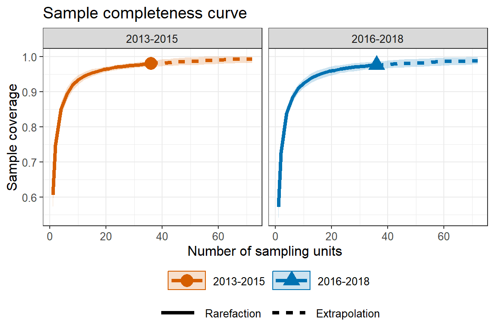

The following commands return the coverage-based
rarefaction/extrapolation sampling curves in which different color
curves represent three diversity orders within each assemblage
(`facet.var = "Assemblage"`), or represent two assemblages within each
diversity order (`facet.var = "Order.q"`), respectively.

``` r
# FD coverage-based R/E curves for incidence data, separating by "Assemblage"
ggiNEXT3D(output_FD_inci, type = 3, facet.var = "Assemblage")
```

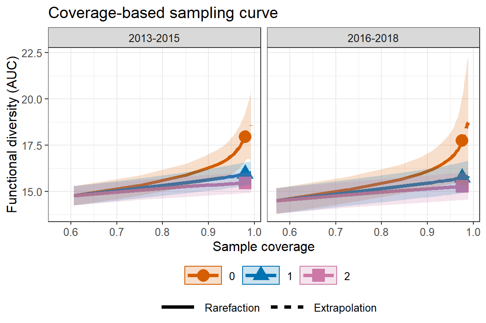

``` r
# FD coverage-based R/E curves for incidence data, separating by "Order.q"
ggiNEXT3D(output_FD_inci, type = 3, facet.var = "Order.q")
```

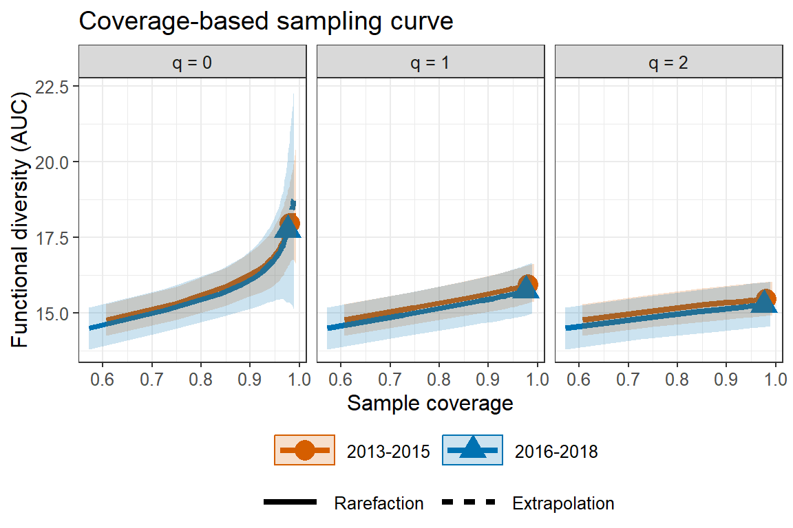

## <span style="color:red;">FUNCTION DataInfo3D(): DATA INFORMATION</span>

The function `DataInfo3D()` provides basic data information for the
reference sample in each individual assemblage. The function
`DataInfo3D()` with default arguments is shown below:

``` r
DataInfo3D(data, diversity = "TD", datatype = "abundance", 
           nT = NULL, PDtree, PDreftime = NULL, 
           FDdistM, FDtype = "AUC", FDtau = NULL) 
```

All arguments in the above function are the same as those for the main
function `iNEXT3D`. Running the `DataInfo3D()` function returns basic
data information including sample size, observed species richness, two
sample coverage estimates (`SC(n)` and `SC(2n)`) as well as other
relevant information in each of the three dimensions of diversity. We
use Brazil_rainforest_abun_data and Fish_incidence_data to demo the
function for each dimension of diversity.

### TAXONOMIC DIVERSITY (TD): Basic data information for abundance data

``` r
data(Brazil_rainforest_abun_data)
DataInfo3D(Brazil_rainforest_abun_data, diversity = 'TD', datatype = "abundance")
```

      Assemblage    n S.obs SC(n) SC(2n)  f1 f2 f3 f4 f5
    1       Edge 1794   319 0.939  0.974 110 48 38 28 13
    2   Interior 2074   356 0.941  0.973 123 48 41 32 19

Output description:

-   `Assemblage` = assemblage name.

-   `n` = number of observed individuals in the reference sample (sample
    size).

-   `S.obs` = number of observed species in the reference sample.

-   `SC(n)` = sample coverage estimate of the reference sample with size
    n.

-   `SC(2n)` = sample coverage estimate of the reference sample with
    size 2n.

-   `f1`-`f5` = the first five species abundance frequency counts in the
    reference sample.

### TAXONOMIC DIVERSITY (TD): Basic data information for incidence data

``` r
data(Fish_incidence_data)
DataInfo3D(Fish_incidence_data, diversity = 'TD', datatype = "incidence_raw")
```

      Assemblage  T   U S.obs SC(T) SC(2T) Q1 Q2 Q3 Q4 Q5
    1  2013-2015 36 532    50 0.980  0.993 11  6  4  1  3
    2  2016-2018 36 522    53 0.976  0.989 13  5  5  2  3

Output description:

-   `Assemblage` = assemblage name.

-   `T` = number of sampling units in the reference sample (sample size
    for incidence data).

-   `U` = total number of incidences in the reference sample.

-   `S.obs` = number of observed species in the reference sample.

-   `SC(T)` = sample coverage estimate of the reference sample with size
    T.

-   `SC(2T)` = sample coverage estimate of the reference sample with
    size 2T.

-   `Q1`-`Q5` = the first five species incidence frequency counts in the
    reference sample.

### PHYLOGENETIC DIVERSITY (PD): Basic data information for abundance data

``` r
data(Brazil_rainforest_abun_data)
data(Brazil_rainforest_phylo_tree)
data <- Brazil_rainforest_abun_data
tree <- Brazil_rainforest_phylo_tree
DataInfo3D(data, diversity = 'PD', datatype = "abundance", PDtree = tree)
```

    # A tibble: 2 x 11
      Assemblage     n S.obs `SC(n)` `SC(2n)` PD.obs `f1*` `f2*`    g1    g2 Reftime
      <chr>      <int> <int>   <dbl>    <dbl>  <dbl> <dbl> <dbl> <dbl> <dbl>   <dbl>
    1 Edge        1794   319   0.939    0.974  24516   110    52  6578  2885     400
    2 Interior    2074   356   0.941    0.973  27727   123    56  7065  3656     400

Output description:

-   `Assemblage`, `n`, `S.obs`, `SC(n)` and `SC(2n)`: definitions are
    the same as in the TD abundance output and thus are omitted.

-   `PD.obs` = the observed total branch length in the phylogenetic tree
    spanned by all observed species.

-   `f1*`,`f2*` = the number of singletons and doubletons in the
    node/branch abundance set.

-   `g1`,`g2` = the total branch length of those singletons/doubletons
    in the node/branch abundance set.

-   `Reftime` = reference time for phylogenetic diversity (the age of
    the root of phylogenetic tree).

### PHYLOGENETIC DIVERSITY (PD): Basic data information for incidence data

``` r
data(Fish_incidence_data)
data(Fish_phylo_tree)
data <- Fish_incidence_data
tree <- Fish_phylo_tree
DataInfo3D(data, diversity = 'PD', datatype = "incidence_raw", PDtree = tree)
```

    # A tibble: 2 x 12
      Assemblage     T     U S.obs `SC(T)` `SC(2T)` PD.obs `Q1*` `Q2*`    R1    R2 Reftime
      <chr>      <int> <int> <int>   <dbl>    <dbl>  <dbl> <dbl> <dbl> <dbl> <dbl>   <dbl>
    1 2013-2015     36   532    50   0.98     0.993   9.62    11     7 0.69  1.23    0.977
    2 2016-2018     36   522    53   0.976    0.989   9.44    13     6 0.368 0.345   0.977

Output description:

-   `Assemblage`, `T`, `U`, `S.obs`, `SC(T)` and `SC(2T)`: definitions
    are the same as in the TD incidence output and thus are omitted.

-   `PD.obs` = the observed total branch length in the phylogenetic tree
    spanned by all observed species.

-   `Q1*`,`Q2*` = the singletons/doubletons in the sample branch
    incidence.

-   `R1`,`R2` = the total branch length of those singletons/doubletons
    in the sample branch incidence.

-   `Reftime` = reference time.

### FUNCTIONAL DIVERSITY (FD): Basic data information for abundance data

``` r
data(Brazil_rainforest_abun_data)
data(Brazil_rainforest_distance_matrix)
data <- Brazil_rainforest_abun_data
distM <- Brazil_rainforest_distance_matrix
DataInfo3D(data, diversity = 'FD', datatype = "abundance", 
           FDdistM = distM, FDtype = 'AUC')
```

      Assemblage    n S.obs SC(n) SC(2n) dmin dmean  dmax
    1       Edge 1794   319 0.939  0.974    0 0.372 0.776
    2   Interior 2074   356 0.941  0.973    0 0.329 0.776

Output description:

-   `Assemblage`, `n`, `S.obs`, `SC(n)` and `SC(2n)`: definitions are
    the same as in TD abundance output and thus are omitted.

-   `dmin` = the minimum distance among all non-diagonal elements in the
    distance matrix.

-   `dmean` = the mean distance between any two individuals randomly
    selected from each assemblage.

-   `dmax` = the maximum distance among all elements in the distance
    matrix.

### FUNCTIONAL DIVERSITY (FD): Basic data information for incidence data

``` r
data(Fish_incidence_data)
data(Fish_distance_matrix)
data <- Fish_incidence_data
distM <- Fish_distance_matrix
DataInfo3D(data, diversity = 'FD', datatype = "incidence_raw", 
           FDdistM = distM, FDtype = 'AUC')
```

      Assemblage  T   U S.obs SC(T) SC(2T)  dmin dmean  dmax
    1  2013-2015 36 532    50 0.980  0.993 0.006 0.240 0.733
    2  2016-2018 36 522    53 0.976  0.989 0.006 0.237 0.733

Output description:

-   `Assemblage`, `T`, `U`, `S.obs`, `SC(T)` and `SC(2T)`: definitions
    are the same as in the TD incidence output and thus are omitted.

-   `dmin` = the minimum distance among all non-diagonal elements in the
    distance matrix.

-   `dmean` = the mean distance between any two individuals randomly
    selected from each assemblage.

-   `dmax` = the maximum distance among all elements in the distance
    matrix.

## <span style="color:red;">FUNCTION estimate3D(): POINT ESTIMATION</span>

`estimate3D` is used to compute 3D diversity (TD, PD, FD) estimates with
q = 0, 1, 2 under any specified levels of sample size (when
`base = "size"`) and sample coverage values (when `base = "coverage"`)
for abundance data (`datatype = "abundance"`) or incidence data
(`datatype = "incidence_raw"`). When `base = "size"`, `level` can be
specified with a particular vector of sample sizes (greater than 0); if
`level = NULL`, this function computes the diversity estimates for the
minimum sample size among all samples extrapolated to the double
reference sizes. When `base = "coverage"`, `level` can be specified with
a particular vector of sample coverage values (between 0 and 1); if
`level = NULL`, this function computes the diversity estimates for the
minimum sample coverage among all samples extrapolated to the double
reference sizes. All arguments in the function are the same as those for
the main function `iNEXT3D`.

``` r
estimate3D(data, diversity = "TD", q = c(0, 1, 2), datatype = "abundance", 
           base = "coverage", level = NULL, nboot = 50, conf = 0.95, 
           nT = NULL, PDtree, PDreftime = NULL, PDtype = "meanPD", 
           FDdistM, FDtype = "AUC", FDtau = NULL, FDcut_number = 50) 
```

## <span style="color:blue;">TAXONOMIC DIVERSITY (TD): point estimation</span>

### Example 7a: TD for abundance data with two target coverage values (93% and 97%)

The following commands return the TD estimates with two specified levels
of sample coverage (93% and 97%) based on the
`Brazil_rainforest_abun_data`.

``` r
data(Brazil_rainforest_abun_data)
output_est_TD_abun <- estimate3D(Brazil_rainforest_abun_data, diversity = 'TD', q = c(0,1,2), 
                                 datatype = "abundance", base = "coverage", level = c(0.93, 0.97))
output_est_TD_abun
```

       Assemblage Order.q   SC        m        Method     qTD   s.e. qTD.LCL qTD.UCL
    1        Edge       0 0.93 1547.562   Rarefaction 302.879  8.892 285.450 320.308
    2        Edge       0 0.97 3261.971 Extrapolation 383.307 17.598 348.816 417.798
    3        Edge       1 0.93 1547.562   Rarefaction 152.374  3.819 144.889 159.860
    4        Edge       1 0.97 3261.971 Extrapolation 166.837  4.443 158.130 175.544
    5        Edge       2 0.93 1547.562   Rarefaction  81.437  4.048  73.503  89.372
    6        Edge       2 0.97 3261.971 Extrapolation  83.726  4.304  75.290  92.163
    7    Interior       0 0.93 1699.021   Rarefaction 331.917 14.476 303.545 360.289
    8    Interior       0 0.97 3883.447 Extrapolation 433.807 22.432 389.840 477.773
    9    Interior       1 0.93 1699.021   Rarefaction 159.330  4.873 149.779 168.882
    10   Interior       1 0.97 3883.447 Extrapolation 175.739  5.536 164.890 186.589
    11   Interior       2 0.93 1699.021   Rarefaction  71.611  4.173  63.432  79.789
    12   Interior       2 0.97 3883.447 Extrapolation  73.326  4.412  64.678  81.973

### Example 7b: TD for incidence data with two target coverage values (97.5% and 99%)

The following commands return the TD estimates with two specified levels
of sample coverage (97.5% and 99%) for the `Fish_incidence_data`.

``` r
data(Fish_incidence_data)
output_est_TD_inci <- estimate3D(Fish_incidence_data, diversity = 'TD', q = c(0, 1, 2), 
                                 datatype = "incidence_raw", base = "coverage", 
                                 level = c(0.975, 0.99))
output_est_TD_inci
```

       Assemblage Order.q    SC     mT        Method    qTD  s.e. qTD.LCL qTD.UCL
    1   2013-2015       0 0.975 29.169   Rarefaction 47.703 3.144  41.542  53.865
    2   2013-2015       0 0.990 58.667 Extrapolation 54.914 4.952  45.209  64.620
    3   2013-2015       1 0.975 29.169   Rarefaction 29.773 1.000  27.813  31.732
    4   2013-2015       1 0.990 58.667 Extrapolation 30.751 0.970  28.849  32.653
    5   2013-2015       2 0.975 29.169   Rarefaction 23.861 0.768  22.356  25.367
    6   2013-2015       2 0.990 58.667 Extrapolation 24.126 0.771  22.615  25.638
    7   2016-2018       0 0.975 34.825   Rarefaction 52.574 5.922  40.968  64.180
    8   2016-2018       0 0.990 76.971 Extrapolation 62.688 9.742  43.595  81.782
    9   2016-2018       1 0.975 34.825   Rarefaction 31.479 1.298  28.935  34.022
    10  2016-2018       1 0.990 76.971 Extrapolation 32.721 1.394  29.989  35.454
    11  2016-2018       2 0.975 34.825   Rarefaction 24.872 0.742  23.418  26.325
    12  2016-2018       2 0.990 76.971 Extrapolation 25.163 0.746  23.700  26.626

## <span style="color:blue;">PHYLOGENETIC DIVERSITY (PD): point estimation</span>

### Example 8a: PD for abundance data with two target sample sizes (1500 and 3500)

The following commands return the PD estimates with two specified levels
of sample sizes (1500 and 3500) for the `Brazil_rainforest_abun_data`.

``` r
data(Brazil_rainforest_abun_data)
data(Brazil_rainforest_phylo_tree)
data <- Brazil_rainforest_abun_data
tree <- Brazil_rainforest_phylo_tree
output_est_PD_abun <- estimate3D(data, diversity = 'PD', datatype = "abundance", 
                                 base = "size", level = c(1500, 3500), PDtree = tree)
output_est_PD_abun
```

       Assemblage Order.q    m        Method    SC    qPD  s.e. qPD.LCL qPD.UCL Reftime   Type
    1        Edge       0 1500   Rarefaction 0.928 58.370 1.280  55.861  60.880     400 meanPD
    2        Edge       0 3500 Extrapolation 0.973 71.893 2.758  66.487  77.298     400 meanPD
    3        Edge       1 1500   Rarefaction 0.928  5.224 0.109   5.011   5.437     400 meanPD
    4        Edge       1 3500 Extrapolation 0.973  5.320 0.111   5.102   5.538     400 meanPD
    5        Edge       2 1500   Rarefaction 0.928  1.797 0.024   1.749   1.844     400 meanPD
    6        Edge       2 3500 Extrapolation 0.973  1.797 0.024   1.750   1.844     400 meanPD
    7    Interior       0 1500   Rarefaction 0.922 63.555 1.066  61.466  65.645     400 meanPD
    8    Interior       0 3500 Extrapolation 0.965 78.004 2.117  73.853  82.154     400 meanPD
    9    Interior       1 1500   Rarefaction 0.922  5.675 0.133   5.414   5.936     400 meanPD
    10   Interior       1 3500 Extrapolation 0.965  5.784 0.135   5.520   6.048     400 meanPD
    11   Interior       2 1500   Rarefaction 0.922  1.913 0.032   1.850   1.977     400 meanPD
    12   Interior       2 3500 Extrapolation 0.965  1.914 0.032   1.851   1.978     400 meanPD

### Example 8b: PD for incidence data with two target coverage values (97.5% and 99%)

The following commands return the PD estimates with two specified levels
of sample coverage (97.5% and 99%) for the `Fish_incidence_data`.

``` r
data(Fish_incidence_data)
data(Fish_phylo_tree)
data <- Fish_incidence_data
tree <- Fish_phylo_tree
output_est_PD_inci <- estimate3D(data, diversity = 'PD', datatype = "incidence_raw", 
                                 base = "coverage", level = c(0.975, 0.99), PDtree = tree)
output_est_PD_inci
```

       Assemblage Order.q    SC     mT        Method    qPD  s.e. qPD.LCL qPD.UCL   Reftime   Type
    1   2013-2015       0 0.975 29.169   Rarefaction  9.672 0.406   8.876  10.469 0.9770115 meanPD
    2   2013-2015       0 0.990 58.667 Extrapolation 10.018 0.718   8.611  11.426 0.9770115 meanPD
    3   2013-2015       1 0.975 29.169   Rarefaction  7.612 0.125   7.368   7.857 0.9770115 meanPD
    4   2013-2015       1 0.990 58.667 Extrapolation  7.680 0.127   7.431   7.929 0.9770115 meanPD
    5   2013-2015       2 0.975 29.169   Rarefaction  7.003 0.121   6.765   7.240 0.9770115 meanPD
    6   2013-2015       2 0.990 58.667 Extrapolation  7.030 0.122   6.792   7.268 0.9770115 meanPD
    7   2016-2018       0 0.975 34.825   Rarefaction  9.646 0.413   8.838  10.455 0.9770115 meanPD
    8   2016-2018       0 0.990 76.971 Extrapolation  9.831 0.704   8.451  11.211 0.9770115 meanPD
    9   2016-2018       1 0.975 34.825   Rarefaction  7.779 0.135   7.513   8.044 0.9770115 meanPD
    10  2016-2018       1 0.990 76.971 Extrapolation  7.835 0.141   7.558   8.112 0.9770115 meanPD
    11  2016-2018       2 0.975 34.825   Rarefaction  7.201 0.135   6.936   7.465 0.9770115 meanPD
    12  2016-2018       2 0.990 76.971 Extrapolation  7.224 0.136   6.957   7.491 0.9770115 meanPD

## <span style="color:blue;">FUNCTIONAL DIVERSITY (FD): point estimation</span>

### Example 9a: FD for abundance data with two target coverage values (93% and 97%)

The following commands return the FD estimates with two specified levels
of sample coverage (93% and 97%) for the `Brazil_rainforest_abun_data`.

``` r
data(Brazil_rainforest_abun_data)
data(Brazil_rainforest_distance_matrix)
data <- Brazil_rainforest_abun_data
distM <- Brazil_rainforest_distance_matrix
output_est_FD_abun <- estimate3D(data, diversity = 'FD', datatype = "abundance", 
                                 base = "coverage", level = c(0.93, 0.97), nboot = 10, 
                                 FDdistM = distM, FDtype = 'AUC')
output_est_FD_abun
```

       Assemblage Order.q   SC        m        Method    qFD  s.e. qFD.LCL qFD.UCL
    1        Edge       0 0.93 1547.562   Rarefaction 17.590 1.700  14.257  20.923
    2        Edge       0 0.97 3261.971 Extrapolation 18.578 1.937  14.781  22.374
    3        Edge       1 0.93 1547.562   Rarefaction 11.732 0.395  10.958  12.506
    4        Edge       1 0.97 3261.971 Extrapolation 11.920 0.398  11.140  12.700
    5        Edge       2 0.93 1547.562   Rarefaction  9.120 0.269   8.593   9.648
    6        Edge       2 0.97 3261.971 Extrapolation  9.183 0.271   8.652   9.714
    7    Interior       0 0.93 1699.021   Rarefaction 16.890 1.952  13.065  20.716
    8    Interior       0 0.97 3883.447 Extrapolation 17.839 3.166  11.634  24.044
    9    Interior       1 0.93 1699.021   Rarefaction  9.668 0.303   9.074  10.262
    10   Interior       1 0.97 3883.447 Extrapolation  9.834 0.317   9.212  10.456
    11   Interior       2 0.93 1699.021   Rarefaction  6.994 0.180   6.641   7.348
    12   Interior       2 0.97 3883.447 Extrapolation  7.033 0.184   6.673   7.393

### Example 9b: FD for incidence data with two target number of sampling units (30 and 70)

The following commands return the FD estimates with two specified levels
of sample sizes (30 and 70) for the `Fish_incidence_data`.

``` r
data(Fish_incidence_data)
data(Fish_distance_matrix)
data <- Fish_incidence_data
distM <- Fish_distance_matrix
output_est_FD_inci <- estimate3D(data, diversity = 'FD', datatype = "incidence_raw", 
                                 base = "size", level = c(30, 70), nboot = 10, 
                                 FDdistM = distM, FDtype = 'AUC')
output_est_FD_inci
```

       Assemblage Order.q mT        Method    SC    qFD  s.e. qFD.LCL qFD.UCL
    1   2013-2015       0 30   Rarefaction 0.976 17.748 0.255  17.248  18.248
    2   2013-2015       0 70 Extrapolation 0.993 18.550 0.582  17.410  19.691
    3   2013-2015       1 30   Rarefaction 0.976 15.929 0.217  15.505  16.354
    4   2013-2015       1 70 Extrapolation 0.993 16.006 0.210  15.594  16.417
    5   2013-2015       2 30   Rarefaction 0.976 15.459 0.215  15.038  15.880
    6   2013-2015       2 70 Extrapolation 0.993 15.477 0.215  15.056  15.898
    7   2016-2018       0 30   Rarefaction 0.972 17.503 0.704  16.124  18.883
    8   2016-2018       0 70 Extrapolation 0.988 18.705 1.135  16.480  20.930
    9   2016-2018       1 30   Rarefaction 0.972 15.729 0.506  14.738  16.720
    10  2016-2018       1 70 Extrapolation 0.988 15.816 0.515  14.808  16.825
    11  2016-2018       2 30   Rarefaction 0.972 15.268 0.486  14.316  16.221
    12  2016-2018       2 70 Extrapolation 0.988 15.290 0.486  14.337  16.242

## <span style="color:red;">FUNCTION ObsAsy3D: ASYMPTOTIC AND OBSERVED DIVERSITY PROFILES</span>

``` r
ObsAsy3D(data, diversity = "TD", q = seq(0, 2, 0.2), datatype = "abundance",
         nboot = 50, conf = 0.95, nT = NULL, 
         method = c("Asymptotic", "Observed"),
         PDtree, PDreftime = NULL, PDtype = "meanPD",
         FDdistM, FDtype = "AUC", FDtau = NULL, FDcut_number = 50
         )
```

All arguments in the above function are the same as those for the main
function `iNEXT3D` (except that the default of `q` here is
`seq(0, 2, 0.2)`). The function `ObsAsy3D()` computes observed and
asymptotic diversity of order q between 0 and 2 (in increments of 0.2)
for 3D diversity; these 3D values with different order q can be used to
depict a q-profile in the `ggObsAsy3D` function.

It also computes observed and asymptotic PD for various reference times
by specifying the argument `PDreftime`; these PD values with different
reference times can be used to depict a time-profile in the `ggObsAsy3D`
function.

It also computes observed and asymptotic FD for various threshold tau
levels by specifying the argument `FDtau`; these FD values with
different threshold levels can be used to depict a tau-profile in the
`ggObsAsy3D` function.

For each dimension, by default, both the observed and asymptotic
diversity estimates will be computed.

## <span style="color:red;">FUNCTION ggObsAsy3D(): GRAPHIC DISPLAYS OF DIVERSITY PROFILES</span>

``` r
ggObsAsy3D(output, profile = "q")
```

`ggObsAsy3D` is a ggplot2 extension for an `ObsAsy3D` object to plot 3D
q-profile (which depicts the observed diversity and asymptotic diversity
estimate with respect to order q) for q between 0 and 2 (in increments
of 0.2).

It also plots time-profile (which depicts the observed and asymptotic
estimate of PD or mean PD with respect to reference times when
`diversity = "PD"` specified in the ObsAsy3D function), and tau-profile
(which depicts the observed and asymptotic estimate of FD with respect
to threshold level tau when `diversity = "FD"` and
`FDtype = "tau_values"` specified in the `ObsAsy3D` function) based on
the output from the function `ObsAsy3D`.

In the plot of profiles, only confidence intervals of the asymptotic
diversity will be shown when both the observed and asymptotic diversity
estimates are computed.

## <span style="color:blue;">TAXONOMIC DIVERSITY (TD): q-profiles</span>

### Example 10a: TD q-profiles for abundance data

The following commands returns the observed and asymptotic taxonomic
diversity (‘TD’) for the `Brazil_rainforest_abun_data`, along with its
confidence interval for diversity order q between 0 to 2. Here only the
first ten rows of the output are shown.

``` r
data(Brazil_rainforest_abun_data)
output_ObsAsy_TD_abun <- ObsAsy3D(Brazil_rainforest_abun_data, diversity = 'TD', 
                                  datatype = "abundance")
output_ObsAsy_TD_abun
```

       Assemblage Order.q     qTD   s.e. qTD.LCL qTD.UCL     Method
    1        Edge     0.0 444.971 29.065 388.005 501.938 Asymptotic
    2        Edge     0.2 375.270 20.145 335.787 414.754 Asymptotic
    3        Edge     0.4 312.452 13.210 286.561 338.343 Asymptotic
    4        Edge     0.6 258.379  8.563 241.595 275.164 Asymptotic
    5        Edge     0.8 213.730  6.097 201.780 225.680 Asymptotic
    6        Edge     1.0 178.000  5.154 167.898 188.101 Asymptotic
    7        Edge     1.2 149.914  4.881 140.347 159.482 Asymptotic
    8        Edge     1.4 127.945  4.803 118.532 137.357 Asymptotic
    9        Edge     1.6 110.672  4.779 101.305 120.039 Asymptotic
    10       Edge     1.8  96.948  4.784  87.571 106.325 Asymptotic

The following commands plot the corresponding q-profiles, along with its
confidence interval for q between 0 to 2.

``` r
# q-profile curves
ggObsAsy3D(output_ObsAsy_TD_abun)
```

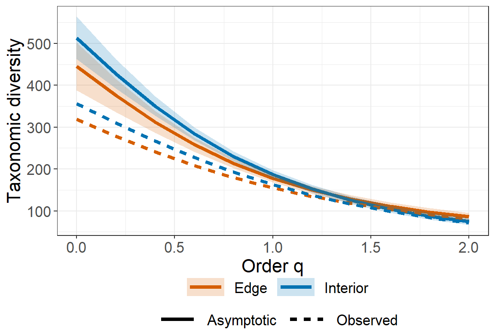

### Example 10b: TD q-profiles for incidence data

The following commands return the observed and asymptotic taxonomic
diversity (‘TD’) estimates for the `Fish_incidence_data`, along with its
confidence interval for diversity order q between 0 to 2. Here only the
first ten rows of the output are shown.

``` r
data(Fish_incidence_data)
output_ObsAsy_TD_inci <- ObsAsy3D(Fish_incidence_data, diversity = 'TD', 
                                  datatype = "incidence_raw")
output_ObsAsy_TD_inci
```

       Assemblage Order.q    qTD   s.e. qTD.LCL qTD.UCL     Method
    1   2013-2015     0.0 59.803 11.767  36.740  82.867 Asymptotic
    2   2013-2015     0.2 50.828  6.526  38.037  63.619 Asymptotic
    3   2013-2015     0.4 43.790  3.500  36.930  50.651 Asymptotic
    4   2013-2015     0.6 38.458  1.993  34.553  42.364 Asymptotic
    5   2013-2015     0.8 34.490  1.343  31.858  37.121 Asymptotic
    6   2013-2015     1.0 31.542  1.084  29.418  33.665 Asymptotic
    7   2013-2015     1.2 29.328  0.966  27.434  31.222 Asymptotic
    8   2013-2015     1.4 27.635  0.897  25.877  29.392 Asymptotic
    9   2013-2015     1.6 26.312  0.846  24.655  27.969 Asymptotic
    10  2013-2015     1.8 25.255  0.804  23.680  26.831 Asymptotic

The following commands plot the corresponding q-profiles, along with its
confidence interval for q between 0 to 2.

``` r
# q-profile curves
ggObsAsy3D(output_ObsAsy_TD_inci)
```

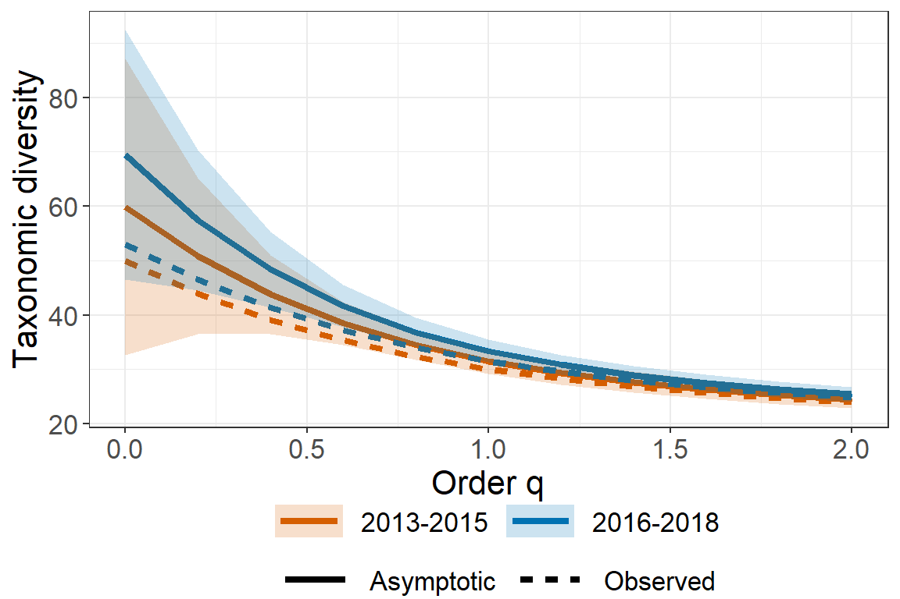

## <span style="color:blue;">PHYLOGENETIC DIVERSITY (PD): time-profiles and q-profiles</span>

### Example 11a: PD time-profiles for abundance data

The following commands return the observed and asymptotic phylogenetic
diversity (‘PD’) estimates for the `Brazil_rainforest_abun_data`, along
with its confidence interval for diversity order q = 0, 1, 2 under
reference times from 0.01 to 400 (tree height). Here only the first ten
rows of the output are shown.

``` r
data(Brazil_rainforest_abun_data)
data(Brazil_rainforest_phylo_tree)
data <- Brazil_rainforest_abun_data
tree <- Brazil_rainforest_phylo_tree
output_ObsAsy_PD_abun <- ObsAsy3D(data, diversity = 'PD', q = c(0, 1, 2), 
                                  PDreftime = seq(0.01, 400, length.out = 20),
                                  datatype = "abundance", nboot = 20, PDtree = tree)
output_ObsAsy_PD_abun
```

       Assemblage Order.q     qPD   s.e. qPD.LCL qPD.UCL     Method Reftime   Type
    1        Edge       0 444.971 27.967 390.156 499.787 Asymptotic   0.100 meanPD
    2        Edge       1 178.000  5.913 166.411 189.589 Asymptotic   0.100 meanPD
    3        Edge       2  85.905  5.294  75.529  96.281 Asymptotic   0.100 meanPD
    4    Interior       0 513.518 26.491 461.597 565.438 Asymptotic   0.100 meanPD
    5    Interior       1 186.983  6.267 174.700 199.266 Asymptotic   0.100 meanPD
    6    Interior       2  74.718  4.907  65.100  84.335 Asymptotic   0.100 meanPD
    7        Edge       0 371.100 21.565 328.834 413.366 Asymptotic  10.354 meanPD
    8        Edge       1 141.418  4.579 132.443 150.393 Asymptotic  10.354 meanPD
    9        Edge       2  72.848  3.824  65.353  80.343 Asymptotic  10.354 meanPD
    10   Interior       0 413.568 25.413 363.758 463.377 Asymptotic  10.354 meanPD

The argument `profile = "time"` in the `ggObsAsy3D` function creates a
separate plot for each diversity order q = 0, 1, and 2 with x-axis being
“Reference time”. Different assemblages will be represented by different
color lines.

``` r
# time-profile curves
ggObsAsy3D(output_ObsAsy_PD_abun, profile = "time")
```

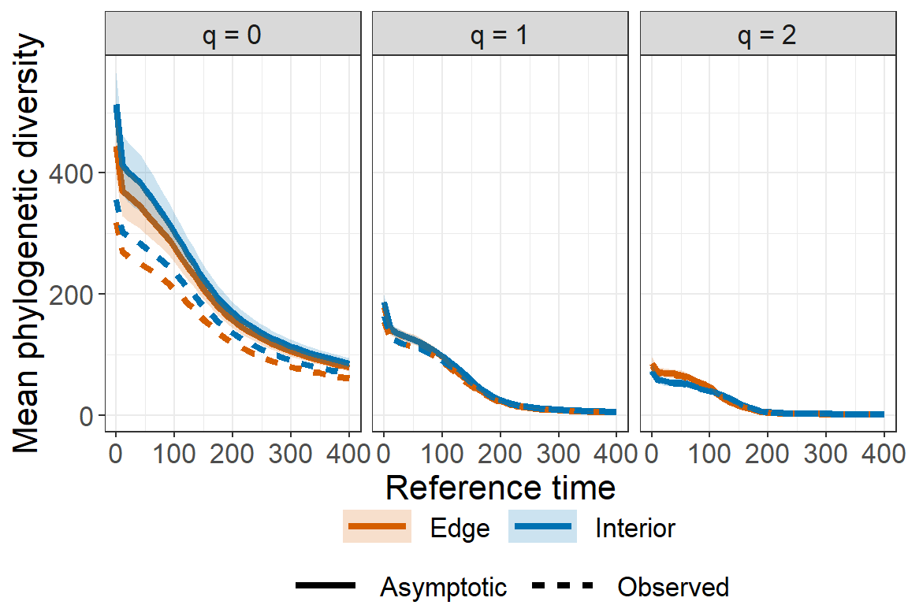

### Example 11b: PD q-profiles for incidence data

The following commands return the observed and asymptotic taxonomic
diversity (‘PD’) estimates for the `Fish_incidence_data`, along with its
confidence interval for diversity order q between 0 to 2. Here only the
first ten rows of the output are shown.

``` r
data(Fish_incidence_data)
data(Fish_phylo_tree)
data <- Fish_incidence_data
tree <- Fish_phylo_tree
output_ObsAsy_PD_inci <- ObsAsy3D(data, diversity = 'PD', q = seq(0, 2, 0.2), 
                                  datatype = "incidence_raw", nboot = 20, PDtree = tree, 
                                  PDreftime = NULL)
output_ObsAsy_PD_inci
```

       Assemblage Order.q    qPD  s.e. qPD.LCL qPD.UCL     Method Reftime   Type
    1   2013-2015     0.0 10.039 1.241   7.607  12.471 Asymptotic   0.977 meanPD
    2   2013-2015     0.2  9.462 0.538   8.407  10.517 Asymptotic   0.977 meanPD
    3   2013-2015     0.4  8.802 0.322   8.170   9.433 Asymptotic   0.977 meanPD
    4   2013-2015     0.6  8.329 0.227   7.884   8.773 Asymptotic   0.977 meanPD
    5   2013-2015     0.8  7.985 0.187   7.619   8.351 Asymptotic   0.977 meanPD
    6   2013-2015     1.0  7.729 0.170   7.397   8.061 Asymptotic   0.977 meanPD
    7   2013-2015     1.2  7.533 0.162   7.216   7.849 Asymptotic   0.977 meanPD
    8   2013-2015     1.4  7.378 0.158   7.067   7.688 Asymptotic   0.977 meanPD
    9   2013-2015     1.6  7.252 0.158   6.943   7.561 Asymptotic   0.977 meanPD
    10  2013-2015     1.8  7.147 0.159   6.836   7.458 Asymptotic   0.977 meanPD

The following commands plot the corresponding q-profiles, along with its
confidence interval for q between 0 to 2, for the default reference time
= 0.977 (the tree depth).

``` r
# q-profile curves
ggObsAsy3D(output_ObsAsy_PD_inci, profile = "q")
```

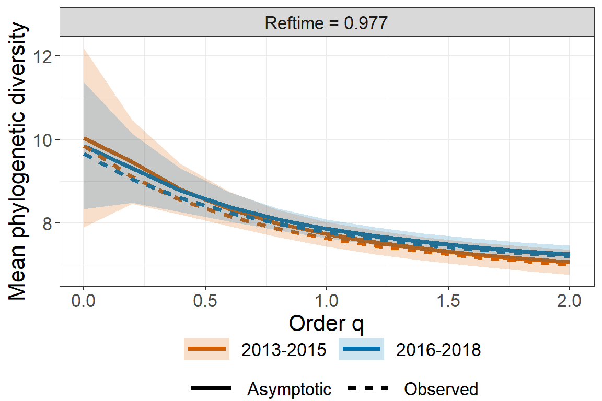

## <span style="color:blue;">FUNCTIONAL DIVERSITY (FD): tau-profiles and q-profiles</span>

### Example 12a: FD tau-profiles for abundance data

The following commands returns observed and asymptotic functional
diversity (‘FD’) for `Brazil_rainforest_abun_data`, along with its
confidence interval at diversity order q = 0, 1, 2 under tau values from
0 to 1. Here only the first ten rows of the output are shown.

``` r
data(Brazil_rainforest_abun_data)
data(Brazil_rainforest_distance_matrix)
data <- Brazil_rainforest_abun_data
distM <- Brazil_rainforest_distance_matrix
output_ObsAsy_FD_abun_tau <- ObsAsy3D(data, diversity = 'FD', q = c(0, 1, 2), 
                                      datatype = "abundance", nboot = 10, FDdistM = distM, 
                                      FDtype = 'tau_values', FDtau = seq(0, 1, 0.05))
output_ObsAsy_FD_abun_tau
```

       Assemblage Order.q     qFD   s.e. qFD.LCL qFD.UCL     Method  Tau
    1        Edge       0 444.971 23.002 399.888 490.055 Asymptotic 0.00
    2        Edge       1 178.000  6.655 164.956 191.043 Asymptotic 0.00
    3        Edge       2  85.905  6.033  74.081  97.730 Asymptotic 0.00
    4        Edge       0  79.904 16.209  48.135 111.673 Asymptotic 0.05
    5        Edge       1  45.187  2.311  40.658  49.716 Asymptotic 0.05
    6        Edge       2  32.092  1.727  28.707  35.477 Asymptotic 0.05
    7        Edge       0  73.276 17.121  39.719 106.832 Asymptotic 0.10
    8        Edge       1  42.200  2.228  37.832  46.567 Asymptotic 0.10
    9        Edge       2  30.182  1.596  27.053  33.311 Asymptotic 0.10
    10       Edge       0  35.372 19.020   0.000  72.651 Asymptotic 0.15

The following commands plot the corresponding tau-profiles, along with
its confidence interval for diversity order q = 0, 1, 2.

``` r
# tau-profile curves
ggObsAsy3D(output_ObsAsy_FD_abun_tau, profile = "tau")
```

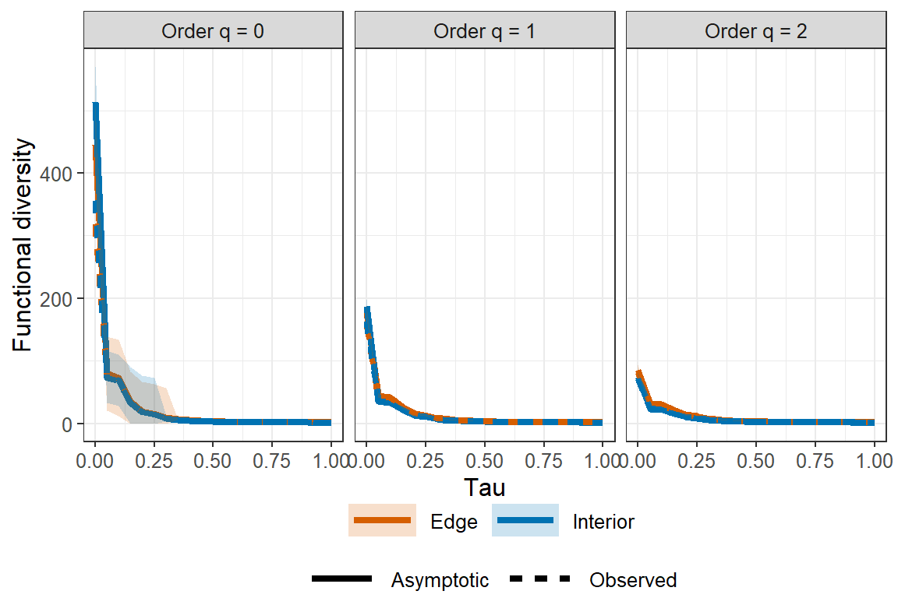

### Example 12b: FD q-profiles for abundance data

The following commands returns the observed and asymptotic taxonomic
diversity (‘FD’) for the `Brazil_rainforest_abun_data`, along with its
confidence interval for diversity order q between 0 to 2 with
`FDtype = 'AUC'`. Here only the first ten rows of the output are shown.

``` r
data(Brazil_rainforest_abun_data)
data(Brazil_rainforest_distance_matrix)
data <- Brazil_rainforest_abun_data
distM <- Brazil_rainforest_distance_matrix
output_ObsAsy_FD_abun <- ObsAsy3D(data, diversity = 'FD', q = seq(0, 2, 0.5), 
                                  datatype = "abundance", nboot = 10, 
                                  FDdistM = distM, FDtype = 'AUC')
output_ObsAsy_FD_abun
```

       Assemblage Order.q    qFD  s.e. qFD.LCL qFD.UCL     Method
    1        Edge     0.0 19.008 8.458   2.431  35.585 Asymptotic
    2        Edge     0.5 14.698 1.114  12.515  16.882 Asymptotic
    3        Edge     1.0 12.037 0.205  11.636  12.438 Asymptotic
    4        Edge     1.5 10.345 0.128  10.094  10.597 Asymptotic
    5        Edge     2.0  9.228 0.150   8.934   9.523 Asymptotic
    6    Interior     0.0 18.208 6.907   4.671  31.745 Asymptotic
    7    Interior     0.5 13.071 1.030  11.051  15.090 Asymptotic
    8    Interior     1.0  9.922 0.228   9.475  10.369 Asymptotic
    9    Interior     1.5  8.103 0.202   7.708   8.499 Asymptotic
    10   Interior     2.0  7.055 0.196   6.671   7.440 Asymptotic

The following commands plot the corresponding q-profiles, along with its
confidence interval for q between 0 to 2.

``` r
# q-profile curves
ggObsAsy3D(output_ObsAsy_FD_abun, profile = "q")
```


### Example 12c: FD q-profiles for incidence data

The following commands returns observed and asymptotic functional
diversity (‘FD’) for `Fish_incidence_data`, along with its confidence
interval at diversity order q from 0 to 2. Here only the first ten rows
of the output are shown.

``` r
data(Fish_incidence_data)
data(Fish_distance_matrix)
data <- Fish_incidence_data
distM <- Fish_distance_matrix
output_ObsAsy_FD_inci <- ObsAsy3D(data, diversity = 'FD', datatype = "incidence_raw",
                                  nboot = 20, FDdistM = distM, FDtype = 'AUC')
output_ObsAsy_FD_inci
```

       Assemblage Order.q    qFD  s.e. qFD.LCL qFD.UCL     Method
    1   2013-2015     0.0 18.906 2.065  14.859  22.952 Asymptotic
    2   2013-2015     0.2 17.826 0.907  16.048  19.604 Asymptotic
    3   2013-2015     0.4 17.115 0.582  15.974  18.256 Asymptotic
    4   2013-2015     0.6 16.624 0.469  15.706  17.543 Asymptotic
    5   2013-2015     0.8 16.284 0.433  15.436  17.132 Asymptotic
    6   2013-2015     1.0 16.043 0.418  15.223  16.863 Asymptotic
    7   2013-2015     1.2 15.868 0.411  15.063  16.673 Asymptotic
    8   2013-2015     1.4 15.736 0.406  14.941  16.532 Asymptotic
    9   2013-2015     1.6 15.635 0.402  14.847  16.423 Asymptotic
    10  2013-2015     1.8 15.555 0.399  14.773  16.338 Asymptotic

The following commands plot the corresponding q-profiles, along with its
confidence interval for q between 0 to 2.

``` r
# q-profile curves
ggObsAsy3D(output_ObsAsy_FD_inci, profile = "q")
```

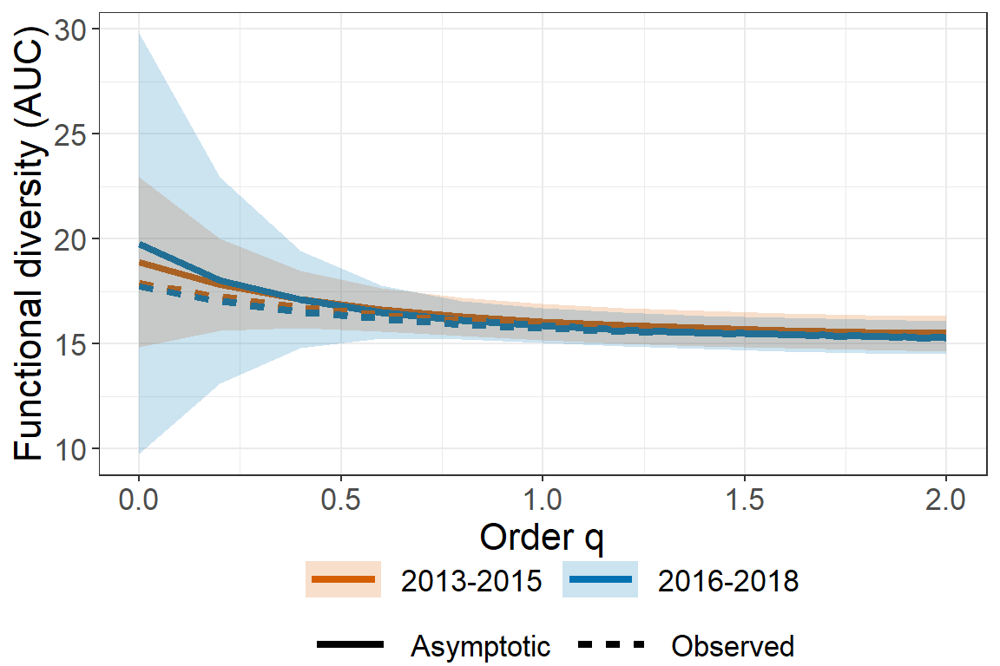

## License

The iNEXT.3D package is licensed under the GPLv3. To help refine
`iNEXT.3D`, your comments or feedback would be welcome (please send them
to Anne Chao or report an issue on the iNEXT.3D github
[iNEXT.3D_github](https://github.com/AnneChao/iNEXT.3D).

## References

-   Chao, A., Henderson, P. A., Chiu, C.-H., Moyes, F., Hu, K.-H.,
    Dornelas, M. and Magurran, A. E. (2021). Measuring temporal change
    in alpha diversity: a framework integrating taxonomic, phylogenetic
    and functional diversity and the iNEXT.3D standardization. Methods
    in Ecology and Evolution, 12, 1926-1940.

-   Hsieh, T. C., Ma, K-H, and Chao, A. (2016). iNEXT: An R package for
    rarefaction and extrapolation of species diversity (Hill numbers).
    Methods in Ecology and Evolution, 7, 1451-1456.
